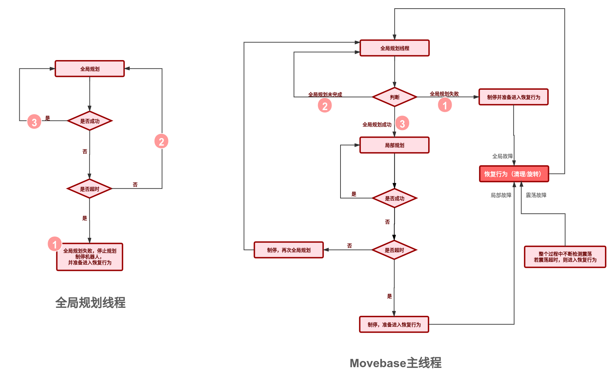
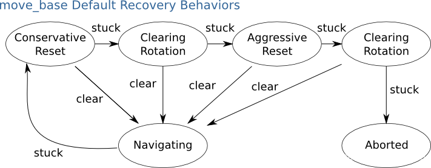
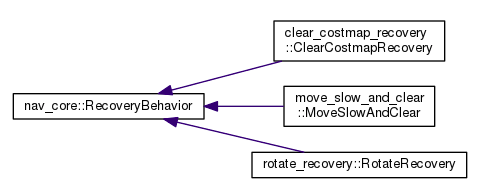

#  navigation_rotate_recovery源码浅析

##  概述

* rotate_recovery 机制是当移动机器人认为自己被卡住时，指导机器人进行一系列的恢复行为；rotate_recovery功能包给导航功能包提供了`rotate_recovery::RotateRecovery`修复机制，它尝试让机器人执行360度旋转来完成清理导航功能包里的代价地图的空间。

* **同时`rotate_recovery::RotateRecovery`继承了`nav_core::RecoveryBehavior`接口，并以插件方式用于move_base node**。





move_base 节点可以在机器人认为自己被卡住时选择性地执行恢复行为。默认情况下，move_base 节点将采取以下操作来清除空间：

* 首先，用户<u>*指定区域以外的障碍物*</u>（这里不清楚是指的哪里）将从机器人的地图上清除。
* 接下来，如果可能的话，机器人将进行原地旋转以清除空间。
* 如果这也失败了，机器人将更积极地清除地图，清除矩形区域之外的所有障碍（在这个区域内机器人可以原地旋转）。这之后将进行另一次原地旋转。
* 如果所有这些都失败了，机器人将认为它的目标是不可行的，并通知用户它已经中止。
* **可以使用 recovery_behaviour 参数配置这些恢复行为，并使用 recovery_behavior_enabled 参数禁用这些恢复行为**。

**导航功能包集合中，有 3 个包与恢复机制有关，这 3 个包中分别定义了 3 个类，都继承了 nav_core 中的接口规范**。分别为：

* [clear_costmap_recovery](http://wiki.ros.org/clear_costmap_recovery?distro=kinetic)实现了清除代价地图的恢复行为

  遍历所有层，然后如果某层在可清理的列表里就清除掉它的costmap。默认可清理列表中只有obstacle layer即障碍物层，即机器人实时扫描建立的costmap。

* [rotate_recovery](http://wiki.ros.org/rotate_recovery?distro=kinetic)实现了旋转的恢复行为，360度旋转来尝试清除空间

  转一圈看看有没有路。在runBehavior里只需要发指令让小车转一圈，有没有路是local costmap在转一圈过程中建立发现的。

* [move_slow_and_clear](http://wiki.ros.org/move_slow_and_clear?distro=kinetic)实现了缓慢移动的恢复行为。

  清理 costmap 然后什么都不管，按照前进速度和转角速度走。从代码里可以看到，根据指定的距离，这是通过先清除全局 costmap 跟局部  costmap 一圈的 obstacle layer 的障碍，然后直接发指令实现的。由于只清除了 obstacle layer ，其实  static layer 的障碍还在，而且这里清不清除跟发指令关系不大，该撞上去的还是会撞的，相当于闭着眼睛往前走。



主要实现两个函数，一个负责初始化，另一个负责执行恢复行为。

* [virtual void initialize()](https://github.com/ros-planning/navigation/blob/kinetic-devel/nav_core/include/nav_core/recovery_behavior.h#L56)
* [virtual void runBehavior() = 0;](https://github.com/ros-planning/navigation/blob/kinetic-devel/nav_core/include/nav_core/recovery_behavior.h#L61)

## 何时触发rotate_recovery

[move_base 中定义了什么时候会触发 recovery ：](https://github.com/ros-planning/navigation/blob/kinetic-devel/move_base/include/move_base/move_base.h#L72)

```C++
enum RecoveryTrigger
{
  PLANNING_R,  // 全局规划失败，即无法算出 plan
  CONTROLLING_R,  // 局部规划失败，即 local planner 无法利用 local costmap 算出一个 local plan ，从而无法得到速度命令
  OSCILLATION_R  // 机器人在不断抖动，长时间被困在一小片区域
};

```

* `MoveBase::planThread` 里， [如果发现无法算出最新的 plan ，就会把 move_base 的状态设置为 CLEARING](https://github.com/ros-planning/navigation/blob/kinetic-devel/move_base/src/move_base.cpp#L616)
* 在 `MoveBase::executeCycle` 的循环中， [在  CONTROLLING 状态时，即还未到达目的地并且已经获得 Plan 的状态下。如果长时间没有成功拿到 local planner  算出的速度命令，比如 local planner 无法算出速度（可能是 local costmap 里有障碍物），就会设置 move_base  状态为 CLEARING](https://github.com/ros-planning/navigation/blob/kinetic-devel/move_base/src/move_base.cpp#L918)
* [在震动时，如果没有恢复，也会设置状态成 CLEARING](https://github.com/ros-planning/navigation/blob/kinetic-devel/move_base/src/move_base.cpp#L894)

具体的：

* 局部规划失败时间大于 controller_patience_ 时会触发恢复机制

  ```C++
  ros::Time attempt_end = last_valid_control_ + ros::Duration(controller_patience_);
  
  //check if we've tried to find a valid control for longer than our time limit
  if(ros::Time::now() > attempt_end){
    //we'll move into our obstacle clearing mode
    publishZeroVelocity();
    state_ = CLEARING;
    recovery_trigger_ = CONTROLLING_R;
  }
  
  ```

* 全局规划失败时间大于 planner_patience_ 或者失败次数（从 0 开始）大于 max_planning_retries_ 时会触发恢复机制

  ```C++
  ros::Time attempt_end = last_valid_plan_ + ros::Duration(planner_patience_);
  
  if(runPlanner_ &&
     (ros::Time::now() > attempt_end || planning_retries_ > uint32_t(max_planning_retries_))){
    //we'll move into our obstacle clearing mode
    state_ = CLEARING;
    runPlanner_ = false;  // proper solution for issue #523
    publishZeroVelocity();
    recovery_trigger_ = PLANNING_R;
  }
  
  ```

* 长时间困在一片小区域时间大于 oscillation_timeout_ 时会触发恢复机制

  ```C++
  //check for an oscillation condition
  if(oscillation_timeout_ > 0.0 &&
      last_oscillation_reset_ + ros::Duration(oscillation_timeout_) < ros::Time::now())
  {
    publishZeroVelocity();
    state_ = CLEARING;
    recovery_trigger_ = OSCILLATION_R;
  }
  
  ```

##  rotate_recovery执行时

recovery 时会执行 recovery behavior 。在Movebase的构造函数中，可以从参数服务器上加载恢复行为列表，当参数服务器上不存在时，调用`loadDefaultRecoveryBehaviors`函数加载默认的恢复行为列表，这里来看一下这个函数。

```C++
    if(!loadRecoveryBehaviors(private_nh)){
      loadDefaultRecoveryBehaviors();
    }

```

 [MoveBase::loadDefaultRecoveryBehaviors](https://github.com/ros-planning/navigation/blob/kinetic-devel/move_base/src/move_base.cpp#L1084) 函数会加载一些 default 的 behavior ，在`loadDefaultRecoveryBehaviors`函数中，按顺序加载了①“cons_clear”、②“rotate”、③“ags_clear”、④“rotate”。实际上，①/③都是ClearCostmapRecovery类，负责清理机器人一定范围外的costmap上的数据，区别在于③保留的范围更小，清理的更多。恢复行为是按照列表顺序调用的，当①、②无效后，才会执行③，清理更多区域。②/④都是RotateRecovery类，使机器人原地旋转。上述两种类型：

* [clear_costmap_recovery/ClearCostmapRecovery](https://github.com/ros-planning/navigation/blob/kinetic-devel/move_base/src/move_base.cpp#L1093)

  会清理从机器人所在位置开始，默认指定 [reset_distance_=3](https://github.com/ros-planning/navigation/blob/kinetic-devel/clear_costmap_recovery/src/clear_costmap_recovery.cpp#L61) 米的矩形范围之外的 costmap 中数据，具体清理 costmap 中的哪个 layer 中的数据呢， [默认清理 obstacle layer 的数据](https://github.com/ros-planning/navigation/blob/kinetic-devel/clear_costmap_recovery/src/clear_costmap_recovery.cpp#L64) 。看 [ClearCostmapRecovery::runBehavior](https://github.com/ros-planning/navigation/blob/kinetic-devel/clear_costmap_recovery/src/clear_costmap_recovery.cpp#L80) 。清理时，将地图中内容设置为未知。会把 global 和 local costmap 中指定的 layer 都清理掉。

* [rotate_recovery/RotateRecovery](https://github.com/ros-planning/navigation/blob/kinetic-devel/move_base/src/move_base.cpp#L1098)

  就是让机器人旋转 360 度。这样就可以更新周围的障碍物数据。


## 源码分析

###  `nav_core/recovery_behavior.h`

```C++
#ifndef NAV_CORE_RECOVERY_BEHAVIOR_H
#define NAV_CORE_RECOVERY_BEHAVIOR_H

#include <costmap_2d/costmap_2d_ros.h>
#include <tf/transform_listener.h>

namespace nav_core {
  /**
   * @class RecoveryBehavior
   * @brief Provides an interface for recovery behaviors used in navigation. All recovery behaviors written as plugins for the navigation stack must adhere to this interface.
   */
  class RecoveryBehavior{
    public:
      /**
       * @brief  Initialization function for the RecoveryBehavior
       * @param tf A pointer to a transform listener
       * @param global_costmap A pointer to the global_costmap used by the navigation stack 
       * @param local_costmap A pointer to the local_costmap used by the navigation stack 
       */
      virtual void initialize(std::string name, tf::TransformListener* tf, costmap_2d::Costmap2DROS* global_costmap, costmap_2d::Costmap2DROS* local_costmap) = 0;

      /**
       * @brief   Runs the RecoveryBehavior
       */
      virtual void runBehavior() = 0;

      /**
       * @brief  Virtual destructor for the interface
       */
      virtual ~RecoveryBehavior(){}

    protected:
      RecoveryBehavior(){}
  };
};  // namespace nav_core

#endif  // NAV_CORE_RECOVERY_BEHAVIOR_H
```

###  `rotate_recovery/rotate_recovery.h`

```C++
#ifndef ROTATE_RECOVERY_ROTATE_RECOVERY_H
#define ROTATE_RECOVERY_ROTATE_RECOVERY_H
#include <nav_core/recovery_behavior.h>
#include <costmap_2d/costmap_2d_ros.h>
#include <tf/transform_listener.h>
#include <base_local_planner/costmap_model.h>
#include <string>

namespace rotate_recovery
{
/**
 * @class RotateRecovery
 * @brief A recovery behavior that rotates the robot in-place to attempt to clear out space
 */
class RotateRecovery : public nav_core::RecoveryBehavior//继承了nav_core/recovery_behavior.h中的父类
{
public:
  /**
   * @brief  Constructor, make sure to call initialize in addition to actually initialize the object
   */
  RotateRecovery();

  /**
   * @brief  Initialization function for the RotateRecovery recovery behavior
   * @param name Namespace used in initialization
   * @param tf (unused)
   * @param global_costmap (unused)
   * @param local_costmap A pointer to the local_costmap used by the navigation stack
   */
    //初始化函数中有两个指针没有用到，分别是tf和global_costmap
  void initialize(std::string name, tf::TransformListener*,
                  costmap_2d::Costmap2DROS*, costmap_2d::Costmap2DROS* local_costmap);

  /**
   * @brief  Run the RotateRecovery recovery behavior.
   */
  void runBehavior();//负责执行恢复行为的函数

  /**
   * @brief  Destructor for the rotate recovery behavior
   */
  ~RotateRecovery();

private:
  costmap_2d::Costmap2DROS* local_costmap_;
  bool initialized_;
  double sim_granularity_, min_rotational_vel_, max_rotational_vel_, acc_lim_th_, tolerance_, frequency_;
  base_local_planner::CostmapModel* world_model_;
};
};  // namespace rotate_recovery
#endif  // ROTATE_RECOVERY_ROTATE_RECOVERY_H
```

### `rotate_recovery.cpp`

```C++
#include <rotate_recovery/rotate_recovery.h>
#include <pluginlib/class_list_macros.h>
#include <ros/ros.h>
#include <geometry_msgs/Twist.h>
#include <geometry_msgs/Point.h>
#include <angles/angles.h>
#include <algorithm>
#include <string>


// register this planner as a RecoveryBehavior plugin 将这个规划器注册登记一下，后面在move_base node中作为插件调用
PLUGINLIB_EXPORT_CLASS(rotate_recovery::RotateRecovery, nav_core::RecoveryBehavior)

namespace rotate_recovery
{
RotateRecovery::RotateRecovery(): local_costmap_(NULL), initialized_(false), world_model_(NULL)//对成员对象初始化
{
}

	//调用初始化函数
void RotateRecovery::initialize(std::string name, tf::TransformListener*,
                                costmap_2d::Costmap2DROS*, costmap_2d::Costmap2DROS* local_costmap)
{
    //检查是否进行了初始化操作，如果没有进行，将其初始化
  if (!initialized_)
  {
    local_costmap_ = local_costmap;

    // get some parameters from the parameter server
    //rotate_recovery::RotateRecovery对象假定move_base node使用的局部路径规划器是  base_local_planner::TrajectoryPlannerROS，并相应地读取其中的一些参数。
    //其将会独立工作，同时需要用户指定其他参数。
    ros::NodeHandle private_nh("~/" + name);
    ros::NodeHandle blp_nh("~/TrajectoryPlannerROS");

    // we'll simulate every degree by default
    //在检查原地旋转是否安全时，检查机器人与障碍物之间的距离，单位为 radians 。默认为1度（这里我没看明白！）
    private_nh.param("sim_granularity", sim_granularity_, 0.017);
    private_nh.param("frequency", frequency_, 20.0);//向移动基座发送速度命令的频率，单位为 HZ 。
      
	//当使用base_local_planner :: TrajectoryPlannerROSjubu局部路径规划器时，这些参数已经设置好的。只有当导航功能包集中的其它局部规划器被rotate_recovery::RotateRecovery使用时才有必要设置这些参数。下面这些设置的参数应该都是属于第二种情况吧
    blp_nh.param("acc_lim_th", acc_lim_th_, 3.2);//机器人的角加速度极限3.2，单位为 radians/sec^2 。
    blp_nh.param("max_rotational_vel", max_rotational_vel_, 1.0);//移动基座允许的最大角速度1.0，单位为 radians/sec 
    blp_nh.param("min_in_place_rotational_vel", min_rotational_vel_, 0.4);//移动基座在执行原地旋转时的最小角速度0.4，单位为 radians/sec 
    blp_nh.param("yaw_goal_tolerance", tolerance_, 0.10);//达到目标时控制器在偏航旋转时（绕y轴旋转）的弧度公差为0.1弧度

    world_model_ = new base_local_planner::CostmapModel(*local_costmap_->getCostmap());//获得局部代价地图将其传给world_model（用来清理其中的obstacle layer？||应该是检查机器人足迹在地图中的位置和方向的合法性？）

    initialized_ = true;//至此完成了初始化工作，改变标志位状态
  }
  else//这里是如果已经初始化了，就不需要二次初始化，不应该再次调用RotateRecovery::initialize()函数
  {
    ROS_ERROR("You should not call initialize twice on this object, doing nothing");
  }
}

RotateRecovery::~RotateRecovery()//析构函数，清除初始化操作中开辟的world_model_
{
  delete world_model_;
}

    //调用执行恢复行为函数
void RotateRecovery::runBehavior()
{
    //如果没有进行过初始化操作，报错
  if (!initialized_)
  {
    ROS_ERROR("This object must be initialized before runBehavior is called");
    return;
  }

    //如果local_costmap为空，则初始化时world_model也为空，报错
  if (local_costmap_ == NULL)
  {
    ROS_ERROR("The costmap passed to the RotateRecovery object cannot be NULL. Doing nothing.");
    return;
  }
  ROS_WARN("Rotate recovery behavior started.");//没出现上述的两个错误，提示开始进行恢复行为

  ros::Rate r(frequency_);//发布速度指令的频率
  ros::NodeHandle n;//创建句柄，并发布速度指令
  ros::Publisher vel_pub = n.advertise<geometry_msgs::Twist>("cmd_vel", 10);

    //根据机器人在全局地图中的位姿信息，利用TF变换得到机器人在局部代价地图中的位姿？
  tf::Stamped<tf::Pose> global_pose;
  local_costmap_->getRobotPose(global_pose);

    //定义机器人初始时刻的角度
  double current_angle = tf::getYaw(global_pose.getRotation());//当前机器人绕y轴旋转的角度（四元数转换为欧拉角的一种方式）
  double start_angle = current_angle;//将一开始时机器人旋转的角度作为起始的角度

  bool got_180 = false;

    //两种情况：一个是没有旋转到180度；一个是当前角度与初始角度的差大于忍耐值
  while (n.ok() &&
         (!got_180 ||
          std::fabs(angles::shortest_angular_distance(current_angle, start_angle)) > tolerance_))
  {
    // Update Current Angle
    //更新记录机器人已经旋转过的角度
    local_costmap_->getRobotPose(global_pose);
    current_angle = tf::getYaw(global_pose.getRotation());

    // compute the distance left to rotate
    //机器人旋转一周还有多少剩余的角度需要去转
    double dist_left;
    if (!got_180)
    {
      // If we haven't hit 180 yet, we need to rotate a half circle plus the distance to the 180 point
      double distance_to_180 = std::fabs(angles::shortest_angular_distance(current_angle, start_angle + M_PI));//得出还剩下多少角度转到180度
      dist_left = M_PI + distance_to_180;//实际上旋转一周还剩下的角度

      //如果距离旋转到180度的值小于忍耐值，则可认为已经旋转到了180度，改变got_180标志位状态为true
      if (distance_to_180 < tolerance_)
      {
        got_180 = true;
      }
    }
    else//这里就是机器人在已经旋转到180度之后，距离旋转一周还剩下的角度
    {
      // If we have hit the 180, we just have the distance back to the start
      dist_left = std::fabs(angles::shortest_angular_distance(current_angle, start_angle));
    }
	
    //获取机器人在全局代价地图中的原点位置坐标？
    double x = global_pose.getOrigin().x(), y = global_pose.getOrigin().y();

    //检查机器人在原地旋转的时候是否可能碰到周围的障碍物
    // check if that velocity is legal by forward simulating
    double sim_angle = 0.0;
    while (sim_angle < dist_left)
    {
      double theta = current_angle + sim_angle;

      // make sure that the point is legal, if it isn't... we'll abort
      double footprint_cost = world_model_->footprintCost(x, y, theta, local_costmap_->getRobotFootprint(), 0.0, 0.0);//footprintCost()没看清楚
      if (footprint_cost < 0.0)//意思是机器人的轮廓足迹点的带价值要是小于0了就会恢复失败
      {
        ROS_ERROR("Rotate recovery can't rotate in place because there is a potential collision. Cost: %.2f",
                  footprint_cost);
        return;
      }

      sim_angle += sim_granularity_;
    }

    //根据加速度速度和路程的公式，计算机器人旋转时的速度
    // compute the velocity that will let us stop by the time we reach the goal
    double vel = sqrt(2 * acc_lim_th_ * dist_left);

    //机器人旋转的速度应该在设定的速度范围之内（不能小于最小的速度也不能dayuzu）
    // make sure that this velocity falls within the specified limits
    vel = std::min(std::max(vel, min_rotational_vel_), max_rotational_vel_);

    //接下来创建速度数据类型并在话题中发布
    geometry_msgs::Twist cmd_vel;
    cmd_vel.linear.x = 0.0;
    cmd_vel.linear.y = 0.0;
    cmd_vel.angular.z = vel;

    vel_pub.publish(cmd_vel);

    r.sleep();
  }
}
};  // namespace rotate_recovery

```


