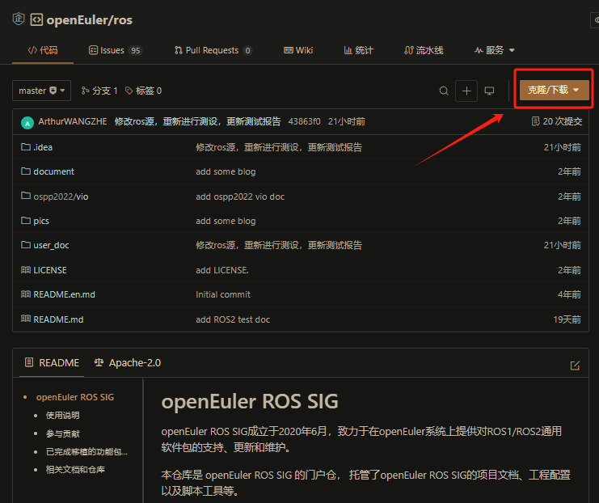
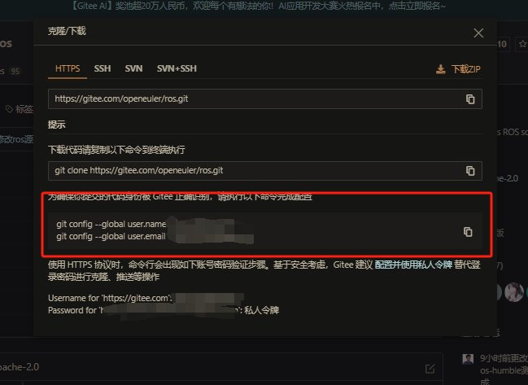
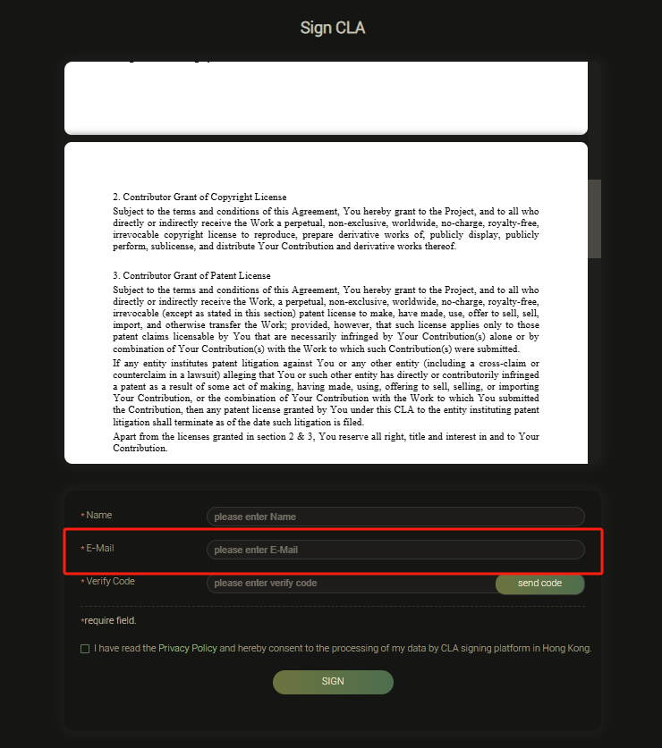
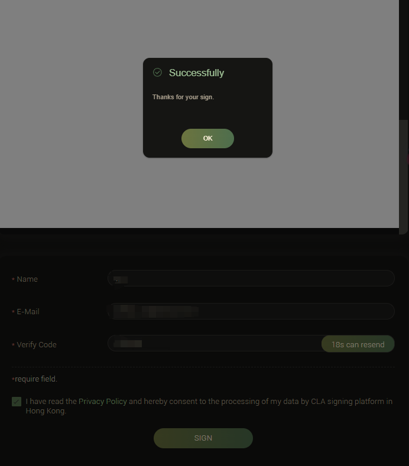

# 参与社区贡献&签署CLA

欢迎对ROS项目感兴趣的成员加入ROS SIG。

关于如何在openEuler开源社区开始贡献的指导文档请参考： [openEuler 贡献者指南](https://gitee.com/openeuler/community/blob/master/zh/contributors/README.md ) 以及[贡献攻略](https://www.openeuler.org/zh/community/contribution/) 

## 签署CLA

前置任务：注册 Gitee[Gitee 帮助中心 - Gitee.com](https://gitee.com/help#article-header0)，了解gitee工作流[Gitee工作流](https://gitee.com/openeuler/community/blob/master/zh/contributors/Gitee-workflow.md)

### 设置Git

签署cla之前需要正确的配置git，git上的邮箱以及用户名需要与gitee上的相一致
可以在gitee上找一个项目，点击**克隆/下载** 一个下面会跳出一个提示窗口告诉，显示相应的`user.name`和`user.email`





复制到终端执行这两行命令
```
git config --global user.name 'yourusername' 
git config --global user.email 'youruseremail'
```

### 签署CLA

#### 0.什么是CLA

CLA（Contributor License Agreement, 社区贡献者许可协议）。
参考文章：[https://zhuanlan.zhihu.com/p/68251730?from_voters_page=true](https://gitee.com/link?target=https%3A%2F%2Fzhuanlan.zhihu.com%2Fp%2F68251730%3Ffrom_voters_page%3Dtrue)
CLA是开源社区为了避免法律纠纷而要求贡献者签署的一个协议。
对 openeuler 开源社区的仓库提交合并代码（Pull Request），就会检验该代码的提交者(committer)邮箱是否签署CLA， 未签署CLA的代码不予合并。建议在提交PR之前，就完成CLA的签署。
需要注意区分企业还是个人，企业签署CLA可以参考[企业签署 CLA ，正式加入 openEuler 社区的流程](https://www.openeuler.org/zh/blog/2022-11-25-cla/CLA%E7%AD%BE%E7%BD%B2%E6%B5%81%E7%A8%8B.html)

#### 1. 选择个人开发者

个人开发者可以打开这个[网站](https://clasign.osinfra.cn/sign/gitee_openeuler-1611298811283968340)进行cla的签署
注意区分企业以及个人


### 2. 填写信息
注册的时候要注意：
- gitee注册邮箱、CLA签署建议使邮箱一致


### 3. 签署成功
点击Sign稍等片刻签署成功
- 首次提交PR（pull request）时，按照机器人提示在评论区回复`/check-cla`检查 [参考链接](https://gitee.com/openeuler/RISC-V/pulls/39)
- Gitee设置有“提交邮箱”这个东西，如果和cla里的邮箱不一致就会不通过
按照以上过程执行，/check-cla 还是不通过的，请在以[issue](https://gitee.com/openeuler/RISC-V/issues) 方式反馈问题，会有人协助处理。 （或者[openEuler RISC-V SIG 公开交流群]中加速沟通快速解决）

