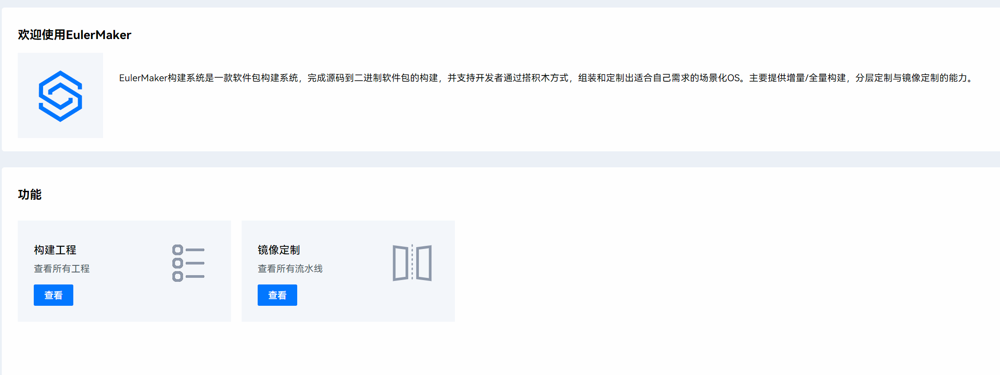
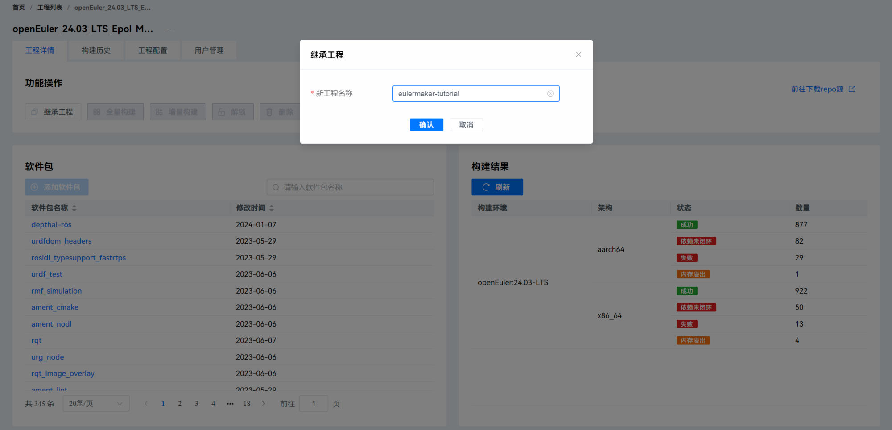
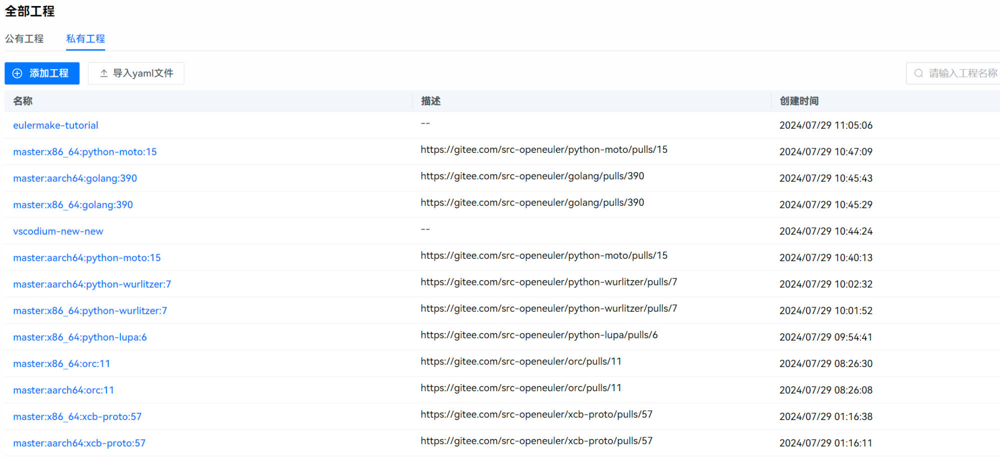
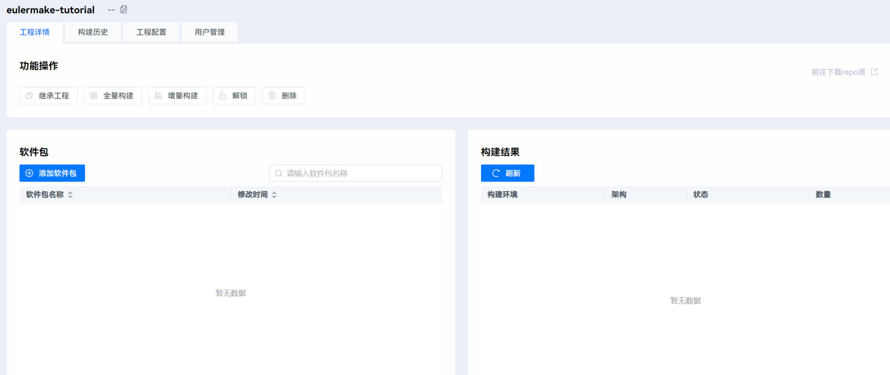
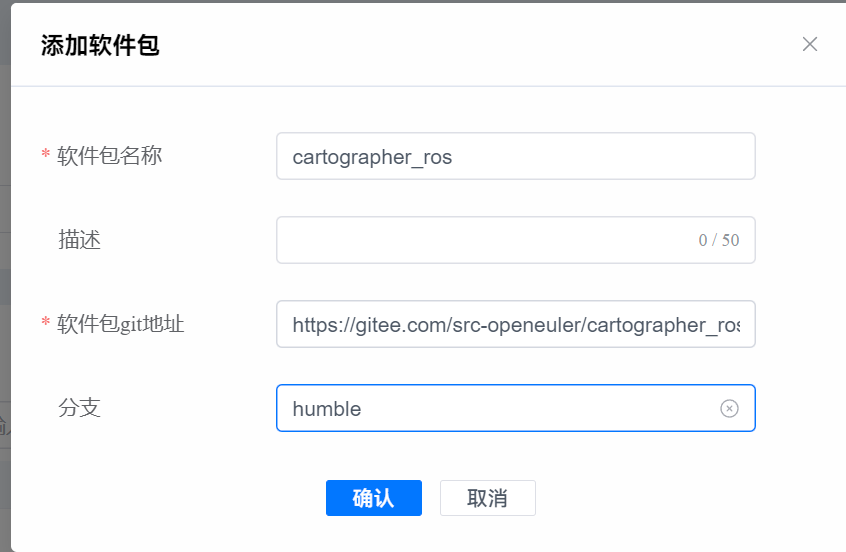
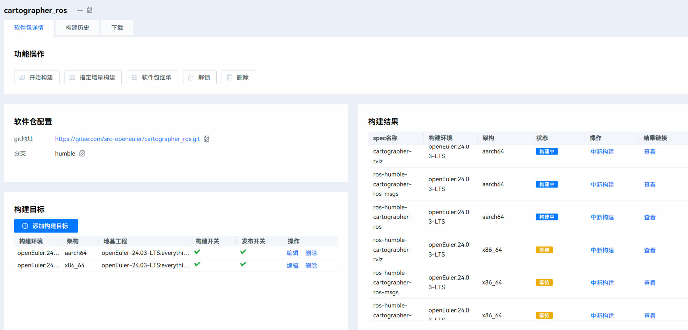

# EulerMaker工具的使用
在使用euler maker构建软件包的时候，我们首先需要区分一下两个概念

*   工程
*   镜像

工程即为你要构建的项目，而镜像则是你项目具体跑在那个版本的os上。

在openeuler里面主要有两个workflow，一个是软件包的构建，还有一个是定制镜像的workflow

在本篇指南中构建镜像的操作并不会被详细说明。

Get start
---------

首先进入EulerMaker官网

在本文中，我们以[cartographer\_ros](https://gitee.com/src-openeuler/cartographer_ros)这个包为例，作为构建对象：

在首页中，我们在公有工程中选择openEuler\_24.03\_LTS\_Epol\_Multi-Version\_ROS\_humble作为父工程，继承以后建立一个自己的工程名称，这里命名为`eulermake-tutorial`

在私有工程中可以看到自己建立的工程

然后添加软件包，这里我们选择humble分支作为需要构建的分支。

然后点击增量构建，在构建历史可以看到构建状态。

关于 _状态_

*   构建阻塞：有别的项目在构建，需要排队
*   构建中：说明你的项目正在构建
*   其他：如构建失败，依赖未闭环，你可能需要先进行检查自己的项目.spec文件是否正确配置，patch文件是否正常打上，可以点击job ID进去查看构建的日志文件。

> 在本人浅薄的实践经验看来，出错日志经常在以下几个部分（有别的实践经验欢迎补充）：
> 
> *   patch文件不符合规范。 这一点是折磨我好久的事情，打patch的时候如果有多个在同一文件上的补丁，一定需要按照严格的顺序在spec里面声明，否则只需要打一个就行。
> *   依赖问题。当有些包按照ros-porting-tools自动生成的时候由于openeuler软件源不全经常会遇到缺包少包的问题。

当然，最近eulermaker似乎非常不稳定，经常刷新页面以后404，所以你可能需要等待一段时间。

> Don't panic.

然后等待构建成功以后就可以下载构建完成的rpm包了。

在软件包→软件包名称→下载 可以找到对应的软件包。
