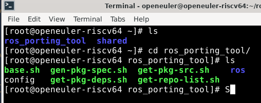

# base.h

该脚本的主要目的是在 ROS 和 OpenEuler 的开发和构建环境中进行初始化配置，确保构建过程能够顺利进行，日志记录过程能够追踪错误、信息和调试细节。它通过配置和组织必要的环境变量、分支名称和输出路径，为后续的代码构建、依赖管理和发布过程打下基础。

## 设置环境变量和分支变量
```  
ROOT=`pwd`  
ROS_DISTRO=`grep ROS_DISTRO config | cut -d'=' -f2`  
SRC_TAR_FROM=`grep SRC_TAR_FROM config | cut -d'=' -f2`  
DEBUG=`grep DEBUG config | cut -d'=' -f2`  
SRC_TAR_BASE_URL=`grep SRC_TAR_BASE_URL config | cut -d'=' -f2`  
GITEE_ORG=`grep GITEE_ORG config | cut -d'=' -f2`  
GITEE_DOMAIN=`grep GITEE_DOMAIN config | cut -d'=' -f2` 
OBS_DOMAIN=`grep OBS_DOMAIN config | cut -d'=' -f2`    
OBS_PROJECT=`grep OBS_PROJECT config | cut -d'=' -f2`  
OPENEULER_BASE_VERSION=`grep OPENEULER_BASE_VERSION config | cut -d'=' -f2`  
OPENEULER_SP_VERSION=`grep OPENEULER_SP_VERSION config | cut -d'=' -f2`  
OPENEULER_DEV_BRANCH=${ROS_DISTRO}  
OPENEULER_ROS_DEP_NEXT_BRANCH=${OPENEULER_BASE_VERSION}-Next  
OPENEULER_NEXT_BRANCH=Multi-Version_ros-${OPENEULER_DEV_BRANCH}_${OPENEULER_BASE_VERSION}-Next
```
这部分代码从一个名为 config 的配置文件中提取键值对，并将这些值赋给相应的变量。使用了从 config 文件中提取的 ROS_DISTRO 和 OPENEULER_BASE_VERSION 来构造一些 Git 分支的名称。

## 这些环境变量：
```
ROS_DISTRO			ROS的发行版
SRC_TAR_FROM			代码的来源 URL地址
SRC_TAR_BASE_URL		远程仓库或镜像站点的地址
GITEE_ORG			Gitee 上的组织名
GITEE_DOMAIN			Gitee 的域名
OBS_DOMAIN			Open Build Service (OBS) 的域名
OBS_PROJECT			OBS 中的项目名称
OPENEULER_BASE_VERSION		OpenEuler 操作系统的基础版本
PENEULER_SP_VERSION		OpenEuler 系统的服务包版本
OPENEULER_DEV_BRANCH		OpenEuler 的开发分支
OPENEULER_ROS_DEP_NEXT_BRANCH	指示与 ROS 相关的 OpenEuler 下一个依赖分支
OPENEULER_NEXT_BRANCH		指示 ROS 与 OpenEuler 的下一个版本分支
OUTPUT、ROS_OUTPUT_TMP路径变量 	这些路径变量用于设置输出目录、临时目录、源代码目录、依赖目录等
```


# get-repo-list.sh

该脚本的作用是读取一个 ROS 项目的列表文件，解析每个项目的 Git 仓库信息，检查是否有版本修复，生成一个新的 ros.repos 文件，该文件包含每个项目的仓库 URL、分支和版本。最终，脚本确保每个仓库的 URL 和项目名称在输出中唯一，并记录所有相关的日志信息。

## 项目处理

脚本遍历 ros-projects.list 文件中的每个项目，处理每个项目的 Git URL 和分支信息。  
    URL 解析： 根据不同的 Git 托管平台（如 GitHub、GitLab、Gitee、Bitbucket），脚本会提取项目名、分支（如 master、main）和 URL。例如：  
        对于 GitHub 和 GitLab，脚本会处理 .git 结尾的 URL，并提取仓库名。
        对于 Gitee，处理包含 /tree/ 的 URL，提取分支名称。
    版本和分支： 根据项目的 URL 和状态，脚本为每个项目确定正确的 Git URL 和分支（或标签）。如果 URL 中没有分支信息，则默认使用 master 或 main。

## 生成输出  
写入 ROS_PKG_LIST：将每个项目的信息写入 ROS_PKG_LIST，包括包名、项目名、版本、Git URL 和分支。  
写入 ROS_REPOS_URL 和 ROS_PROJECTS_NAME：确保每个项目的 URL 和名称都唯一且不会重复。  
写入 ROS_REPOS：根据项目名称、URL 和版本生成相应的仓库信息，写入 ros.repos 文件中，格式如下：  

```
$project_name:
  type: git
  url: $new_url
  version: $fix_version
```


# get-pkg-src.sh

生成一个 ros-pkg-src.list 文件，这个文件包含了有关 ROS 软件包的源路径、版本信息、Git URL 等内容。脚本通过解析 ROS_PKG_LIST 文件中列出的每个软件包及其信息，查找和确认每个软件包的源路径并将相关信息写入到 ros-pkg-src.list 文件中

## main 函数是脚本的入口，执行以下操作：  
调用 prepare 函数进行前置检查。  
输出日志，表示开始分析 ROS 软件包。    
从 ROS_PKG_LIST 中读取每行（每个软件包的详细信息），依次处理每个软件包。   
根据读取的内容（如软件包名、路径、版本等），通过 find_pkg_src_path_by_package_xml 函数查找软件包的源路径。    
将每个软件包的信息（名称、源路径、版本、Git URL 和树形结构）写入 ros-pkg-src.list 文件。    

## 如何根据 SRC_TAR_FROM 判断包源     
如果 SRC_TAR_FROM 为 "ubuntu"，表示包来自 Ubuntu 系统，脚本将根据文件名（如 .orig.tar.gz）来确定包的源路径。  
否则，它将根据 package.xml 文件的存在来推断包的源路径。
    


# get-pkg-deps.sh 

这个脚本通过解析每个 ROS 包的 package.xml 文件，读取其中的依赖信息，并生成适当的依赖关系文件。它处理了不同类型的依赖（构建、执行、测试等），并确保这些依赖被正确记录和分类。这些依赖关系文件可以用于后续的构建或部署工作。

## gen_depend()：
这是脚本中最重要的函数。它负责解析每个包的依赖并将其分类（根据 depend_name 例如 depend, build_depend, exec_depend 等）。从 ROS_DEPS_BASE 目录中的 pkg-PackageXml 文件中读取依赖关系数据，并根据类型生成相应的依赖信息。  
对于每个依赖包：如果该依赖包在 ROS_PKG_LIST 中，脚本会生成特定的依赖格式；如果没有找到，就将依赖包添加到外部依赖文件（pkg-ExtDeps）。脚本根据不同的依赖类型（all、exec、build 等）调用 write_dep 来记录依赖。通过对不同类型的依赖（如 run_depend, test_depend, buildtool_depend）进行处理，脚本为每个软件包生成多个不同的依赖文件。
	
## 核心逻辑：
ROS_PKG_SRC 文件包含了 ROS 包的信息。脚本会从中读取每个包的名称、路径和版本，并处理每个包的依赖关系。
gen_depend() 会根据不同的依赖类型（如 depend, build_depend, exec_depend 等）生成依赖关系，并将其写入到相应的文件中。
例如：
    对于 depend 类型的依赖，生成 pkg-BuildDepends 和 pkg-ExecDepends 文件。
    对于 build_depend 类型的依赖，生成 pkg-BuildDepends 文件。
    对于 test_depend 类型的依赖，生成 pkg-TestDepends 文件。
        


### gen-pkg-spec.sh
准备工作：首先通过 prepare() 函数进行初始化，确保所有必要的文件和目录存在。  
为每个包生成 spec 文件：通过读取 ROS 包列表，脚本逐个处理包的依赖关系、版本、描述信息等，最终生成 spec 文件。
包修复：如果某个包有特殊的修复要求（如通过 source.fix 或 prep.fix 文件），则会将这些修复应用到 spec 文件中。
生成 multibuild 文件：如果 GEN_ONE 参数为空，则会生成一个包含多个包的 multibuild 文件，方便多包构建。
当前面脚本完成后，这一步就是进行打包。


# 操作流程
## 1.创建工作环境
文件结构
```
ros-porting-tools\
		  base.sh
		  get-repo-list.sh
		  get-pkg-src.sh
		  get-pkg-deps.sh
		  gen-pkg-spec.sh
		  \ros
		  	\humble
		  		ros-projects.list
```
		  		
		  		
## 2.运行get-repo-list.sh解析ros-projects.list


## 3.执行vcs import src < ros.repos
文件结构
ros-porting-tools\
		  base.sh
		  get-repo-list.sh
		  get-pkg-src.sh
		  get-pkg-deps.sh
		  gen-pkg-spec.sh
		  \ros
		  	\humble
		  		ros-projects.list
在这里执行	    \output
			
		  	\src	

这一步是根据解析的链接下载源码

## 4.执行get-pkg-src.sh
文件结构
```
ros-porting-tools\    在这里执行
		  base.sh
		  get-repo-list.sh
		  get-pkg-src.sh
		  get-pkg-deps.sh
		  gen-pkg-spec.sh
		  \ros
		  	\humble
		  		ros-projects.list
		  \output
			
		  	\src
		  		\许多源码包
```


## 5.执行get-pkg-deps.sh
文件结构
```
ros-porting-tools\    在这里执行
		  base.sh
		  get-repo-list.sh
		  get-pkg-src.sh
		  get-pkg-deps.sh
		  gen-pkg-spec.sh
		  \ros
		  	\humble
		  		ros-projects.list
		  \output
			
		  	\src
		  		\许多源码包
			ros-pkg-src.list
```


## 6.执行gen-pkg-spec.sh
ros-porting-tools\    在这里执行
		  base.sh
		  get-repo-list.sh
		  get-pkg-src.sh
		  get-pkg-deps.sh
		  gen-pkg-spec.sh
		  \ros
		  	\humble
		  		ros-projects.list
		  \output
			
		  	\src
		  		\许多源码包
			ros-pkg-src.list
			\deps

部分源码包可以打包成功

## 7.上传tar包和spec到对应的ros仓库
由于批量上传脚本缺失ros-push.list文件，所以直接手动fork src-openeuler仓库，上传到自己fork的仓库，然后编译通过，提交pr即可。
