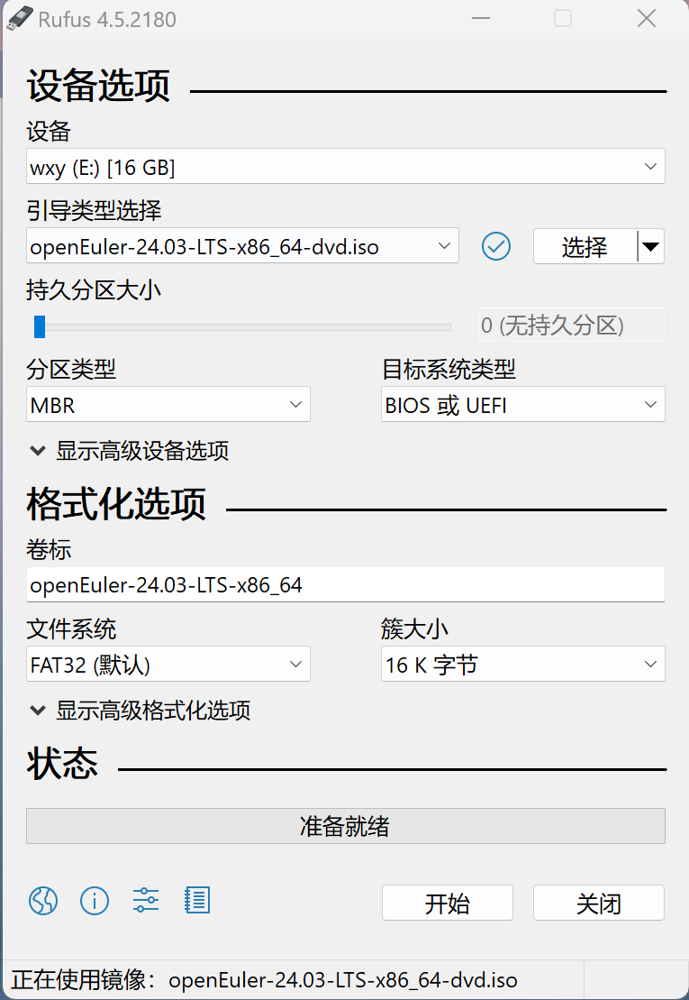
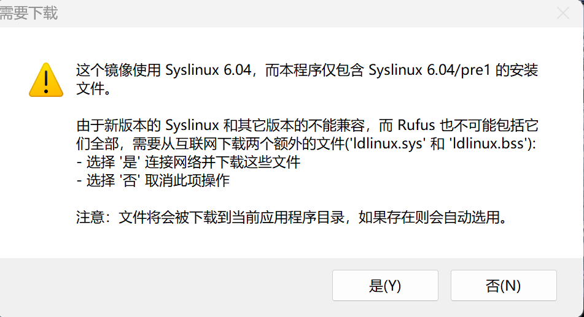
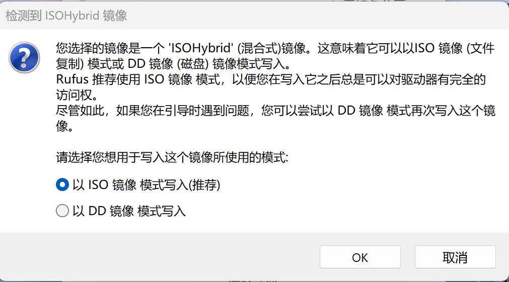
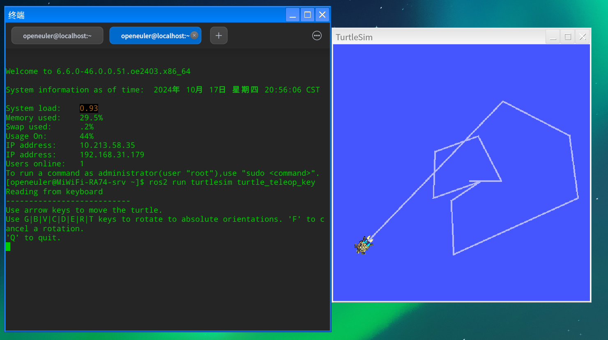

# 物理机安装openEuler24.03
本教程将以Intel NUC电脑主机为例，介绍物理机安装openEuler24.03系统的过程。

更多安装过程和要求可以参考：https://docs.openeuler.org/zh/docs/24.03_LTS/docs/Installation/%E5%AE%89%E8%A3%85%E6%96%B9%E5%BC%8F%E4%BB%8B%E7%BB%8D.html

`注意`：openEuler系统安装后默认没有无线wifi驱动，因此需要网线连接电脑提供网络环境

## 制作启动盘
- 根据电脑架构（x86/arm/riscv），从openEuler的官方网站下载最新的ISO镜像文件：https://repo.openeuler.org/openEuler-24.03-LTS/ISO/

- Intel Nuc是X86架构，因此这里下载的镜像是openEuler-24.03-LTS-x86_64-dvd.iso

- 可以使用Refus等工具制作安装启动盘。refus下载链接：https://rufus.ie/zh/#

- 刻录启动盘：插入U盘，将下载的ISO镜像文件刻录到U盘中，如下图所示，选择好U盘和镜像后，点击`开始`按钮进行刻录，等待几分钟完成



- 刻录时可能会弹出类似下面的窗口，点击是选择下载额外文件，选择以ISO镜像模式写入





## 进入BIOS，设置U盘启动项

每个电脑进入BIOS设置的快捷键不一致，这里大家可根据自己的电脑进行操作。

- 进入BIOS，将启动顺序调整为U盘优先，保存并退出

## 安装openEuler24.03

- 将制作好的启动盘插入NUC电脑，重启电脑，F10快捷键进入Boot界面如下图所示：


- 选择USB那一行的选项进入，可以看到如下所示的安装界面：


- 选择`Inatall openEuler 24.03-LTS`，点击`Enter`开始安装过程

- 整个安装过程与前面的虚拟机安装过程一致，这里不再赘述

- 安装完成后，拔下U盘，重启NUC电脑，可以进入openEuler系统的命令行界面

- 根据提示输入安装过程中设置的用户名和密码，可以进入如下所示界面，开始安装桌面系统等


## 安装桌面环境

- 更新源

```
sudo dnf update
```

- 输入以下命令安装dde桌面环境：

```
yum install dde
```

- 设置以图形化界面启动

```
systemctl set-default graphical.target
```

- 重启生效

```
reboot
```
- 重启后NUC电脑会自动进入dde桌面环境

## 安装ROS Humble

输入以下命令在/etc/yum.repos.d/ROS.repo文件中配置软件源：

- x86架构软件源配置：


  ```
  
  bash -c 'cat << EOF > /etc/yum.repos.d/ROS.repo
  [openEulerROS-humble]
  name=openEulerROS-humble
  baseurl= https://eulermaker.compass-ci.openeuler.openatom.cn/api/ems1/repositories/ROS-SIG-Multi-Version_ros-humble_openEuler-24.03-LTS-TEST4/openEuler%3A24.03-LTS/x86_64/
  enabled=1
  gpgcheck=0
  EOF'
  
  ```
  
- 依次输入以下命令安装ROS Humble所有软件包：

```
dnf update
dnf install "ros-humble-*" --skip-broken --exclude=ros-humble-generate-parameter-library-example
```

- 输入以下命令将环境变量写入~/.bashrc文件

```
echo "source /opt/ros/humble/setup.bash" >> ~/.bashrc
```

- 随后输入`source ~/.bashrc`来激活ROS环境变量的设置

- 安装ROS后，打开终端输入以下命令启动小乌龟仿真测试：

```
ros2 run turtlesim turtlesim_node
```
- 新开终端，输入以下命令启动键盘控制节点，在英文输入法下，可以根据终端提示按下键盘的上下左右键控制小乌龟运动：

```
ros2 run turtlesim turtle_teleop_key
```



## 安装无线wifi驱动

参考：https://blog.csdn.net/lcwyan/article/details/124632951

- 在终端依次输入以下命令安装驱动

```
yum clean all
yum makecache
yum install linux-firmware-iwlwifi
yum install iw
yum install wpa_supplicant
reboot
```
- 重启电脑后可在桌面右下角网络图标处选择wifi连接，或使用nmcli连接自己的wifi


