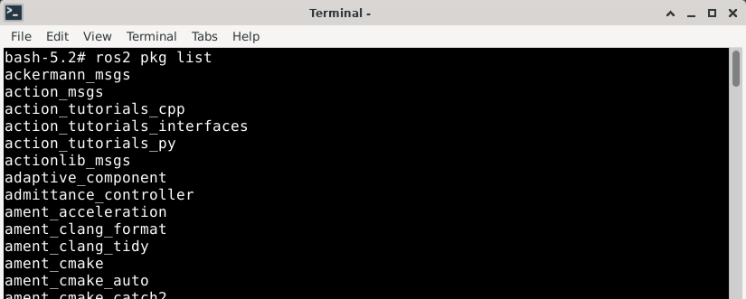
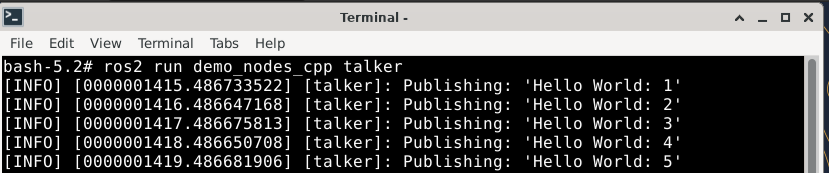
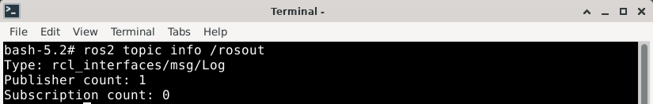
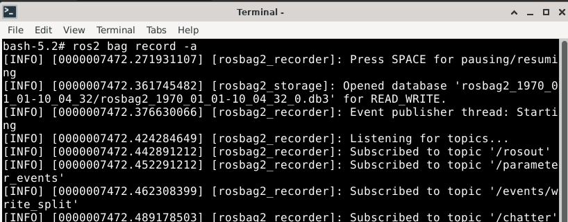
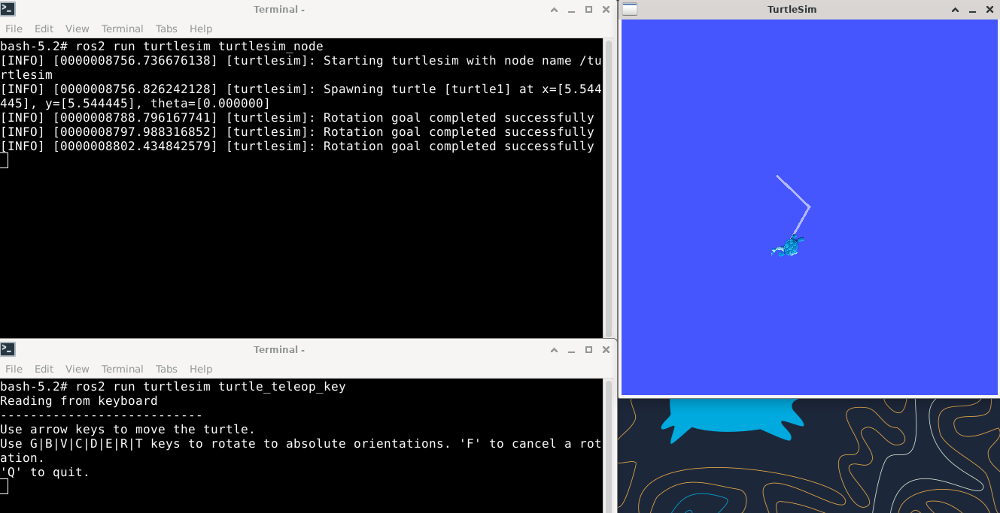

# 树莓派安装测试openEuler ROS Humble

ROS2 Humble 在 openEuler-24.03-LTS-raspi-aarch64 上的安装测试

## 测试环境
### 硬件信息
1. 树莓派 3B+
2. SD卡：128G （完成桌面与 ROS 安装后，大概占用为 25 G）

### 软件信息
1. OS：openEuler-24.03-LTS-raspi-aarch64
2. 镜像地址：https://repo.openeuler.org/openEuler-24.03-LTS/raspi_img/


## 安装系统
1. 参考 [OpenEuler 官方安装指引](https://docs.openeuler.org/zh/docs/24.03_LTS/docs/Installation/%E5%AE%89%E8%A3%85%E5%9C%A8%E6%A0%91%E8%8E%93%E6%B4%BE.html), 完成系统安装


## 测试环境安装
### XFCE 桌面安装
> 安装过程请以 [安装文档](https://docs.openeuler.org/zh/docs/24.03_LTS/docs/desktop/Install_XFCE.html) 为准

0. 更新软件源
   ```
   sudo dnf update
   ```
   **由于目前(2024.08.15)树莓派镜像中的 dnf 包更新时会卸载 dnf, 参见 [Issue](https://gitee.com/src-openeuler/dnf/issues/IAJTH8?from=project-issue)**

   **在 PR 合并解决问题之前, 可使用以下方式暂时应对, 继续完成试验:**
   ```
   ln -s /usr/bin/dnf-3 /usr/bin/dnf
   ```

1. 安装字库
   ```
   sudo dnf install dejavu-fonts liberation-fonts gnu-*-fonts google-*-fonts
   ```
2. 安装Xorg
   ```
   sudo dnf install xorg-*
   ```
3. 安装XFCE及组件
   ```
   sudo dnf install xfwm4 xfdesktop xfce4-* xfce4-*-plugin network-manager-applet *fonts
   ```
4. 安装登录管理器
   ```
   sudo dnf install lightdm lightdm-gtk
   ```
5. 设置默认桌面为XFCE 通过root权限用户设置
   ```
   echo 'user-session=xfce' >> /etc/lightdm/lightdm.conf.d/60-lightdm-gtk-greeter.conf
   ```
6. 使用登录管理器登录XFCE
   ```
   sudo systemctl start lightdm
   ```
7. 设置开机自启动图形界面
   ```
   sudo systemctl enable lightdm
   sudo systemctl set-default graphical.target
   ```
8. 重启验证
    ```
    sudo reboot
    ```

### ROS 安装
> 安装过程请以 [官网安装文档](https://docs.openeuler.org/zh/docs/24.03_LTS/docs/ROS/%E5%AE%89%E8%A3%85%E4%B8%8E%E9%83%A8%E7%BD%B2.html) 为准

1. 修改软件源
   ```
   bash -c 'cat << EOF > /etc/yum.repos.d/ROS.repo
    [openEulerROS-humble]
    name=openEulerROS-humble
    baseurl=https://eulermaker.compass-ci.openeuler.openatom.cn/api/ems1/repositories/ROS-SIG-Multi-Version_ros-humble_openEuler-24.03-LTS-TEST4/openEuler%3A24.03-LTS/aarch64/
    enabled=1
    gpgcheck=0
    EOF'
   ```

2. 安装 ROS2-humble
   ```
   dnf install "ros-humble-*" --skip-broken --exclude=ros-humble-generate-parameter-library-example
   ```

3. 在 shell 启动配置中加入 ros 环境激活配置
   ```
   echo "source /opt/ros/humble/setup.bash" >> ~/.bashrc
   ```

## 测试内容及测试结果

> 测试内容 [参考文档](https://gitee.com/openeuler/ros/blob/1b6ef5dae7692568d75be4af275a97cc56ca9067/user_doc/ROS-humble-oerv24.03-arm/README.md)

| 测试用例名                     | 状态 |
| ------------------------- |----|
| 测试ros2 pkg create         | 成功 |
| 测试ros2 pkg executables    | 成功 |
| 测试ros2 pkg list           | 成功 |
| 测试ros2 pkg prefix         | 成功 |
| 测试ros2 pkg xml            | 成功 |
| 测试ros2 run                | 成功 |
| 测试ros2 topic list         | 成功 |
| 测试ros2 topic info         | 成功 |
| 测试ros2 topic type         | 成功 |
| 测试ros2 topic find         | 成功 |
| 测试ros2 topic hz           | 成功 |
| 测试ros2 topic bw           | 成功 |
| 测试ros2 topic echo         | 成功 |
| 测试ros2 param 工具           | 成功 |
| 测试ros2 service 工具         | 成功 |
| 测试ros2 node list          | 成功 |
| 测试ros2 node info          | 成功 |
| 测试ros2 bag 工具             | 成功 |
| 测试ros2 launch 工具          | 成功 |
| 测试ros2 interface list     | 成功 |
| 测试ros2 interface package  | 成功 |
| 测试ros2 interface show     | 成功 |
| 测试 ros 通信组件相关功能           | 成功 |
| 测试 turtlesim功能            | 成功 |

### 1. ROS2 包工具
#### 1.1 创建包
使用命令 `ros2 pkg create --build-type ament_cmake mypkg` 创建一个新的ROS2包。


#### 1.2 包中的可执行文件
通过 `ros2 pkg executables turtlesim` 查看 turtlesim 包中的可执行文件。


#### 1.3 列出所有包
运行 `ros2 pkg list` 来列出当前系统中所有的ROS2包。




#### 1.4 包的安装路径
使用 `ros2 pkg prefix turtlesim` 来查找 turtlesim 包的安装路径。


#### 1.5 包的XML文件
通过 `ros2 pkg xml turtlesim` 查看 turtlesim 包的XML描述文件。


### 2. 运行工具
使用 `ros2 run demo_nodes_cpp talker` 来运行一个名为 talker 的节点。



### 3. 话题工具
#### 3.1 列出所有话题
执行 `ros2 topic list` 来查看当前系统中所有的话题。


#### 3.2 话题信息
使用 `ros2 topic info /rosout` 来获取 /rosout 话题的详细信息。



#### 3.3 话题类型
通过 `ros2 topic type /rosout` 来查看 /rosout 话题的消息类型。


#### 3.4 查找话题类型
使用 `ros2 topic find rcl_interfaces/msg/Log` 来查找指定消息类型的话题。


#### 3.5 话题发布频率
先运行 `ros2 run demo_nodes_cpp talker`，然后在另一个终端使用 `ros2 topic hz /chatter` 来测量 /chatter 话题的发布频率。


#### 3.6 话题带宽
同样在运行 talker 后，使用 `ros2 topic bw /chatter` 来测量 /chatter 话题的带宽。


#### 3.7 监听话题
在运行 talker 后，使用 `ros2 topic echo /chatter` 来监听 /chatter 话题的内容。


### 4. 参数工具
在运行 `ros2 run demo_nodes_cpp talker` 后，使用 `ros2 param list` 来列出当前节点的所有参数。


### 5. 服务工具
在运行 talker 后，使用 `ros2 service list` 来列出当前节点提供的所有服务。


### 6. 节点工具
#### 6.1 列出所有节点
在运行 talker 后，使用 `ros2 node list` 来列出当前系统中所有的节点。


#### 6.2 节点信息
在运行 talker 后，使用 `ros2 node info /talker` 来获取 talker 节点的详细信息。


### 7. 包记录工具
使用 `ros2 bag record -a` 来记录所有话题的数据。




#### 7.1 包信息
使用 `ros2 bag info [上一步存储的路径].db3` 来查看包的详细信息。


#### 7.2 播放包
使用 `ros2 bag play [上一步存储的路径].db3` 来播放记录的数据。


### 8. 启动工具
使用 `ros2 launch demo_nodes_cpp talker_listener.launch.py` 来启动一个包含多个节点的启动文件。


### 9. 接口工具
#### 9.1 列出所有接口
使用 `ros2 interface list` 来列出系统中的所有接口，包括消息、服务和动作。


#### 9.2 接口包
使用 `ros2 interface package action_msgs` 来查看 action_msgs 包中的接口。


#### 9.3 显示接口详细内容
使用 `ros2 interface show geometry_msgs/msg/TwistStamped` 来查看消息（服务和动作亦可）的详细内容。


### 10. 测试ROS通信组件
#### 10.1 话题通信
Python实现
在两个终端中分别运行 `ros2 run demo_nodes_py talker` 和 `ros2 run demo_nodes_py listener` 来测试话题通信。


#### 10.2 服务通信
C++实现
在两个终端中分别运行 `ros2 run demo_nodes_cpp add_two_ints_server` 和 `ros2 run demo_nodes_cpp add_two_ints_client` 来测试服务通信。


#### 10.3 测试ROS坐标转换
坐标转换的发布和订阅
在两个终端中分别运行 `ros2 run tf2_ros static_transform_publisher 1 1 1 0 0 0 /base_link /odom` 和 `ros2 run tf2_ros tf2_echo base_link odom` 来测试坐标转换。


### 11. 测试turtlesim
在两个终端中分别运行 `ros2 run turtlesim turtlesim_node` 和 `ros2 run turtlesim turtle_teleop_key` 来测试turtlesim的功能。

