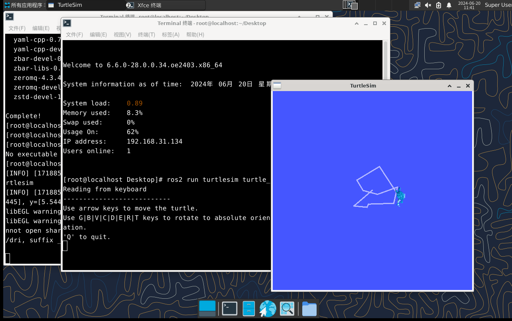

# 安装ROS Humble

本教程将介绍如何安装测试已经随openEuler系统发版的ROS Humble软件包。

openEuler ROS的开发测试可参考后续的基础教程各个专题教程。

在安装ROS Humble前，需确保已经安装好**openEuler操作系统** 和**系统桌面**。

## 添加ROS软件源

**注意**：

- 1.在openEuler 22.03系统上，输入`yum install openeuler-ros`时会自动配置ROS软件源，无需手动配置
- 2.目前在openEuler 24.03以及其他系统版本上仍需手动添加软件源
- 3.为方便定位问题以及解决bug，openEuler24.03的ROS软件源推荐使用本教程中设置的软件源，而非openEuler官方源
- 4.手动配置软件源时注意区分欧拉系统架构（x86、arm or riscv）

下面以openEuler24.03为例介绍软件源的配置过程。

输入以下命令在/etc/yum.repos.d/ROS.repo文件中配置软件源：

- x86架构软件源配置：

  ```
  bash -c 'cat << EOF > /etc/yum.repos.d/ROS.repo
  [openEulerROS-humble]
  name=openEulerROS-humble
  baseurl= https://eulermaker.compass-ci.openeuler.openatom.cn/api/ems1/repositories/ROS-SIG-Multi-Version_ros-humble_openEuler-24.03-LTS-TEST4/openEuler%3A24.03-LTS/x86_64/
  enabled=1
  gpgcheck=0
  EOF'
  ```


- ARM架构软件源配置：

  ```
  bash -c 'cat << EOF > /etc/yum.repos.d/ROS.repo
  [openEulerROS-humble]
  name=openEulerROS-humble
  baseurl=https://eulermaker.compass-ci.openeuler.openatom.cn/api/ems1/repositories/ROS-SIG-Multi-Version_ros-humble_openEuler-24.03-LTS-TEST4/openEuler%3A24.03-LTS/aarch64/
  enabled=1
  gpgcheck=0
  EOF'
  ```


- RISC-V架构软件源配置：

  ```
  bash -c 'cat << EOF > /etc/yum.repos.d/ROS.repo
  [openEulerROS-humble]
  name=openEulerROS-humble
  baseurl=https://build-repo.tarsier-infra.com/openEuler:/ROS/24.03/
  enabled=1
  gpgcheck=0
  EOF'
  ```

## 安装ROS Humble

依次输入以下命令安装ROS Humble所有软件包：

```
dnf update
dnf install "ros-humble-*" --skip-broken --exclude=ros-humble-generate-parameter-library-example
```

也可输入以下命令安装单独软件包：

```
yum install ros-humble-<package-name>
# or
dnf install ros-humble-<package-name>
```

例如输入以下命令安装ROS Humble基础包和turtlesim包

```
yum install ros-humble-ros-base ros-humble-turtlesim
```

安装上述软件包后，编辑 `~/.bashrc` 追加以下内容

```bash
source /opt/ros/humble/setup.bash
```

或者输入以下命令将上述语句写入~/.bashrc文件

```
echo " source /opt/ros/humble/setup.bash" >> ~/.bashrc 
```

随后输入`source  ~/.bashrc`来激活ROS环境变量的设置

## 测试小乌龟

安装ROS后，打开终端输入以下命令启动小乌龟仿真测试：

```
ros2 run turtlesim turtlesim_node
```


新开终端，输入以下命令启动键盘控制节点，在英文输入法下，可以根据终端提示按下键盘的上下左右键控制小乌龟运动：

```
ros2 run turtlesim turtle_teleop_key
```



若小乌龟仿真测试通过，则说明openEuler ROS已成功安装~
