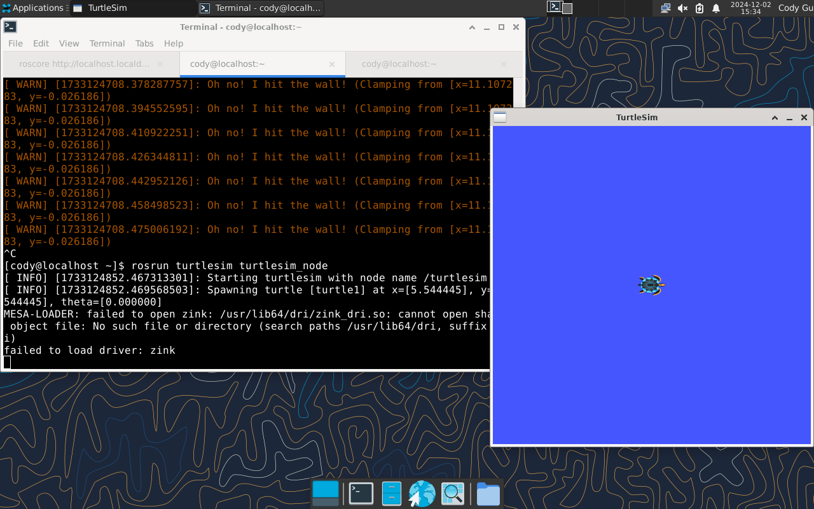
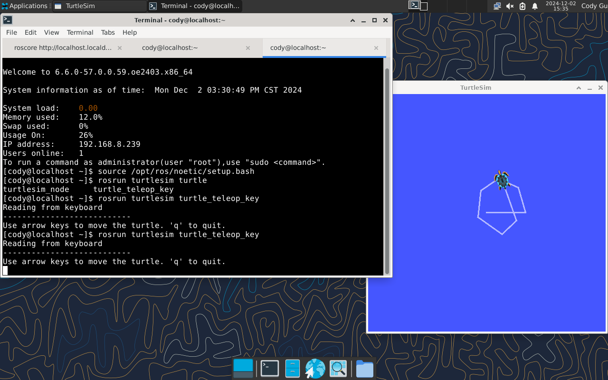

# 安装ROS Noetic

本教程将介绍如何在openEuler 24.03下安装测试ROS Noetic软件包。

在安装ROS Noetic前，需确保已经安装好**openEuler操作系统** 和**系统桌面**。

首先在[官网下载openEuler 24.03 LTS镜像](https://www.openeuler.org/zh/download/?version=openEuler%2024.03%20LTS)

按照[官网教程](https://docs.openeuler.org/zh/docs/24.03_LTS/docs/desktop/Install_XFCE.html)安装xfce桌面环境

## 添加ROS　Noetic软件源

下面以openEuler 24.03为例介绍软件源的配置过程。

输入以下命令在/etc/yum.repos.d/ROS.repo文件中配置软件源：

- x86架构软件源配置：

```
bash -c 'cat << EOF > /etc/yum.repos.d/ROS.repo
[openEulerROS-Noetic]
name=openEulerROS-Noetic
baseurl=https://eulermaker.compass-ci.openeuler.openatom.cn/api/ems1/repositories/ROS-SIG-Multi-Version_ros-noetic_openEuler-24.03-LTS-TEST1/openEuler%3A24.03-LTS/x86_64/
enabled=1
gpgcheck=0
EOF'
```

- ARM架构软件源配置：

```
bash -c 'cat << EOF > /etc/yum.repos.d/ROS.repo
[openEulerROS-Noetic]
name=openEulerROS-Noetic
baseurl=https://eulermaker.compass-ci.openeuler.openatom.cn/api/ems1/repositories/ROS-SIG-Multi-Version_ros-noetic_openEuler-24.03-LTS-TEST1/openEuler%3A24.03-LTS/aarch64/
enabled=1
gpgcheck=0
EOF'
```

## 安装ROS Noetic

依次输入以下命令安装ROS Noetic所有软件包：

```
sudo dnf update
sudo dnf install "ros-noetic-*" --skip-broken
```

也可输入以下命令安装单独软件包：

```
yum install ros-noetic-<package-name>
# or
dnf install ros-noetic-<package-name>
```

安装上述软件包后，编辑 `~/.bashrc` 追加以下内容

```bash
source /opt/ros/noetic/setup.bash
```

或者输入以下命令将上述语句写入~/.bashrc文件

```
echo "source /opt/ros/noetic/setup.bash" >> ~/.bashrc
```

随后输入`source ~/.bashrc`来激活ROS环境变量的设置

## 测试小乌龟

安装ROS后，打开终端输入以下命令启动小乌龟仿真测试：

```
rosrun turtlesim turtlesim_node
```



新开终端，输入以下命令启动键盘控制节点，在英文输入法下，可以根据终端提示按下键盘的上下左右键控制小乌龟运动：

```
rosrun turtlesim turtle_teleop_key
```



若小乌龟仿真测试通过，则说明openEuler ROS Noetic已成功安装～
