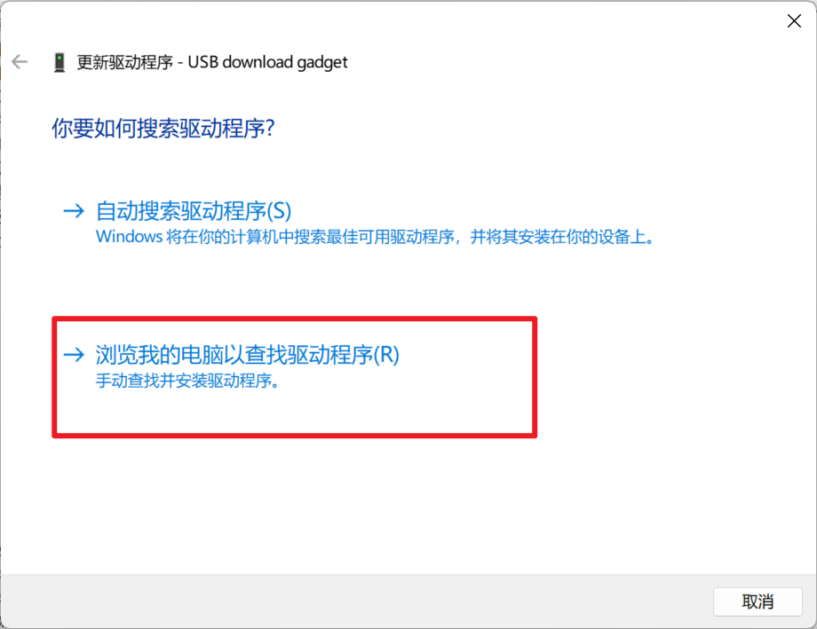
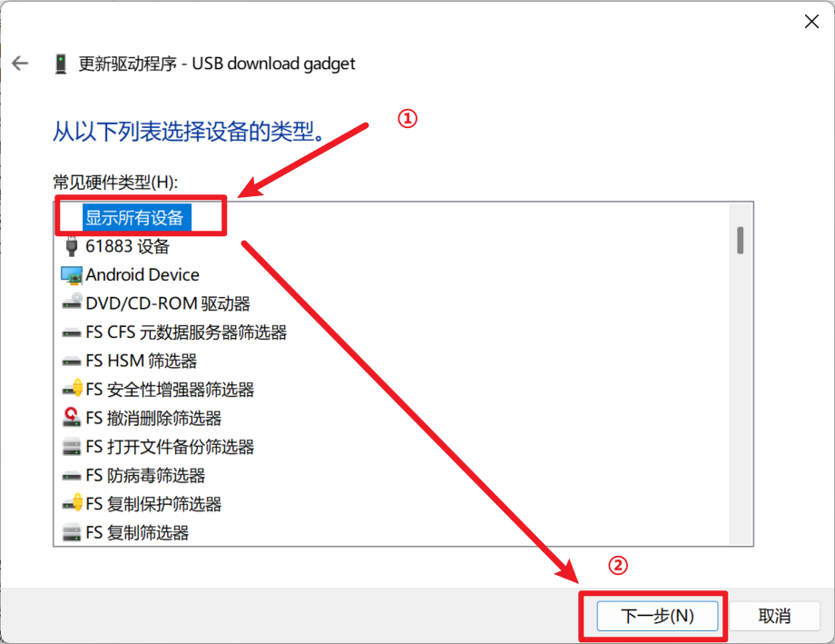
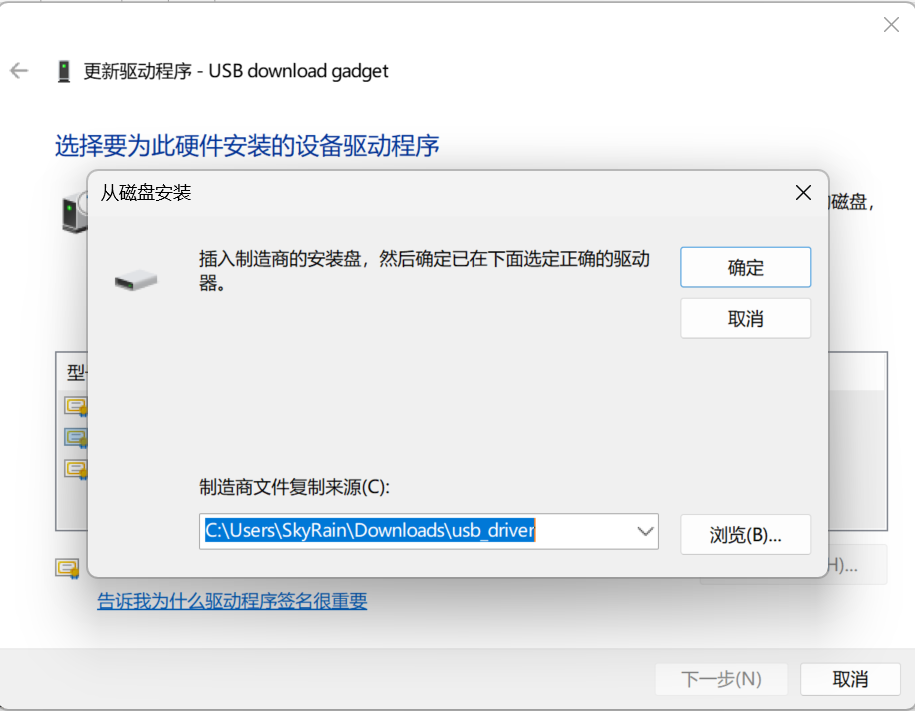
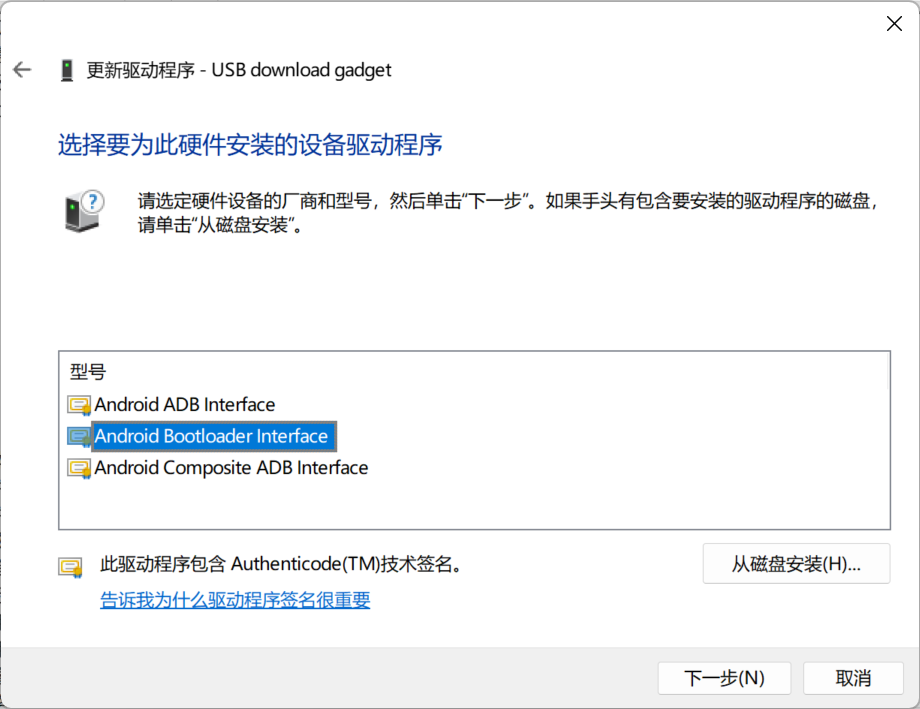
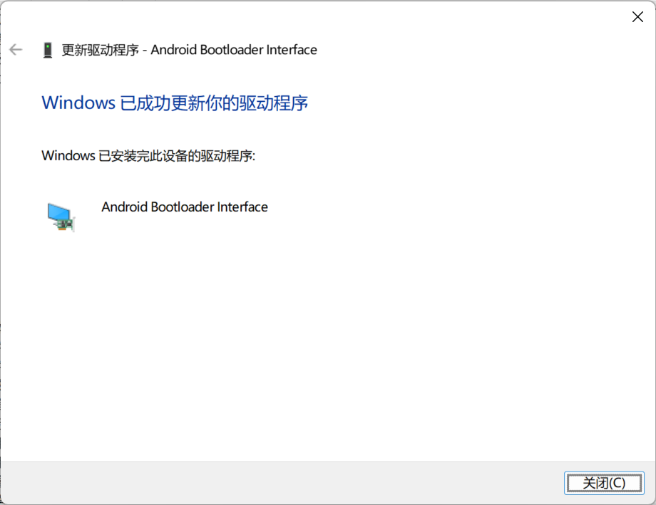
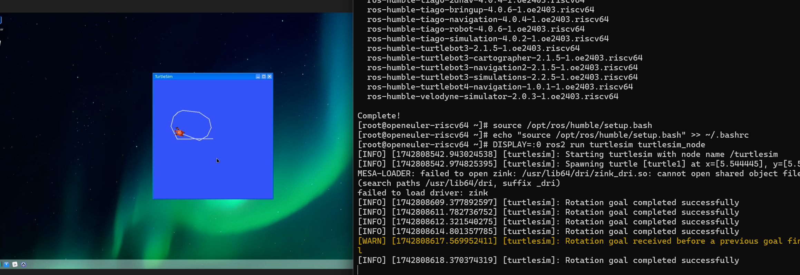

# RISC-V lpi4a 安装测试openEuler ROS Humble

## 环境信息

#### 硬件信息

1. LicheePi 4A
2. 处理器 TH1520
3. 内存 16GB
4. eMMC 128GB

#### 软件信息

1. OS 版本：openEuler-24.03-LTS-SP1-riscv64-lpi4a
2. 镜像地址：<https://www.openeuler.org/zh/download/?version=openEuler%2024.03%20LTS>
3. 软件源：[https://build-repo.tarsier-infra.isrc.ac.cn/openEuler:/ROS/24.03/](https://build-repo.tarsier-infra.isrc.ac.cn/openEuler:/ROS/24.03/)

登录用户名和密码如下

- 用户名：`root`

- 密码：`openEuler12#$`

## 刷写镜像并启动

前往官网，下载 `u-boot-with-spl-lpi4a-16g.bin`,`boot.ext4.zst`,`root.ext4.zst`三个文件
，如果你的Licheepi4A的RAM是8G版本，请下载`u-boot-with-spl-lpi4a.bin`

下载完成后的`boot.ext4.zst`和`root.ext4.zst`需要解压后才能烧录（uboot文件不需要解压），Windows系统请使用[7-Zip-zstd](https://github.com/mcmilk/7-Zip-zstd/releases)，Linux系统直接使用`zstd -d`命令解压

按住板上的BOOT按键不放，然后插入 USB-C 线缆上电（线缆另一头接 PC ），进入USB烧录模式


### Linux刷写eMMC方式安装

请注意！从 eMMC 启动前请先取出 SD 卡！

此处演示环境是 Ubuntu22.04

首先确保你系统内有wget、zstd、fastboot工具

```bash
sudo apt update
sudo apt install wget zstd fastboot
```

<!-- 下载并解压缩fastboot

```bash
wget https://dl.google.com/android/repository/platform-tools_r34.0.5-linux.zip
unzip platform-tools_r34.0.5-linux.zip && cd platform-tools
``` -->

使用wget命令下载uboot、boot及root文件

```bash
wget https://fast-mirror.isrc.ac.cn/openeuler/openEuler-24.03-LTS-SP1/embedded_img/riscv64/lpi4a/u-boot-with-spl-lpi4a-16g.bin
wget https://fast-mirror.isrc.ac.cn/openeuler/openEuler-24.03-LTS-SP1/embedded_img/riscv64/lpi4a/openEuler-24.03-LTS-SP1-riscv64-lpi4a-base-boot.ext4.zst
wget https://fast-mirror.isrc.ac.cn/openeuler/openEuler-24.03-LTS-SP1/embedded_img/riscv64/lpi4a/openEuler-24.03-LTS-SP1-riscv64-lpi4a-base-root.ext4.zst
```

如果你是8GB版本请下载`u-boot-with-spl-lpi4a.bin`并将下面的命令中的uboot替换成这个文件名

```bash
wget https://fast-mirror.isrc.ac.cn/openeuler/openEuler-24.03-LTS-SP1/embedded_img/riscv64/lpi4a/u-boot-with-spl-lpi4a.bin
```

使用如下命令解压镜像文件，解压大约占用5GB空间，u-boot文件不需要解压

```bash
zstd -d openEuler-24.03-LTS-SP1-riscv64-lpi4a-base-boot.ext4.zst
zstd -d openEuler-24.03-LTS-SP1-riscv64-lpi4a-base-root.ext4.zst
```

Linux下需要配置 udev rules 来解决 USB 设备文件权限问题

```bash
cat << EOF | sudo tee /etc/udev/rules.d/99-thead-th1520.rules
SUBSYSTEM=="usb", ATTR{idVendor}=="2345", ATTR{idProduct}=="7654", MODE="0660", GROUP="plugdev", TAG+="uaccess"
SUBSYSTEM=="usb", ATTR{idVendor}=="1234", ATTR{idProduct}=="8888", MODE="0660", GROUP="plugdev", TAG+="uaccess"
EOF
```

执行后需要重新插拔 USB 使新规则生效。

按住板上的BOOT按键不放，然后插入 USB-C 线缆上电（线缆另一头接 PC ），进入USB烧录模式，输入`lsusb`命令检查是否识别到如下的fastboot设备

```
Bus 003 Device 005: ID 2345:7654 T-HEAD USB download gadget
```

使用`sudo fastboot devices`检查是否识别到fastboot设备，应该出现如下内容

```
????????????    fastboot
```

然后使用如下命令烧写镜像到设备eMMC中

```bash
fastboot flash ram ./u-boot-with-spl-lpi4a-16g.bin
fastboot reboot
sleep 1
fastboot flash uboot ./u-boot-with-spl-lpi4a-16g.bin
fastboot flash boot ./openEuler-24.03-LTS-SP1-riscv64-lpi4a-base-boot.ext4
fastboot flash root ./openEuler-24.03-LTS-SP1-riscv64-lpi4a-base-root.ext4
```

随后耐心等待烧录完成即可，大约需要5分钟

### Windows刷写eMMC方式安装

按住板卡上的BOOT键后，将靠近BOOT键的Type-C口接入电脑，板卡会进入刷写模式。

在Windows徽标右键，打开设备管理器，如果在“其他设备”处看到“USB download gadget”，即表明设备已被正确识别。但是未安装驱动程序。

为了打入fastboot驱动，需要下载[Google USB驱动（需要代理）](https://dl.google.com/android/repository/usb_driver_r13-windows.zip)，下载并解压到某一位置。

  1. 右键设备管理器中的“USB download gadget”，点击“更新驱动程序”
  2. 选择“浏览我的电脑以查找驱动程序” 
  3. 选择“让我从计算机上的可用驱动程序列表中选取”
  4. 选中“显示所有设备”，并点击“下一步” 更新驱动程序步骤
  5. 点击“从磁盘安装”
  6. 点击“浏览”，选中Google USB驱动下的inf文件，点击确定
  7. 选中“Android Bootloader Interface”，点击“下一步”，在弹出对话框中点击“是”，在弹出的Windows安全中心对话框中点击“安装”
  8. 成功安装fastboot驱动

若上述步骤出现问题，请回到设备管理器找到该设备，点击“卸载驱动程序”，然后重新插拔开发板并重试。

Windows用户请先下载[Android SDK平台工具](https://developer.android.google.cn/tools/releases/platform-tools?hl=zh-cn#downloads)并将其解压到合适的位置。在包含`fastboot.exe`的文件夹中打开`Powershell`（空白处右键->在终端中打开），运行`.\fastboot.exe --version`，判断`fastboot.exe`是否能够正常运行。

```
PS C:\xxx\platform-tools> .\fastboot.exe --version
fastboot version 35.0.2-12147458
Installed as C:\xxx\platform-tools\fastboot.exe
```

如果如上所示能够正常显示版本号则说明fastboot安装成功。

然后开始烧录镜像，请将命令中的镜像替换为您下载的镜像的路径，可在资源管理器中将文件拖放到终端以快速输入文件的路径

```
.\fastboot.exe flash ram .\u-boot-with-spl-lpi4a-16g.bin
.\fastboot.exe reboot
sleep 1
.\fastboot.exe flash uboot .\u-boot-with-spl-lpi4a-16g.bin
.\fastboot.exe flash boot .\openEuler-24.03-LTS-SP1-riscv64-lpi4a-base-boot.ext4
.\fastboot.exe flash root .\openEuler-24.03-LTS-SP1-riscv64-lpi4a-base-root.ext4
```

随后耐心等待烧录完成即可，大约需要5分钟

### 从SD卡启动

TODO

## 测试安装

### 修改软件源

执行以下命令设置软件源：

```bash
bash -c 'cat << EOF > /etc/yum.repos.d/ROS.repo
[openEulerROS-humble]
name=openEulerROS-humble
baseurl=https://build-repo.tarsier-infra.com/openEuler:/ROS/24.03/
enabled=1
gpgcheck=0
EOF'
```

修改 /etc/yum.repos.d/openEuler.repo 中的以下部分

```
[EPOL]
name=EPOL
baseurl=http://repo.openeuler.org/openEuler-24.03-LTS-SP1/EPOL/main/$basearch/
.....

[update]
name=update
...
enabled=0
....

[debuginfo]
name=debuginfo
....
enabled=0
.....
```

### 安装

```bash
dnf install "ros-humble-*" --skip-broken --exclude=ros-humble-generate-parameter-library-example
```

安装上述软件列表后，编辑 `~/.bashrc` 追加以下内容

```bash
source /opt/ros/humble/setup.sh
```

随后输入`source ~/.bashrc`来激活

## 测试用例列表及测试结果

测试用例列表如下

| 测试用例名                  | 状态 |
| --------------------------- | ---- |
| 测试 turtlesim功能          | 成功 |
| 使用HDMI开机                | 成功 |
| 安装桌面环境并启动           | 成功 |
| 测试ros2 pkg create         | 成功 |
| 测试ros2 pkg executables    | 成功 |
| 测试ros2 pkg list           | 成功 |
| 测试ros2 pkg prefix         | 成功 |
| 测试ros2 pkg xml            | 成功 |
| 测试ros2 run                | 成功 |
| 测试ros2 topic list         | 成功 |
| 测试ros2 topic info         | 成功 |
| 测试ros2 topic type         | 成功 |
| 测试ros2 topic find         | 成功 |
| 测试ros2 topic hz           | 成功 |
| 测试ros2 topic bw           | 成功 |
| 测试ros2 topic echo         | 成功 |
| 测试ros2 param 工具         | 成功 |
| 测试ros2 service 工具       | 成功 |
| 测试ros2 node list          | 成功 |
| 测试ros2 node info          | 成功 |
| 测试ros2 bag 工具           | 成功 |
| 测试ros2 launch 工具        | 成功 |
| 测试ros2 interface list     | 成功 |
| 测试ros2 interface package  | 成功 |
| 测试ros2 interface packages | 成功 |
| 测试ros2 interface show     | 成功 |
| 测试ros2 interface proto    | 成功 |
| 测试 ros 通信组件相关功能   | 成功 |

## 安装桌面环境

openEuler 24.03 LTS SP1 源里暂时没有提供XFCE的包，可以使用dde桌面。

- 更新源

```
sudo dnf update
```

- 输入以下命令安装dde桌面环境：

```
yum install dde
```

- 设置以图形化界面启动

```
systemctl set-default graphical.target
```

- 重启生效

```
reboot
```

- 重启后会自动进入dde桌面环境

## 测试 ros 基础工具相关功能

#### 1 ros2 pkg 工具

##### 1.1 ros2 pkg create

执行 `ros2 pkg create riscv-ros-pkg`，输出如下，且当前目录存在相应文件夹，测试通过


##### 1.2 ros2 pkg executables

执行 `ros2 pkg executables turtlesim`，输出如下，测试通过


##### 1.3 ros2 pkg list

执行 `ros2 pkg list`，输出如下，测试通过


##### 1.4 ros2 pkg prefix

执行 `ros2 pkg prefix turtlesim`，输出如下，测试通过


##### 1.5 ros2 pkg xml

执行 `ros2 pkg xml turtlesim`，输出如下，测试通过


#### 2 ros2 run 工具

执行 `ros2 run demo_nodes_cpp talker`，输出如下，测试通过


#### 3 ros2 topic 工具

##### 3.1 ros2 topic list

执行  `ros2 topic list`，输出如下，测试通过


##### 3.2 ros2 topic info

执行 `ros2  topic info /rosout`，输出如下，测试通过


##### 3.3 ros2 topic type

执行 `ros2 topic type /rosout`，输出如下，测试通过


##### 3.4 ros2 topic find

执行 `ros2 topic find rcl_interfaces/msg/Log`，输出如下， 测试通过


##### 3.5 ros2 topic hz

分别执行命令 `ros2 run demo_nodes_cpp talker`，`ros2 topic hz /chatter`，输出如下，测试通过


##### 3.6 ros2 topic bw

分别执行命令 `ros2 run demo_nodes_cpp talker`，`ros2 topic bw /chatter`，输出如下，测试通过


##### 3.7 ros2 topic echo

分别执行命令 `ros2 run demo_nodes_cpp talker`，`ros2 topic echo /chatter`，输出如下，测试通过


#### 4 ros2 param 工具

分别执行命令 `ros2 run demo_nodes_cpp talker`, `ros2 param list`，输出如下，测试通过


#### 5 ros2 service 工具

分别执行命令 `ros2 run demo_nodes_cpp talker`, `ros2 service list`，输出如下，测试通过


#### 6 ros2 node 工具

##### 6.1 ros2 node list

分别执行命令 `ros2 run demo_nodes_cpp talker`, `ros2 node list`，输出如下，测试通过


##### 6.2 ros2 node info

分别执行命令 `ros2 run demo_nodes_cpp talker`, `ros2 node info /talker`，输出如下，测试通过


#### 7 ros2 bag 工具

输入 `ros2 bag record -a`,

检查当前目录，如下，测试通过


ros2 bag info 工具

执行 `ros2 bag info rosbag2_2023_11_23-21_48_31/rosbag2_2023_11_23-21_48_31_0.db3 ` （文件由上一步骤生成）命令，输出如下，测试通过


执行 `ros2 bag play rosbag2_2023_11_23-21_48_31/rosbag2_2023_11_23-21_48_31_0.db3` 命令，输出如下，测试通过


#### 8 ros2 launch 工具

输入 `ros2 launch demo_nodes_cpp talker_listener.launch.py`，输出如下，测试通过


#### 9 ros2 interface 工具

##### 9.1 ros2 interface list

分类显示系统内所有的接口，包括消息（Messages）、服务（Services）、动作（Actions）。

执行 `ros2 interface list` ，输出如下，测试通过


##### 9.2 ros2 interface package

显示指定接口包内的子接口。

执行 `ros2 interface package action_msgs` ，输出如下，测试通过


##### 9.3 ros2 interface packages

显示指定接口包。

执行 `ros2 interface packages` 输出如下，测试通过


##### 9.4 ros2 interface show

显示指定接口的详细内容。

用于消息类型 Message：执行 `ros2 interface show geometry_msgs/msg/TwistStamped` ，输出如下，测试通过


用于服务 Service：执行 `ros2 interface show action_msgs/srv/CancelGoal` ，输出如下，测试通过


用于动作 Action：执行 `ros2 interface show action_tutorials_interfaces/action/Fibonacci` ，输出如下，测试通过


##### 9.5 ros2 interface proto

显示消息模板。

执行 `ros2 interface proto geometry_msgs/msg/TwistStamped` ，输出如下，测试通过


#### 10.测试 ros 通信组件相关功能

##### 10.1 topic 通信

###### c++ 实现

分别执行 `ros2 run demo_nodes_cpp talker` 和 `ros2 run demo_nodes_cpp listener`，输出如下，测试通过


###### python 实现

分别执行 `ros2 run demo_nodes_py talker` 和 `ros2 run demo_nodes_py listener`，输出如下，测试通过


##### 10.2 service 通信

###### c++ 实现

分别执行 `ros2 run demo_nodes_cpp add_two_ints_server` 和 `ros2 run demo_nodes_cpp add_two_ints_client`，输出如下，测试通过


###### python 实现

分别在两个终端执行 `ros2 run demo_nodes_py add_two_ints_server` 和 `ros2 run demo_nodes_py add_two_ints_client`，输出如下，测试通过


##### 10.3 测试 ros 坐标转换相关功能

###### 坐标转换的发布和订阅

分别在两个终端执行 `ros2 run tf2_ros static_transform_publisher 1 1 1 0 0 0 /base_link /odom` 和 `ros2 run tf2_ros tf2_echo base_link odom`，输出如下，测试通过


###### tf_monitor 监控

分别在两个终端执行 `ros2 run tf2_ros static_transform_publisher 1 1 1 0 0 0 /base_link /odom` 和 `ros2 run tf2_ros tf2_monitor`，输出如下，测试通过


###### 10.4 view_frames 保存 pdf

分别在两个终端执行 `ros2 run tf2_ros static_transform_publisher 1 1 1 0 0 0 /base_link /odom` 和 `ros2 run tf2_tools view_frames`，输出如下，且存在 pdf 文件，测试通过


#### 11 测试 turtlesim

分别在两个终端执行 `ros2 run turtlesim turtlesim_node` 和 `ros2 run turtlesim turtle_teleop_key` 



小海龟能正常移动，测试通过
