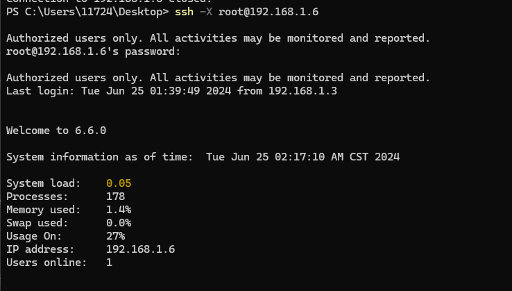
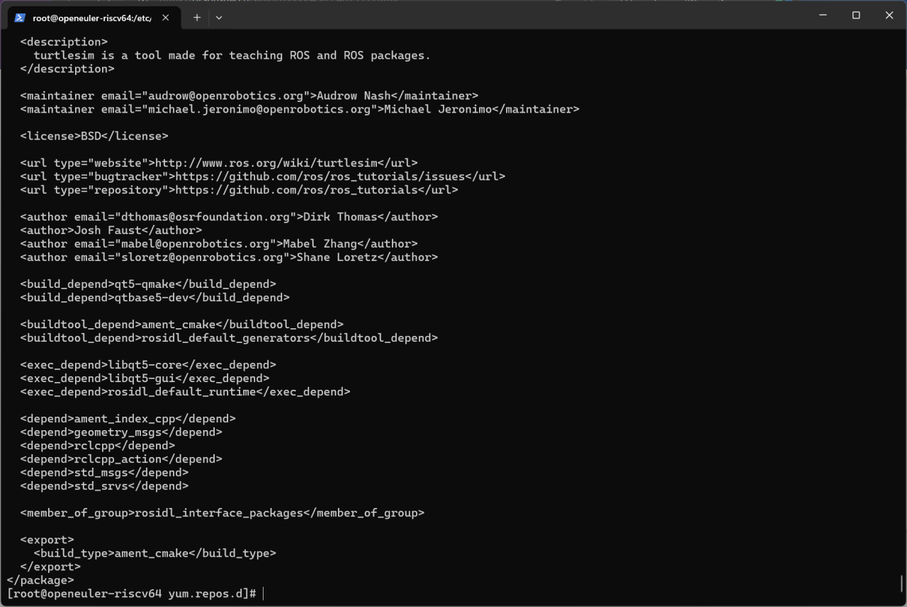

# RISC-V  lpi4a 上的测试openEuler ROS Humble

## 环境信息

#### 硬件信息

1. LicheePi 4A
2. 处理器 TH1520
3. 内存 16GB

#### 软件信息

1. OS 版本：openEuler-24.03-lpi4a
2. 镜像地址：https://www.openeuler.org/zh/download/?version=openEuler%2024.03%20LTS
3. 软件源：[https://build-repo.tarsier-infra.isrc.ac.cn/openEuler:/ROS/24.03/](https://build-repo.tarsier-infra.isrc.ac.cn/openEuler:/ROS/24.03/)

## 刷写镜像并启动

前往官网，下载 ` u-boot-with-spl-lpi4a-16g.bin`,`boot`,`root`三个文件

按住板上的BOOT按键不放，然后插入 USB-C 线缆上电（线缆另一头接 PC ），进入USB烧录模式


在Linux系统下，输入如下命令

```
sudo ./fastboot flash ram ./images/u-boot-with-spl-lpi4a-16g.bin
sudo ./fastboot reboot
sudo ./fastboot flash uboot ./images/u-boot-with-spl-lpi4a-16g.bin
sudo ./fastboot flash boot ./images/boot_sing.ext4
sudo ./fastboot flash root ./images/rootfs-sing.ext4
```

随后耐心等待烧录完成即可

由于oERV 24.03主线用的是 6.6 同源内核，所以没有HDMI驱动，因此需要使用ssh进行登录

登录用户名和密码如下

- 用户名：`root`

- 密码：`openEuler12#$`


## 测试安装

### 修改软件源

执行以下命令设置软件源：

```bash
bash -c 'cat << EOF > /etc/yum.repos.d/ROS.repo
[openEulerROS-humble]
name=openEulerROS-humble
baseurl=https://build-repo.tarsier-infra.com/openEuler:/ROS/24.03/
enabled=1
gpgcheck=0
EOF'
```

修改 /etc/yum.repos.d/openEuler.repo 中的以下部分

```
[EPOL]
name=EPOL
baseurl=http://repo.openeuler.org/openEuler-24.03-LTS/EPOL/main/$basearch/
.....

[update]
name=update
...
enabled=0
....

[debuginfo]
name=debuginfo
....
enabled=0
.....
```

### 安装

```bash
dnf install "ros-humble-*" --skip-broken --exclude=ros-humble-generate-parameter-library-example
```

安装上述软件列表后，编辑 `~/.bashrc` 追加以下内容

```bash
source /opt/ros/humble/setup.sh
```

随后输入`source  ~/.bashrc`来激活

## 测试用例列表及测试结果

测试用例列表如下

| 测试用例名                  | 状态 |
| --------------------------- | ---- |
| 测试 turtlesim功能          | 成功 |
| 使用HDMI开机                | 失败 |
| 安装XFCE并启动              | 失败 |
| 测试ros2 pkg create         | 成功 |
| 测试ros2 pkg executables    | 成功 |
| 测试ros2 pkg list           | 成功 |
| 测试ros2 pkg prefix         | 成功 |
| 测试ros2 pkg xml            | 成功 |
| 测试ros2 run                | 成功 |
| 测试ros2 topic list         | 成功 |
| 测试ros2 topic info         | 成功 |
| 测试ros2 topic type         | 成功 |
| 测试ros2 topic find         | 成功 |
| 测试ros2 topic hz           | 成功 |
| 测试ros2 topic bw           | 成功 |
| 测试ros2 topic echo         | 成功 |
| 测试ros2 param 工具         | 成功 |
| 测试ros2 service 工具       | 成功 |
| 测试ros2 node list          | 成功 |
| 测试ros2 node info          | 成功 |
| 测试ros2 bag 工具           | 成功 |
| 测试ros2 launch 工具        | 成功 |
| 测试ros2 interface list     | 成功 |
| 测试ros2 interface package  | 成功 |
| 测试ros2 interface packages | 成功 |
| 测试ros2 interface show     | 成功 |
| 测试ros2 interface proto    | 成功 |
| 测试 ros 通信组件相关功能   | 成功 |

失败的测试用例如下:

| 测试用例名         | 状态 |
| ------------------ | ---- |
| 使用HDMI开机        | 失败 |
| 安装XFCE并启动      | 失败 |

结论：由于oERV 24.03主线用的是 6.6 内核，[暂时没有HDMI驱动](https://github.com/revyos/revyos/issues/74)，因此需要使用ssh进行远程连接

## 安装XFCE

安装字库

```
# sudo dnf install dejavu-fonts liberation-fonts gnu-*-fonts google-*-fonts
```

安装Xorg

```
# sudo dnf install xorg-*
```

安装XFCE及组件

```
# sudo dnf install xfwm4 xfdesktop xfce4-* xfce4-*-plugin network-manager-applet *fonts
```

安装登录管理器

```
# sudo dnf install lightdm lightdm-gtk
```

设置默认桌面为XFCE 通过root权限用户设置

```
# echo 'user-session=xfce' >> /etc/lightdm/lightdm.conf.d/60-lightdm-gtk-greeter.conf
```

使用登录管理器登录XFCE

```
# sudo systemctl start lightdm
```

登录管理器启动后，在右上角左侧选择"xfce-session" 输入用户名、密码登录

此时无法打开管理器

设置开机自启动图形界面

```
# sudo systemctl enable lightdm
# sudo systemctl set-default graphical.target
```

重启验证

```
# sudo reboot
```

经检验，在ssh开启-X情况下仍无图像输出



## 测试 ros 基础工具相关功能

#### 1 ros2 pkg 工具

##### 1.1 ros2 pkg create

执行 `ros2 pkg create riscv-ros-pkg`，输出如下，且当前目录存在相应文件夹，测试通过


##### 1.2 ros2 pkg executables

执行 `ros2 pkg executables turtlesim`，输出如下，测试通过


##### 1.3 ros2 pkg list

执行 `ros2 pkg list`，输出如下，测试通过


##### 1.4 ros2 pkg prefix

执行 `ros2 pkg prefix turtlesim`，输出如下，测试通过


##### 1.5 ros2 pkg xml

执行 `ros2 pkg xml turtlesim`，输出如下，测试通过




#### 2 ros2 run 工具

执行 `ros2 run demo_nodes_cpp talker`，输出如下，测试通过


#### 3 ros2 topic 工具

##### 3.1 ros2 topic list

执行  `ros2 topic list`，输出如下，测试通过


##### 3.2 ros2 topic info

执行 `ros2  topic info /rosout`，输出如下，测试通过


##### 3.3 ros2 topic type

执行 `ros2 topic type /rosout`，输出如下，测试通过


##### 3.4 ros2 topic find

执行 `ros2 topic find rcl_interfaces/msg/Log`，输出如下， 测试通过


##### 3.5 ros2 topic hz

分别执行命令 `ros2 run demo_nodes_cpp talker`，`ros2 topic hz /chatter`，输出如下，测试通过


##### 3.6 ros2 topic bw

分别执行命令 `ros2 run demo_nodes_cpp talker`，`ros2 topic bw /chatter`，输出如下，测试通过


##### 3.7 ros2 topic echo

分别执行命令 `ros2 run demo_nodes_cpp talker`，`ros2 topic echo /chatter`，输出如下，测试通过


#### 4 ros2 param 工具

分别执行命令 `ros2 run demo_nodes_cpp talker`, `ros2 param list`，输出如下，测试通过


#### 5 ros2 service 工具

分别执行命令 `ros2 run demo_nodes_cpp talker`, `ros2 service list`，输出如下，测试通过


#### 6 ros2 node 工具

##### 6.1 ros2 node list

分别执行命令 `ros2 run demo_nodes_cpp talker`, `ros2 node list`，输出如下，测试通过


##### 6.2 ros2 node info

分别执行命令 `ros2 run demo_nodes_cpp talker`, `ros2 node info /talker`，输出如下，测试通过


#### 7 ros2 bag 工具

输入 `ros2 bag record -a`,

检查当前目录，如下，测试通过


ros2 bag info 工具

执行 `ros2 bag info rosbag2_2023_11_23-21_48_31/rosbag2_2023_11_23-21_48_31_0.db3 ` （文件由上一步骤生成）命令，输出如下，测试通过


执行 `ros2 bag play rosbag2_2023_11_23-21_48_31/rosbag2_2023_11_23-21_48_31_0.db3` 命令，输出如下，测试通过


#### 8 ros2 launch 工具

输入 `ros2 launch demo_nodes_cpp talker_listener.launch.py`，输出如下，测试通过


#### 9 ros2 interface 工具

##### 9.1 ros2 interface list

分类显示系统内所有的接口，包括消息（Messages）、服务（Services）、动作（Actions）。

执行 `ros2 interface list` ，输出如下，测试通过


##### 9.2 ros2 interface package

显示指定接口包内的子接口。

执行 `ros2 interface package action_msgs` ，输出如下，测试通过


##### 9.3 ros2 interface packages

显示指定接口包。

执行 `ros2 interface packages` 输出如下，测试通过


##### 9.4 ros2 interface show

显示指定接口的详细内容。

用于消息类型 Messsage：执行 `ros2 interface show geometry_msgs/msg/TwistStamped` ，输出如下，测试通过


用于服务 Service：执行 `ros2 interface show action_msgs/srv/CancelGoal` ，输出如下，测试通过


用于动作 Action：执行 `ros2 interface show action_tutorials_interfaces/action/Fibonacci` ，输出如下，测试通过


##### 9.5 ros2 interface proto

显示消息模板。

执行 `ros2 interface proto geometry_msgs/msg/TwistStamped` ，输出如下，测试通过


#### 10.测试 ros 通信组件相关功能

##### 10.1 topic 通信

###### c++ 实现

分别执行 `ros2 run demo_nodes_cpp talker` 和 `ros2 run demo_nodes_cpp listener`，输出如下，测试通过


###### python 实现

分别执行 `ros2 run demo_nodes_py talker` 和 `ros2 run demo_nodes_py listener`，输出如下，测试通过


##### 10.2 service 通信

###### c++ 实现

分别执行 `ros2 run demo_nodes_cpp add_two_ints_server` 和 `ros2 run demo_nodes_cpp add_two_ints_client`，输出如下，测试通过


###### python 实现

分别在两个终端执行 `ros2 run demo_nodes_py add_two_ints_server` 和 `ros2 run demo_nodes_py add_two_ints_client`，输出如下，测试通过


##### 10.3 测试 ros 坐标转换相关功能

###### 坐标转换的发布和订阅

分别在两个终端执行 `ros2 run tf2_ros static_transform_publisher 1 1 1 0 0 0 /base_link /odom` 和 `ros2 run tf2_ros tf2_echo base_link odom`，输出如下，测试通过


###### tf_monitor 监控

分别在两个终端执行 `ros2 run tf2_ros static_transform_publisher 1 1 1 0 0 0 /base_link /odom` 和 `ros2 run tf2_ros tf2_monitor`，输出如下，测试通过


###### 10.4 view_frames 保存 pdf

分别在两个终端执行 `ros2 run tf2_ros static_transform_publisher 1 1 1 0 0 0 /base_link /odom` 和 `ros2 run tf2_tools view_frames`，输出如下，且存在 pdf 文件，测试通过


#### 11 测试 turtlesim

分别在两个终端执行 `ros2 run turtlesim turtlesim_node` 和 `ros2 run turtlesim turtle_teleop_key` 

在执行第一个命令时出错，由于oERV 24.03主线用的是 6.6 内核，[暂时没有HDMI驱动](https://github.com/revyos/revyos/issues/74)，需要使用 `ssh -X` forward X11 功能在本地电脑上显示


首先修改 `Licheepi 4A` 上的 `/etc/ssh/sshd_config` 文件，修改`X11Forwarding`项为`yes`，然后重启`sshd`服务

```bash
sudo systemctl restart sshd
```

就可以在你的电脑上使用下面的命令通过`ssh -X`启动`Licheepi 4A`上的小海龟界面了，同理，其他需要显示界面的程序都可以这样显示

在其他有 X11 client 环境的系统下执行，比如Ubuntu或者openEuler桌面版

```bash
ssh -X openeuler@192.168.xx.xx "ros2 run turtlesim turtlesim_node"
``` 


小海龟能正常移动，测试通过
