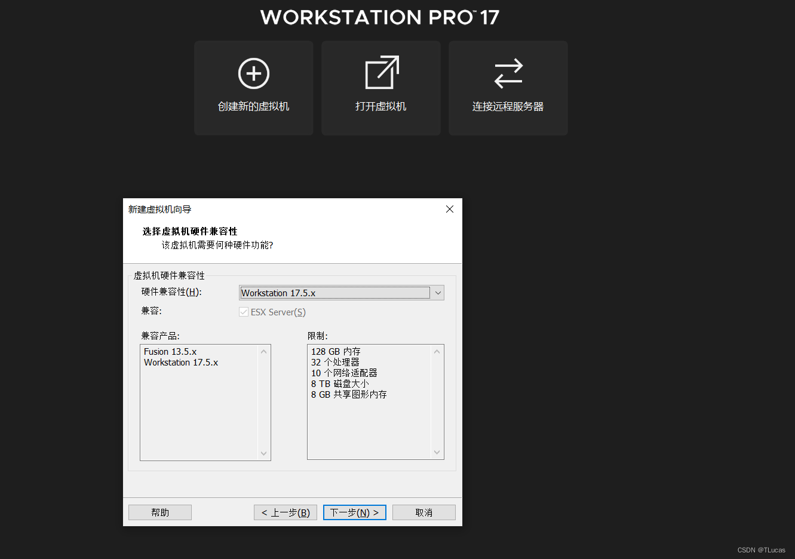

# VMWare安装openEuler24.03操作系统

## 1.安装VMWare虚拟机

[官网](https://www.vmware.com/)

1.从页面中点击＂Products＂，


2.下滑页面找到并点击DOWNLOAD TRIAL


3.下滑页面找到Windows版并点击 DOWNLOAD NOW 即可自动跳转下载


4.之后根据提示正常安装，在桌面上找到安装完成的VMware并双击打开，出现弹窗要求重启电脑，点击是


## 2.安装openEuler24.03系统

首先是下载[openEuler系统镜像](https://www.openeuler.org/zh/download/?version=openEuler%2024.03%20LTS)

选择"创建新的虚拟机",进入向导页面，选择"自定义"


进入选择兼容性页面，确定好后直接"下一步"


点击"稍后安装操作系统"


因为VMware没有openEuler系统选项，所以我们选择"Linux"->"其他Linux 6.x内核64位"


虚拟机命名，选择好安装位置，点击"下一步"


后面处理器和内存根据手中电脑配置而定，官方给的硬件要求是2个CPU，内存不低于4GB，硬盘不低于32GB


网络，IO和磁盘类型


最后在自定义硬件中找到新CD/DVD，使用ISO映像文件，把镜像文件导入即可


之后我们打开虚拟机,开启后会让我们选择语言，选择中文


这个时候会进入安装信息摘要


选择安装目的地,进去默认即可


选择软件选择处,点击最小安装即可


在用户设置处,进入Root账户,设置密码,之后重装系统


安装好之后,我们还需要解决VMWare复制粘贴问题

```
yum install open-vm-tools-desktop -y
reboot
```

## 3.安装桌面环境

桌面环境这里推荐UKUI,安装简便,与其他UI界面相比，UKUI更加注重易用性和敏捷度，各元件相依性小，可以不依赖其他套件而独自运行

1.更新源

```
sudo dnf update
```

2.安装UKUI

```
sudo dnf install ukui
```

3.在确认正常安装后，如果希望以图形界面的方式启动，请在命令行运行以下代码，并重启

```
systemctl set-default graphical.target
reboot
```


