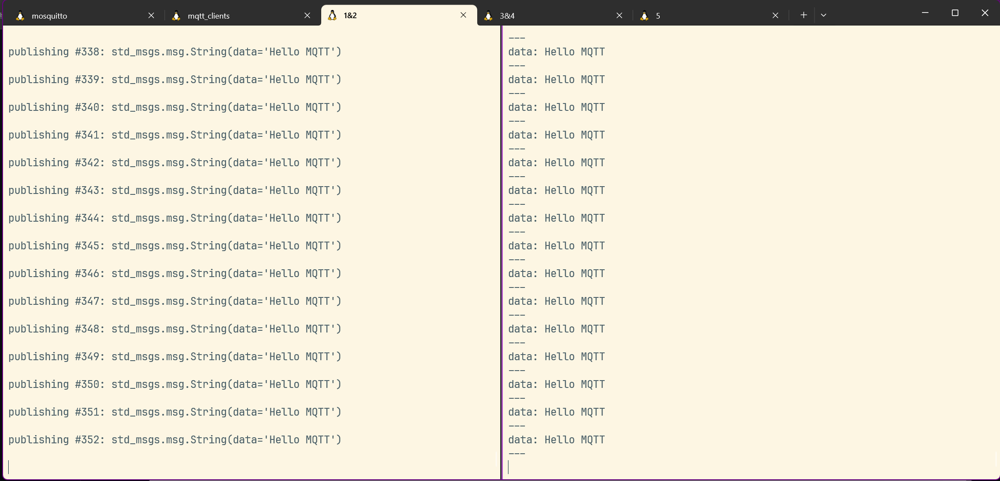
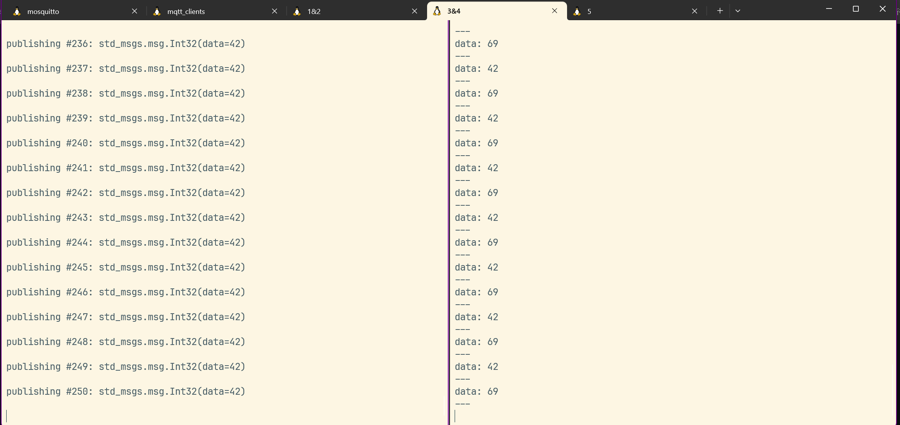

# MQTT-ROS Client的安装与测试
## 环境配置
系统环境：OpenEuler 24.03 LTS x86_64 in WSL
### 添加源

```shell
 cat << EOF > /etc/yum.repos.d/openEuler-mqtt.repo
[openEuler-mqtt]
name=openEuler-mqtt
baseurl=https://eulermaker.compass-ci.openeuler.openatom.cn/api/ems2/repositories/openEuler_24.03_LTS:paho-mqtt/openEuler%3A24.03-LTS/x86_64/
enabled=1
gpgcheck=0
EOF
```

### 安装mqtt-client

```shell
 sudo dnf install ros-humble-mqtt-client
```


## 测试(ROS2)

此处参考github原项目 https://github.com/ika-rwth-aachen/mqtt_client

### 配置MQTT broker

这里使用 [*Mosquitto*](https://mosquitto.org/)

```shell
sudo dnf install mosquitto
mosquitto
```

输出：

```shell
1739970505: mosquitto version 2.0.20 starting
1739970505: Using default config.
1739970505: Starting in local only mode. Connections will only be possible from clients running on this machine.
1739970505: Create a configuration file which defines a listener to allow remote access.
1739970505: For more details see https://mosquitto.org/documentation/authentication-methods/
1739970505: Opening ipv4 listen socket on port 1883.
1739970505: Opening ipv6 listen socket on port 1883.
1739970505: mosquitto version 2.0.20 running
1739970590: New connection from 127.0.0.1:46061 on port 1883.
1739970590: New client connected from 127.0.0.1:46061 as auto-42FA838C-3234-EF5C-B164-FB657BB4376D (p2, c1, k60).
```

### 启动mqtt

```shell
source /opt/ros/humble/setup.bash
ros2 launch mqtt_client standalone.launch.ros2.xml
```

输出：

```shell
[INFO] [launch]: All log files can be found below /home/ifreturn/.ros/log/2025-02-19-21-09-49-803241-DESKTOP-LUSMJ9U-1976
[INFO] [launch]: Default logging verbosity is set to INFO
[INFO] [mqtt_client-1]: process started with pid [1977]
[mqtt_client-1] [WARN] [1739970590.183676056] [mqtt_client]: Parameter 'broker.tls.enabled' not set, defaulting to '0'
[mqtt_client-1] [WARN] [1739970590.183743995] [mqtt_client]: Parameter 'client.id' not set, defaulting to ''
[mqtt_client-1] [WARN] [1739970590.183752676] [mqtt_client]: Client buffer can not be enabled when client ID is empty
[mqtt_client-1] [WARN] [1739970590.183757453] [mqtt_client]: Parameter 'client.clean_session' not set, defaulting to '1'
[mqtt_client-1] [WARN] [1739970590.183763751] [mqtt_client]: Parameter 'client.keep_alive_interval' not set, defaulting to '60.000000'
[mqtt_client-1] [WARN] [1739970590.183769283] [mqtt_client]: Parameter 'client.max_inflight' not set, defaulting to '65535'
[mqtt_client-1] [INFO] [1739970590.183789071] [mqtt_client]: Bridging ROS topic '/ping/ros' to MQTT topic 'pingpong/ros'
[mqtt_client-1] [INFO] [1739970590.183796316] [mqtt_client]: Bridging MQTT topic 'pingpong/ros' to ROS topic '/pong/ros'
[mqtt_client-1] [INFO] [1739970590.184501929] [mqtt_client]: Connecting to broker at 'tcp://localhost:1883' ...
[mqtt_client-1] [INFO] [1739970590.186678715] [mqtt_client]: Connected to broker at 'tcp://localhost:1883'
[mqtt_client-1] [INFO] [1739970590.186722493] [mqtt_client]: Subscribed MQTT topic 'mqtt_client/ros_msg_type/pingpong/ros'
```

启动第二个`mqtt_client`，使用配置文件更改话题名到`/ping/primitive`和`/pong/primitive`，用以测试mqtt_client之间的通信:

```shell
ros2 launch mqtt_client standalone.launch.ros2.xml params_file:=$(ros2 pkg prefix mqtt_client)/share/mqtt_client/config/params.ros2.primitive.yaml
```

开启5个终端，分别执行如下操作：

```shell
# 1st terminal: publish ROS message to /pin
ros2 topic pub /ping/ros std_msgs/msg/String "{data: \"Hello MQTT\"}"
```

```shell
# 2nd terminal: listen for ROS messages on /pong
ros2 topic echo /pong/ros
```

```shell
# 3rd terminal: publish primitive ROS message to /ping/primitive
ros2 topic pub /ping/primitive std_msgs/msg/Int32 "{data: 42}"
```

```shell
# 4th terminal: listen for primitive ROS messages on /pong/primitive
ros2 topic echo /pong/primitive
```

```shell
# 5th terminal: publish primitive MQTT message to pingpong/primitive directly using mosquitto_pub
mosquitto_pub -h localhost -t "pingpong/primitive" --repeat 20 --repeat-delay 1 -m 69
```





测试结果如图，可以其中1、2终端证明mqtt可以正常接受/发送`rostopic`

3、4终端中则表明mqtt_client之间的通信正常
