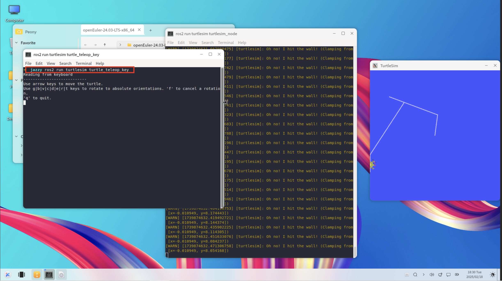

# 在 openEuler 上移植并测试 ROS Jazzy：以“小乌龟 (turtlesim)” 为例

随着 **ROS（Robot Operating System）** 在开源机器人领域的不断发展，越来越多的操作系统开始支持最新的 **ROS 2** 版本。ROS 是业界广泛使用的开源机器人软件框架，拥有海量功能包与庞大的开发者社区。从学术研究到工业应用，ROS 2 在实时性、跨平台兼容和工业安全性等方面均具优势。**ROS 2 Jazzy Jalisco**（以下简称 *Jazzy*）作为 ROS 2 的第十个正式发行版，于 2024 年 5 月 23 日正式发布，并被定位为**长期支持（LTS）**版本，维护期直至 2029 年 5 月。它延续了 ROS 2 的分布式架构设计理念，升级至 **RTI Connext 6.1.1** 以改善大规模节点通信时的延迟抖动，并首次引入 **rmw_zenoh** 中间件预览版，为云端—边缘端的广域网协同提供了新选择。基于 openEuler 已支持的 **ROS 2 Humble** 版本，我们着手移植 *Jazzy*，以期为 openEuler 社区和机器人开发者提供更多可行性与拓展空间。在本次项目中，我们完成了对 *Jazzy* 的适配与测试，并以“小乌龟（turtlesim）”示例进行初步验证，为后续更多功能包的支持打下基础。本文将介绍项目背景、移植方法，以及对 *Jazzy* 这一 LTS 版本的简要解析。

---

## 项目说明

本项目旨在将 **ROS 2 Jazzy** 版本移植至 **openEuler**。在此过程中，我们对 ROS 包的构建流程进行了调研，并针对 openEuler 的特性进行了适配，积累了丰富的经验。后续我们将以系列文章的形式，分享从环境准备、打包构建到调试发布的实践细节，帮助开发者在更多操作系统环境中高效构建 ROS 软件包。

### 自研工具「ROT」：自动化移植的试验探索

在本次将 ROS 2 Jazzy 移植到 openEuler 的过程中，我们并未完全采用官方构建方式，而是自行研发了一个名为 **ROT (ROS openEuler Tool)** 的 Python 工具来自动化处理移植流程。**ROT** 可视作对 **bloom**、**rosdep** 等官方工具链的二次封装，重点针对 openEuler 做了适配，并包含多段 Python 脚本，可通过命令行调用。其主要功能包括：

1. **自动生成 spec 及源码包**  
   - 通过分析目标 ROS 包的依赖，自动调用 *bloom*、*rosdep* 等工具，生成符合 openEuler 打包规范的 spec 文件与源码包。  
   - 减少编写、维护 spec 文件的人工负担。

2. **自动上传至 Gitee**  
   - 完成包生成后，ROT 可将成果自动上传到内部或指定的 Gitee 仓库，方便版本管理与协同开发。

3. **构建错误分析**  
   - 当编译或打包过程遇到缺失依赖、版本冲突等问题时，ROT 会收集日志并进行基础分析，便于开发者快速定位并修复。

> **试验性质声明**  
> 目前，ROT 仍处于早期探索阶段，仅在内部使用，尚未公开发布。由于部分包的依赖关系尚待完善，在执行 `dnf install` 时仍可能出现大量 `conflict` 提示。就“小乌龟（turtlesim）”示例而言，ROT 已能够完成编译与运行，但对于更复杂的 ROS 包仍需进一步迭代与测试。  
> 后续我们将持续完善 ROT 的功能与稳定性，开展更深入的打包测试与错误处理改进，努力在更多 ROS 场景中为 openEuler 提供自动化支持。当前阶段主要是技术预告，若社区对此感兴趣，可持续关注我们的进展。

尽管当前 ROT 还存在部分包冲突、依赖不完备等问题，我们相信通过持续的完善和实践分享，ROT 将为 ROS 与 openEuler 的结合提供更自动化、更便捷的方案，也期待更多开发者加入到移植与打包优化中。

---

## 启用软件源

1. **创建 .repo 文件**  
   在 `/etc/yum.repos.d` 目录下新建一个 `.repo` 文件，用于添加软件源。例如：
   ```bash
   cd /etc/yum.repos.d
   sudo vi openEuler-jazzy.repo
   ```
2. **编辑 repo 文件**  
   在 `openEuler-jazzy.repo` 中添加以下内容（可根据实际情况调整）：
   ```ini
   [openEuler-Jazzy]
   name=openEuler-Jazzy
   baseurl=https://eulermaker.compass-ci.openeuler.openatom.cn/api/ems1/repositories/jazzy_ament_package/openEuler%3A24.03-LTS/x86_64/
   enabled=1
   gpgcheck=0
   ```
3. **刷新并更新系统仓库**  
   新增 repo 后，需要清理并重新生成缓存：
   ```bash
   sudo dnf clean all
   sudo dnf makecache
   sudo dnf update --nobest
   ```

---

## 安装 ROS Jazzy

在成功添加仓库后，可执行以下命令安装 ROS Jazzy：
```bash
sudo dnf install "ros-jazzy*" --skip-broken -y
```
由于仓库中仍存在部分冲突包，安装过程中可能会出现大量 `conflict` 提示，属**预期行为**。`dnf` 会自动安装可用的包并跳过无法处理的部分。若仅用于“小乌龟”示例，可忽略该报错信息。

---

## 运行“小乌龟”示例

1. **激活 ROS 环境**  
   完成安装后，需要激活 ROS 相关环境脚本：
   ```bash
   source /opt/ros/jazzy/setup.zsh
   ```
   > 如果使用 `bash`，请改为 `setup.bash`。

2. **启动 turtlesim 节点**  
   在第一个终端中执行：
   ```bash
   ros2 run turtlesim turtlesim_node
   ```

3. **开启键盘控制**  
   在另一个终端中执行：
   ```bash
   ros2 run turtlesim turtle_teleop_key
   ```
   使用方向键或 `WASD` 控制界面中的小乌龟移动。若窗口正常弹出并可以移动，即说明示例运行成功。

**示例界面**：  


---

## 其他说明

1. **dnf 更新时出现 tbb 冲突**  
   如果在 `dnf update` 时出现与 **tbb** 相关的冲突，可忽略提示。openEuler 自带的 tbb 版本与 ROS Jazzy 需求不完全一致，但这并不影响“小乌龟”示例运行。

2. **安装包时出现大量 conflict**  
   目前仓库重点满足“小乌龟”示例的正常执行，其余包仍在完善。当出现大量 conflict，只要关键依赖正确安装，示例即可运行。

---

## 其他相关文档

为进一步介绍 **ROS Jazzy** 的打包与移植，我们后续将发布更多内容，包括但不限于：

- **ROS 官方工具链调研**  
- **在 eulermaker 上的打包完整流程**  
- **衍生工具原理及说明**  
- ……

这些文档将详细解析打包流程、小乌龟环境的构建原理，并分享更多实践经验与常见坑点，敬请期待！

