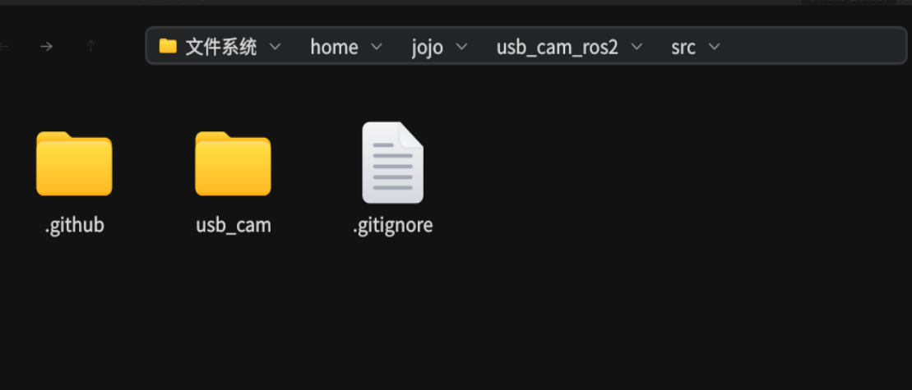

# openEuler24 编译 usb_cam源码

## 一、下载usb_cam源码

github官网下载usb_cam源码，[ https://github.com/ros-drivers/usb_cam ](https://) ，


usb_cam源码解压到 用户的桌面，不要放root桌面下，Rosdep会提示执行权限错误


注意我这边的目录结构，usb_cam解压的源码是放在src目录下，在压缩包这层执行 colcon build



## 二、修改MakeList 文件，编译，source加入ros2环境

根据sub_cam项目md提示，执行Rosdep   init/update 都会报错，


修改 pluma  /usr/lib/python3.11/site-packages/rospkg/os\_detect.py 第606行的函数，强制判断为euleros，


成功rosdep update ， 但是没用，后续 colcon build 会继续报错 Pakeage.XML 文件的错误。


### 我这里选择，直接解决colcon build 报错问题


### 第一个问题 colcon build 编译报错，缺少Avcodec.h头文件 ，解决方案如下：

先dnf install ,把ffmeg 的这三个包 全都安装上，

`dnf install ffmpegdnf install ffmpeg-develdnf install ffmpeg-libs`


这里通过pkg-config --modversion libavcodec  发现有这个库


磁盘搜索 find /usr/include -name avcodec.h 查找到 在FFmpeg目录下，把路径链接上去


修改MakeList文件，为了能链接到 avcodec库，

添加左边圈出的 两段代码，右边是原始 未修改的MakeList 文件

```
set(FFMPEG_INCLUDE_DIR "/usr/include/ffmpeg")
set(CMAKE_PREFIX_PATH  "/opt/ros/humble")
```

```
target_include_directories(${PROJECT_NAME} PUBLIC
"include"
${OpenCV_INCLUDE_DIRS}
${avcodec_INCLUDE_DIRS})
```


然后编译，通过


### 第二个问题，在代码里使用usb_cam库的时候，编译报错

需要这样写，添加红圈里的代码，为什么就不解释了，


执行colcon build编译报错，

提示如下，YAML_CPP_INCLUDE_DIR 这个变量错误


编辑该文件，`pluma /lib64/cmake/yaml-cpp-static/yaml-cpp-config.cmake`

直接到写死，YAML_CPP_INCLUDE_DIR 这个变量值，黄色那一行，/usr/include


并且在 用户环境中 ，也添加这个路径，

pluma  ~/.bashrc文件，添加 `export YAML_CPP_INCLUDE_DIR="/usr/include/yaml-cpp"`


继续执行 colcon build 编译成功，


## 三、运行测试

可以使用 ，ros2 launch 脚本文件 或是 run usb_cam usb_cam_node_exe ， 启动摄像头


```
ros2 run usb_cam usb_cam_node_exe  --ros-args --params-file /home/jojo/usb_cam_ros2/install/usb_cam/share/usb_cam/config/params_1.yaml
```

--ros-args --params-file ，参数表示使用 摄像头配置文件.yaml格式，启动摄像头，如果没有填，

默认使用这个路径的 摄像头配置文件 [/root/.ros/camera_info/default_cam.yaml]


查看节点是否  成功启动摄像头， 接下来测试图像显示是否正常


打开rviz ，点击image节点查看，显示正常 ， 如果没有image节点显示，手动添加如下：


点击add ， 选择by topic , 点击image ，确定， 注意要绑定 /images_raw节点


