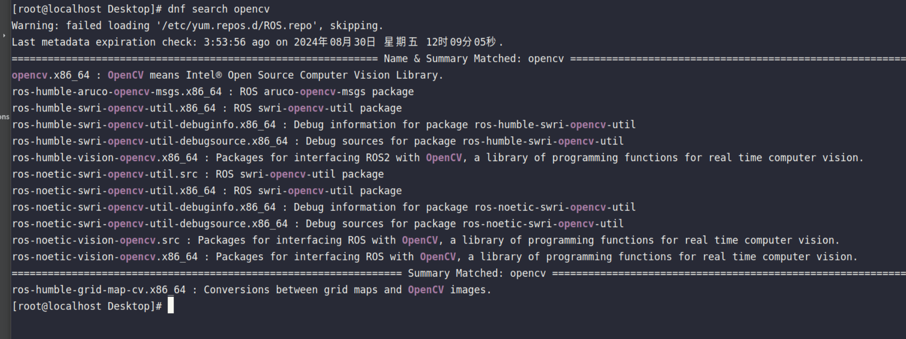
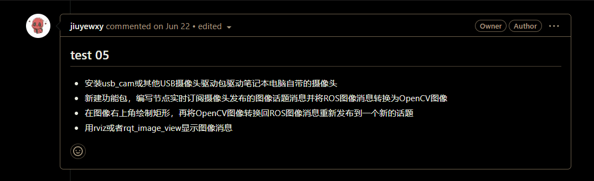
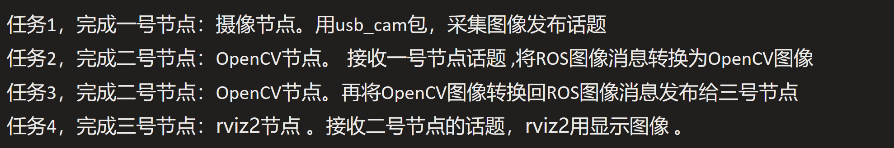
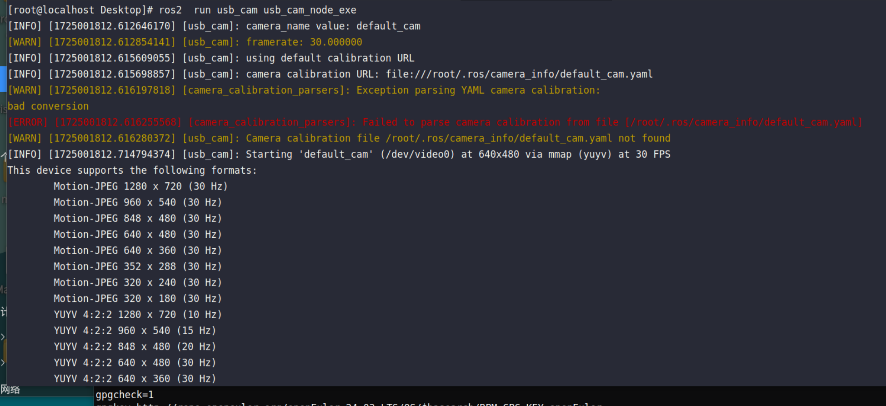
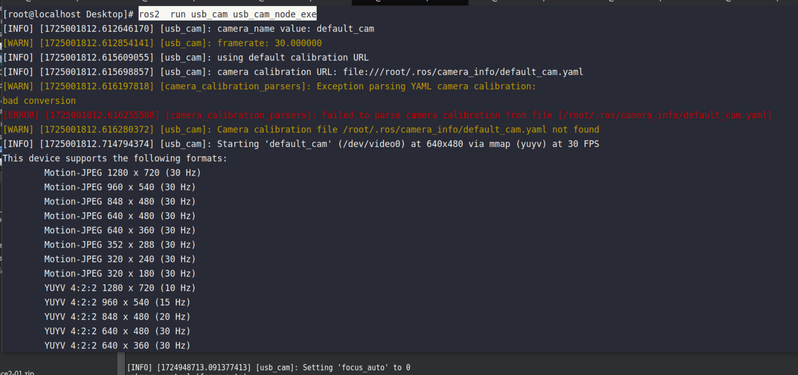
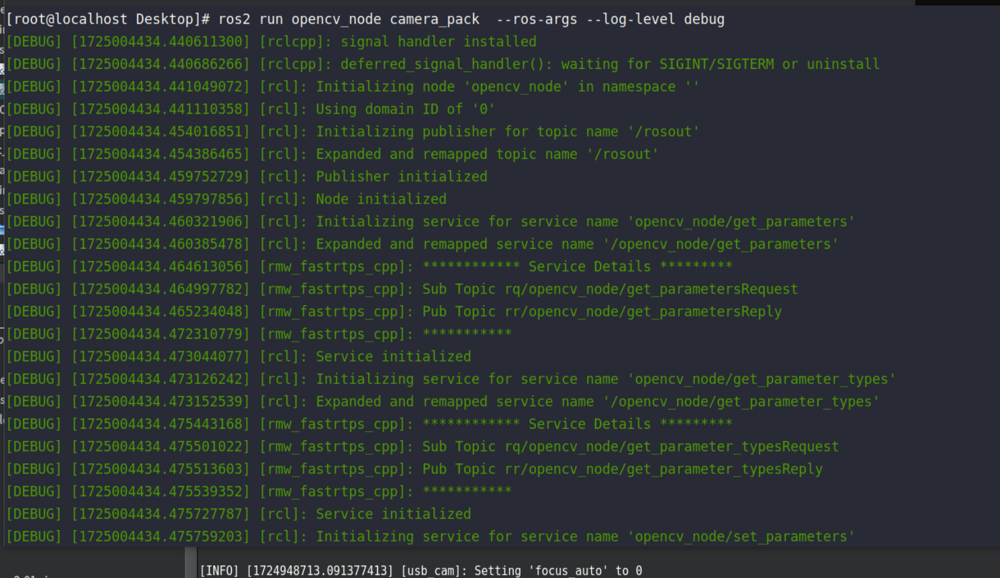
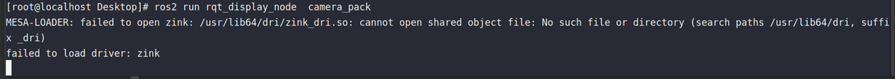
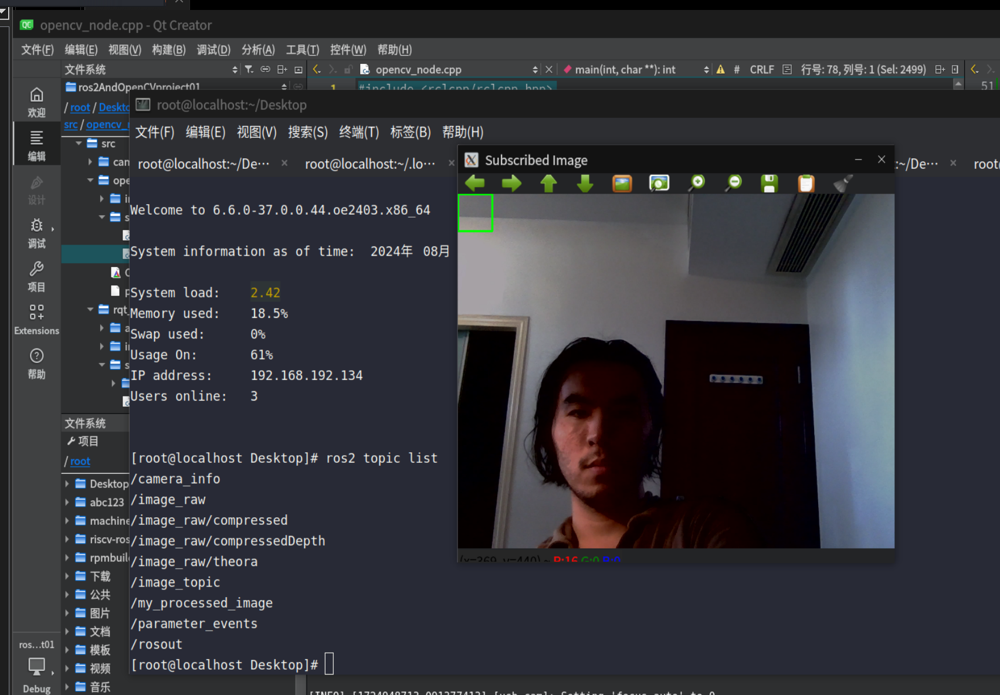

# openEuler上开发测试案例教程，ROS2+usb_cam+OpenCV+QT库实验

## 一、usb_cam源码编译，OpenCV库安装

### 1、usb_cam源码编译

usb_cam 源码编译 参考 openEuler24 [编译usb_cam源码](https://openeuler-ros-docs.readthedocs.io/en/latest/other-tutorials/usb-cam-build.html)文章。

### 2、OpenCV库安装

使用` dnf install` 命令安装ros对应的版本的opencv，这里用的是ros-humble，全部装上



如果 dnf search opencv 显示没有可安装的包，请配置dnf源 ，

使用 `pluma /etc/yum.repos.d/openEuler.repo `  打开dnf源，可参考，如下配置文件
W
```
#generic-repos is licensed under the Mulan PSL v2.
#You can use this software according to the terms and conditions of the Mulan PSL v2.
#You may obtain a copy of Mulan PSL v2 at:
#    http://license.coscl.org.cn/MulanPSL2
#THIS SOFTWARE IS PROVIDED ON AN "AS IS" BASIS, WITHOUT WARRANTIES OF ANY KIND, EITHER EXPRESS OR
#IMPLIED, INCLUDING BUT NOT LIMITED TO NON-INFRINGEMENT, MERCHANTABILITY OR FIT FOR A PARTICULAR
#PURPOSE.
#See the Mulan PSL v2 for more details.

[openEulerROS-humble]
name=openEulerROS-humble
baseurl=https://repo.openeuler.org/openEuler-24.03-LTS/EPOL/multi_version/ROS/humble/x86_64/
enabled=1
gpgcheck=0


[openEulerROS-noetic]
name=openEulerROS-humble
baseurl=https://eulermaker.compass-ci.openeuler.openatom.cn/api/ems1/repositories/ROS-SIG-Multi-Version_ros-noetic_openEuler-24.03-LTS-TEST1/openEuler%3A24.03-LTS/x86_64/
enabled=1
gpgcheck=1
gpgkey=https://eulermaker.compass-ci.openeuler.openatom.cn/api/ems1/repositories/ROS-SIG-Multi-Version_ros-noetic_openEuler-24.03-LTS-TEST1/openEuler%3A24.03-LTS/x86_64/RPM-GPG-KEY-openEuler


[OS]
name=OS
baseurl=http://repo.openeuler.org/openEuler-24.03-LTS/OS/$basearch/
enabled=1
gpgcheck=1
gpgkey=http://repo.openeuler.org/openEuler-24.03-LTS/OS/$basearch/RPM-GPG-KEY-openEuler

[everything]
name=everything
baseurl=http://repo.openeuler.org/openEuler-24.03-LTS/everything/$basearch/
enabled=1
gpgcheck=1
gpgkey=http://repo.openeuler.org/openEuler-24.03-LTS/everything/$basearch/RPM-GPG-KEY-openEuler

[EPOL]
name=EPOL
baseurl=http://repo.openeuler.org/openEuler-24.03-LTS/EPOL/main/$basearch/
enabled=1
gpgcheck=1
gpgkey=http://repo.openeuler.org/openEuler-24.03-LTS/OS/$basearch/RPM-GPG-KEY-openEuler

[debuginfo]
name=debuginfo
baseurl=http://repo.openeuler.org/openEuler-24.03-LTS/debuginfo/$basearch/
enabled=1
gpgcheck=1
gpgkey=http://repo.openeuler.org/openEuler-24.03-LTS/debuginfo/$basearch/RPM-GPG-KEY-openEuler

[source]
name=source
baseurl=http://repo.openeuler.org/openEuler-24.03-LTS/source/
enabled=1
gpgcheck=1
gpgkey=http://repo.openeuler.org/openEuler-24.03-LTS/source/RPM-GPG-KEY-openEuler

[update]
name=update
baseurl=http://repo.openeuler.org/openEuler-24.03-LTS/update/$basearch/
enabled=1
gpgcheck=1
gpgkey=http://repo.openeuler.org/openEuler-24.03-LTS/OS/$basearch/RPM-GPG-KEY-openEuler

[update-source]
name=update-source
baseurl=http://repo.openeuler.org/openEuler-24.03-LTS/update/source/
enabled=1
gpgcheck=1
gpgkey=http://repo.openeuler.org/openEuler-24.03-LTS/source/RPM-GPG-KEY-openEuler
```

## 二、需求分析，代码编写

题目：test05



完整代码在我的github仓库下 成果02，[https://github.com/jojoandgyc/PLCTandJiaChen](https://)

]

题目如上，需求分析如下，分三个节点实现：



`ros2  run usb_cam usb_cam_node_exe `，启动usb_cam节点，



二号节点代码，如下：

通过，opencv节点改成灰度图，不然感觉openCV节点没啥用，继续传给三号节点显示。

```
#include <rclcpp/rclcpp.hpp>
#include <sensor_msgs/msg/image.hpp>
#include <cv_bridge/cv_bridge.h>
#include <opencv2/opencv.hpp>

class OpenCVNode : public rclcpp::Node
{
public:
    OpenCVNode() : Node("opencv_node")
    {
        // 订阅来自摄像节点的图像话题
        image_subscriber_ = this->create_subscription<sensor_msgs::msg::Image>(
            "/image_raw", 10,
            std::bind(&OpenCVNode::image_callback, this, std::placeholders::_1));

        // 创建图像发布者
        image_publisher_ = this->create_publisher<sensor_msgs::msg::Image>(
            "/my_processed_image", 10);
    }

private:
    void image_callback(const sensor_msgs::msg::Image::SharedPtr msg)
    {
        // 将ROS图像消息转换为OpenCV图像
        cv_bridge::CvImagePtr cv_ptr;
        try
        {
            RCLCPP_DEBUG(this->get_logger(), "jr1  excep");
            cv_ptr = cv_bridge::toCvCopy(msg, sensor_msgs::image_encodings::BGR8);
            RCLCPP_DEBUG(this->get_logger(), "cg2  excep");
        }
        catch (cv_bridge::Exception& e)
        {
            RCLCPP_ERROR(this->get_logger(), "cv_bridge exception: %s", e.what());
            return;  // 如果转换失败，返回
        }

        // 图像变量
        cv::Mat processed_image;

        // 通道数是 3 就是rgb 否则yuv
        if (cv_ptr->image.channels() == 3) {
            // 如果是 RGB，直接转换为 BGR
            cv::cvtColor(cv_ptr->image, processed_image, cv::COLOR_RGB2BGR);
            // 图像处理示例：将图像转换为灰度图
            // cv::cvtColor(cv_ptr->image, processed_image, cv::COLOR_BGR2GRAY);

        } else {
            //  使用 YUV 转换
            cv::cvtColor(cv_ptr->image, processed_image, cv::COLOR_YUV2BGR_Y422);
            // 图像处理示例：将图像转换为灰度图
            // cv::cvtColor(cv_ptr->image, processed_image, cv::COLOR_BGR2GRAY);
        }

        // 将处理后的OpenCV图像转换回ROS图像消息
        sensor_msgs::msg::Image::SharedPtr output_msg= cv_bridge::CvImage(std_msgs::msg::Header(), sensor_msgs::image_encodings::RGB8,processed_image).toImageMsg();

        RCLCPP_DEBUG(this->get_logger(), "fb3  excep");
        // 发布处理后的图像
        image_publisher_->publish(*output_msg);
        RCLCPP_DEBUG(this->get_logger(), "fbcg4  excep");
    }

    // 订阅者和发布者
    rclcpp::Subscription<sensor_msgs::msg::Image>::SharedPtr image_subscriber_;
    rclcpp::Publisher<sensor_msgs::msg::Image>::SharedPtr image_publisher_;
};

int main(int argc, char **argv)
{
    rclcpp::init(argc, argv);  // 初始化ROS 2
    rclcpp::spin(std::make_shared<OpenCVNode>());  // 运行节点
    rclcpp::shutdown();  // 关闭ROS 2
    return 0;
}

```

三号节点 接收二号节点 图像显示， 代码如下：

注意这边代码，直接使用openCV的图像类，直接show，显示图像

```#include
#include <sensor_msgs/msg/image.hpp>
#include <cv_bridge/cv_bridge.h>
#include <opencv2/opencv.hpp>

class OpenCVNode : public rclcpp::Node
{
public:
    OpenCVNode() : Node("opencv_node")
    {
        // 订阅来自摄像节点的图像话题
        image_subscriber_ = this->create_subscription<sensor_msgs::msg::Image>(
            "/image_raw", 10,
            std::bind(&OpenCVNode::image_callback, this, std::placeholders::_1));

        // 创建图像发布者
        image_publisher_ = this->create_publisher<sensor_msgs::msg::Image>(
            "/my_processed_image", 10);
    }

private:
    void image_callback(const sensor_msgs::msg::Image::SharedPtr msg)
    {
        // 将ROS图像消息转换为OpenCV图像
        cv_bridge::CvImagePtr cv_ptr;
        try
        {
            RCLCPP_DEBUG(this->get_logger(), "jr1  excep");
            cv_ptr = cv_bridge::toCvCopy(msg, sensor_msgs::image_encodings::BGR8);
            RCLCPP_DEBUG(this->get_logger(), "cg2  excep");
        }
        catch (cv_bridge::Exception& e)
        {
            RCLCPP_ERROR(this->get_logger(), "cv_bridge exception: %s", e.what());
            return;  // 如果转换失败，返回
        }

        // 图像变量
        cv::Mat processed_image;

        // 通道数是 3 就是rgb 否则yuv
        if (cv_ptr->image.channels() == 3) {
            // 如果是 RGB，直接转换为 BGR
            cv::cvtColor(cv_ptr->image, processed_image, cv::COLOR_RGB2BGR);
            // 图像处理示例：将图像转换为灰度图
             cv::cvtColor(cv_ptr->image, processed_image, cv::COLOR_BGR2GRAY);

        } else {
            //  使用 YUV 转换
            cv::cvtColor(cv_ptr->image, processed_image, cv::COLOR_YUV2BGR_Y422);
            // 图像处理示例：将图像转换为灰度图
            cv::cvtColor(cv_ptr->image, processed_image, cv::COLOR_BGR2GRAY);
        }


        // 将处理后的OpenCV图像转换回ROS图像消息
        sensor_msgs::msg::Image::SharedPtr output_msg= cv_bridge::CvImage(std_msgs::msg::Header(), sensor_msgs::image_encodings::RGB8,processed_image).toImageMsg();

        RCLCPP_DEBUG(this->get_logger(), "fb3  excep");
        // 发布处理后的图像
        image_publisher_->publish(*output_msg);
        RCLCPP_DEBUG(this->get_logger(), "fbcg4  excep");
    }

    // 订阅者和发布者
    rclcpp::Subscription<sensor_msgs::msg::Image>::SharedPtr image_subscriber_;
    rclcpp::Publisher<sensor_msgs::msg::Image>::SharedPtr image_publisher_;
};

int main(int argc, char **argv)
{
    rclcpp::init(argc, argv);  // 初始化ROS 2
    rclcpp::spin(std::make_shared<OpenCVNode>());  // 运行节点
    rclcpp::shutdown();  // 关闭ROS 2
    return 0;
}
```


## 三、运行测试

启动一号节点，`ros2  run usb_cam usb_cam_node_exe`，这里可以自己配置，摄像头参数. yaml文件



启动二号节点，`ros2 run opencv_node camera_pack  --ros-args --log-level debug`



启动三号节点，`ros2 run rqt_display_node  camera_pack`



完成，如下 ， 使用 `ros2 topic list  `命令可以看到，节点都已经起来了，显示正常


