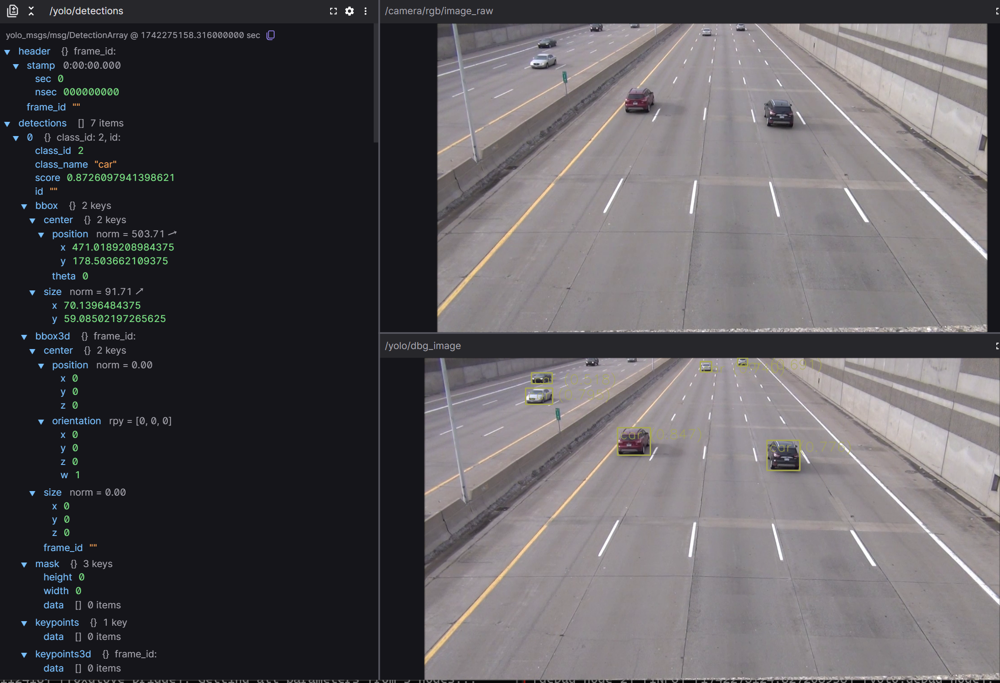

# 在openEuler系统上使用yolo算法进行目标检测
## 环境配置

### 配置ROS开发环境
如果已经配置好，请跳过
#### x86_64
系统环境：openEuler 24.03 LTS
```shell
bash -c 'cat << EOF |sudo tee /etc/yum.repos.d/ROS.repo
[openEulerROS-humble]
name=openEulerROS-humble
baseurl= https://eulermaker.compass-ci.openeuler.openatom.cn/api/ems1/repositories/ROS-SIG-Multi-Version_ros-humble_openEuler-24.03-LTS-TEST4/openEuler%3A24.03-LTS/x86_64/
enabled=1
gpgcheck=0
EOF'
sudo dnf install ros-humble-desktop python3-pip
pip3 install pytest colcon-common-extensions
```
#### arm
系统环境：openEuler 24.03 LTS sp1    
硬件环境：树莓派5
```shell
bash -c 'cat << EOF > /etc/yum.repos.d/ROS.repo
[openEulerROS-humble]
name=openEulerROS-humble
baseurl=https://eulermaker.compass-ci.openeuler.openatom.cn/api/ems1/repositories/ROS-SIG-Multi-Version_ros-humble_openEuler-24.03-LTS-TEST4/openEuler%3A24.03-LTS/aarch64/
enabled=1
gpgcheck=0
EOF'
sudo dnf install ros-humble-desktop python3-pip
pip3 install --user pytest colcon-common-extensions
echo 'export PATH=$PATH:$HOME/.local/bin' > ~/.bashrc # 添加本地包到PATH
#[可选]echo 'source /opt/ros/humble/setup.bash' >~/.bashrc
```
#### risc-v 
TODO
### 配置yolo
这里采用[yolo-ros](https://github.com/mgonzs13/yolo_ros)包作为示例
```shell
#!/bin/bash
#source /opt/ros/humble/setup.bash
mkdir -p ~/yolo_ws/src
cd ~/yolo_ws/src 
git clone https://github.com/mgonzs13/yolo_ros.git
pip3 install --user lap ultralytics typing-extensions
cd ~/yolo_ws
colcon build
```
### 配置相机
需要根据自己的相机型号选择合适的ros包，这里使用`v4l2-camera`
```shell
sudo dnf install ros-humble-v4l2-camera
```

## 运行yolo
```shell
#!/bin/bash
#source /opt/ros/humble/setup.bash 
#source ~/yolo_ws/install/setup.bash
ros2 run v4l2_camera v4l2_camera_node
ros2 launch yolo_bringup yolo.launch.py
```
默认的相机话题在`/camera/rgb/image_raw`，如果相机驱动不在这个话题，可以调整`input_image_topic`参数，比如：
```shell
ros2 launch yolo_bringup yolo.launch.py input_image_topic:=/cam 
```
除此之外，还可以指定模型等参数，具体可以参见[parameters](https://github.com/mgonzs13/yolo_ros?tab=readme-ov-file#parameters)   

由于测试时可能缺少实际相机环境，可以使用如下方法将.mp4文件转到raw_image进行测试：
```python
import rclpy
from rclpy.node import Node
import cv2 as cv
from cv_bridge import CvBridge
from sensor_msgs.msg import Image

class cam_node(Node):
    def __init__(self):
        super().__init__('cam_node')
        self.pub = self.create_publisher(Image,"/camera/rgb/image_raw",10)
        self.camera = cv.VideoCapture("/path/to/video.mp4")
        self.bridge = CvBridge()
        self.timer = self.create_timer(0.05,self.timer_callback)
        
    def timer_callback(self):
        ret,frame = self.camera.read()
        if ret==0:
            self.camera.set(cv.CAP_PROP_POS_FRAMES,1)
            return
        msg = self.bridge.cv2_to_imgmsg(frame,encoding="bgr8")
        self.pub.publish(msg)

def main(args=None):
    rclpy.init(args=args)
    cam = cam_node()
    rclpy.spin(cam)
    
        
if __name__ == '__main__':
    main()

```

启动后，目标检测结果会出现在`/yolo/detections`话题中，如果启用了debug，还会有`/yolo/dbg_image`的图像输出   

需要注意的是，`tracking`和`3d`模式的优先级比较高，如果启用时无深度图像，会导致`dbg_image`无输出，按以下方式启动即可正常显示：
```shell
ros2 launch yolo_bringup yolov11.launch.py use_3d:=False use_tracking:=False input_image_topic:=/your/image
```

对于树莓派，由于性能限制，且无cuda，需要指定cpu运算，最好选用n模型，测试帧率约为3~5fps
```shell
ros2 launch yolo_bringup yolov11.launch.py use_3d:=False use_tracking:=False input_image_topic:=/your/image model:=yolo11n.pt device:=cpu
```

检测结果示例输出:



## TODO
1. 在基于risc-v的开发版上进行测试