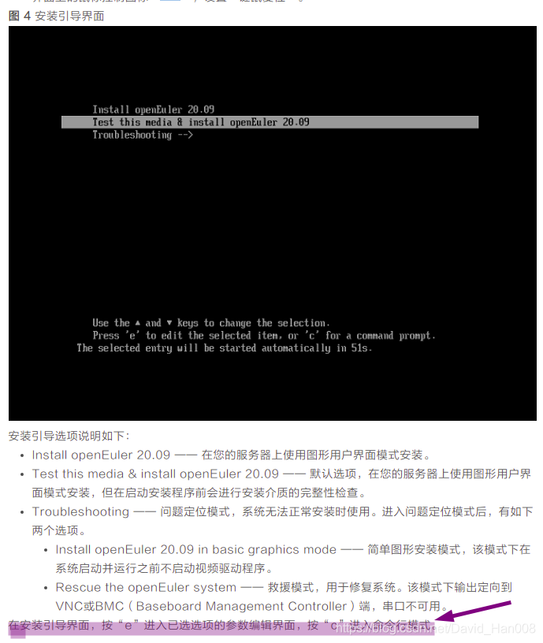
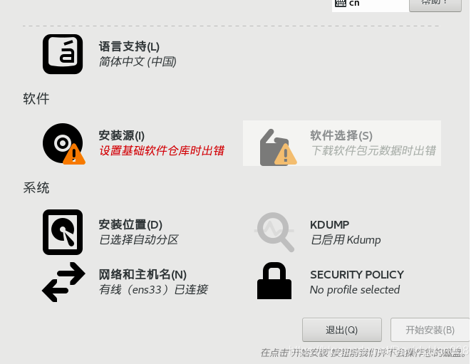
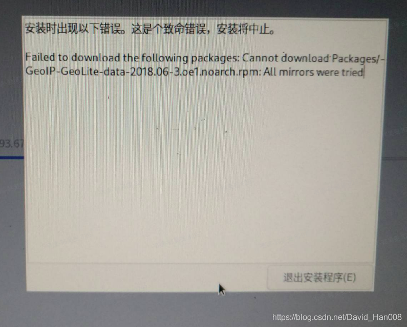
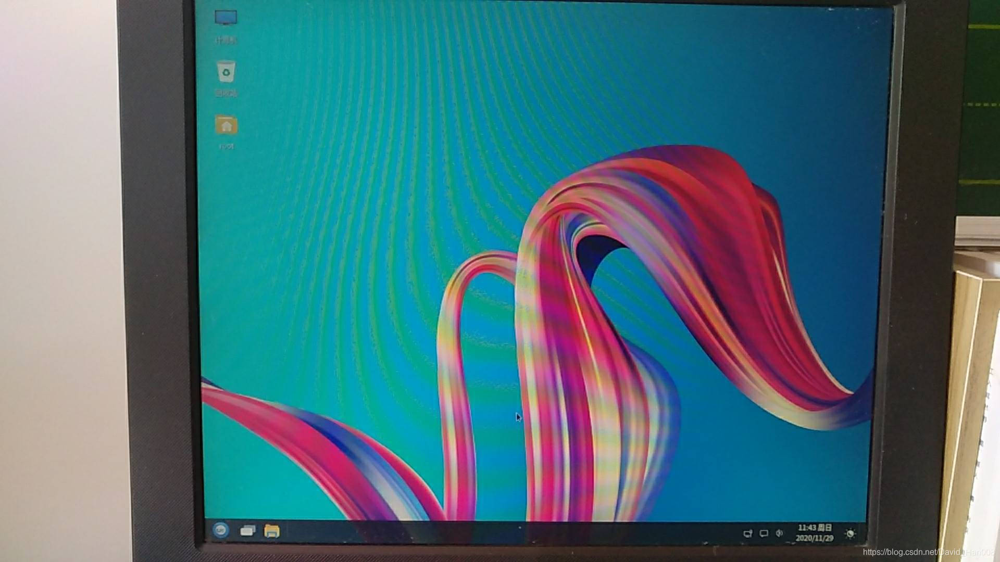

# openEuler20.09以及21.03的安装测试

## 步骤1: 下载openEuler20.09镜像

下载链接:https://repo.openeuler.org/openEuler-20.09/ISO/

## 步骤2: 查看官方的安装指南

参考链接: [openEuler](https://openeuler.org/zh/docs/20.09/docs/Installation/installation.html)




参考链接:https://blog.csdn.net/qq_36937234/article/details/82996998 将stage2=hd:LABEL=** 改成/dev/sda4 或openEuler-2 然后按 **`Ctrl+x`** 执行安装

## 问题集锦:

#### 问题1: 出现需要设置基础软件仓库时出错



解决办法,在安装源那边设置源的链接为: https://repo.openeuler.org/openEuler-20.09/OS/x86_64/ 或者https://repo.openeuler.org/openEuler-20.09/OS/aarch64/ 需结合安装的到底是基于x86还是aarch64来定

#### 问题2: 安装时出现以下错误,xxx安装终止




这个问题主要是网络环境不好,无法完整下载下来对应的rpm包,插上网线就好了.

安装系统方面参考博客:[openEuler简介与安装_淼叔的博客-CSDN博客_openeuler](https://blog.csdn.net/liumiaocn/article/details/110255783)

## 步骤3: 安装UKUI界面

完成步骤2之后,开机之后你发现可能跟openeuler20.03一样,只有一个终端.现在openeuler20.09的源可以默认搜到ukui界面.只需要输入几行命令,重启即可

```
yum install ukui --allowerasing
yum install google-noto*sc-fonts --allowerasing
systemctl set-default graphical.target
```

注意:

```
以命令 systemctl get-default 可查看当前默认的模式为multi-user.target，即命令行模式
systemctl set-default graphical.target  # 将默认模式修改为图形界面模式
systemctl set-default multi-user.target # 将默认模式修改为命令行模式
```



参考链接:

[openEuler 中 UKUI 的安装部署-云海天教程](https://www.yht7.com/news/101519)

[UKUI 3.0 的安装部署（openEuler） | 易学教程](https://www.e-learn.cn/topic/3861933)

\#######################################################

更新日期：2021年8月16日

## 步骤1: 下载openEuler21.03镜像

下载链接:[https://repo.openeuler.org/openEuler-21.03/ISO/](https://repo.openeuler.org/openEuler-20.09/ISO/)

## 问题集锦:

#### 问题1: 出现需要设置基础软件仓库时出错

解决办法,需要先吧repo的选项改成https://,然后接着输入为: [repo.openeuler.org/openEuler-21.03/OS/x86_64/](https://repo.openeuler.org/openEuler-20.09/OS/x86_64/) 或者[repo.openeuler.org/openEuler-21.03/OS/aarch64/](https://repo.openeuler.org/openEuler-20.09/OS/aarch64/) 需结合安装的到底是基于x86还是aarch64来定

后续步骤跟openeuler20.09相同，值得庆祝的地方，openeuler21.03安装默然安装了火狐浏览器，可以愉快的上网了
