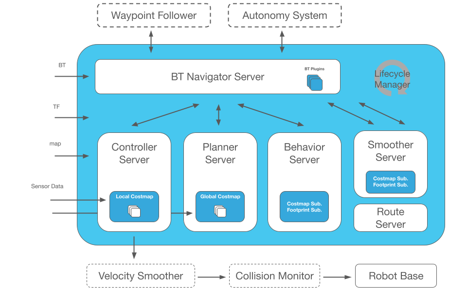

# OpenEuler 建图导航仿真

运行环境： 

+ OS ： OpenEuler 24.03(LTS)
+ CPU ： Intel(R) Core(TM) i5-7260U
+ Memory：8G
+ ROS2版本: humble

## Gazebo 下载与启动：

### Gazebo 源配置：

添加 `gazebo` 源 `vim /etc/yum.repos.d/gazebo.repo`：

```bash
[openEulerROS-humble-3rdparty]
name=openEulerROS-humble
baseurl=https://eulermaker.compass-ci.openeuler.openatom.cn/api/ems1/repositories/ROS-SIG-Multi-Version_ros-humble_openEuler-24.03-LTS-ROS-3rdparty/openEuler%3A24.03-LTS/x86_64 
enabled=1
gpgcheck=0
```

### 启动 gazebo：

Terminal 中输入指令： `gazebo`


> 若出现报错：
>
> ```bash
> gazebo: error while loading shared libraries: libhdf5.so.310: cannot open shared object file: No such file or directory
> ```
>
> 在/etc/ld.so.conf.d中添加文件`custom.conf`并刷新ld缓存
>
> ```bash
> echo "/usr/lib64/mpich/lib" > /etc/ld.so.conf.d/custom.conf
> ldconfig
> ```
>
> 图形界面显示不完全，打开终端输入：
>
> ```bash
> export QT_AUTO_SCREEN_SCALE_FACTOR=0
> export QT_SCREEN_SCALE_FACTORS=[1.0]
> ```


## Gazebo 场景搭建

启动 `Gazebo` 图形界面，点击 `Edit->Building Editor` 启动环境编辑界面，左侧选择墙体以及材质，根据需要构建运行环境地图：


构建结束后，将地图文件保存为 `.world` 文件


## 机器人模型发布

机器人模型仿真模型通过 `urdf` 模型发布，基本的模型搭建可以参考：

https://wiki.ros.org/urdf/XML/link
https://docs.ros.org/en/humble/Tutorials/Intermediate/URDF/URDF-Main.html

新建仿真包工作地址：

```
mkdir nav_sim_ws
```

下载仿真包：

```bash
cd nav_sim_ws
git clone git@github.com:Akana-kunama/nav2_sim.git
```

编译机器人模型发布包：

```bash
colcon build --packages-select robot_description
source ./install/setup.bash
```

启动模型发布：

```bash
ros2 launch robot_description robot_display		
```


随后可以通过 `teleop_twist_keyboard` 实现对小车模型的控制：

```bash
ros2 run teleop_twist_keyboard teleop_twist_keyboard
```

> 
>
> 如遇到路径相关报错，将 `urdf` 文件中机器人模型的相关路径修改为绝对路径即可：
>
> ```xml
> <mesh filename="package://robot_description/meshes/MicroROS/base_link.STL" />
> ```
>
> 修改为：
>
> ```xml
> <mesh filename="file//<path to package>/robot_description/meshes/MicroROS/base_link.STL" />
> ```


## Slam Tool Box 建图


Slam Toolbox是由Steve Macenski在Simbe Robotics期间开发、三星研究院期间维护并持续在业余时间更新的2D SLAM工具集。该项目以模块化设计为核心，支持激光雷达、摄像头、IMU等多种传感器融合，提供从基础建图到动态地图维护的全流程解决方案，其功能覆盖了主流SLAM库（包括免费和付费）的核心能力并进行了扩展

github 仓库 ： https://github.com/SteveMacenski/slam_toolbox

下载 `slam_toolbox` :

```bash
sudo dnf install ros-<version>-slam-toolbox
```

`slam tool box` 安装好后，对 `robot_slam` 进行编译，可以通过 `robot_slam` 包实现地图创建和保存

```
colon build --packages-select robot_slam
source ./install 
```


1. 启动仿真环境：

   ```bash
   ros2 launch robot_description robot_display_launch.py
   ```

2. 启动 `slam tool box ` 建图

   ```bash
   ros2 launch robot_slam slam_mapping_launch.py		
   ```

3. 启动键盘控制

   ```
   ros2 run teleop_twist_keyboard teleop_twist_keyboard
   ```

4. 保存地图文件：

   ```bash
   ros2 launch robot_slam map_saving_launch.py math_path:<path to map>
   ```


## Navigation2 导航

Navigation2是ROS 2生态中用于机器人自主导航的核心框架，其设计理念通过模块化组件和行为树（Behavior Tree）实现高度可配置的导航系统。



官方文档：https://docs.nav2.org/index.html

中文文档： https://fishros.org/doc/nav2/index.html#

下载安装 `navigation2`:

```bash
sudo dnf install ros-<ros2-distro>-navigation2
sudo dnf install ros-<ros2-distro>-nav2-bringup
source /opt/ros/<ros2-distro>/setup.bash
```


`Navigation2 ` 相关依赖安装完成后，对 `robot_navigation` 进行编译，可以进行建好的地图进行导航：

```bash
colon build --packages-select robot_navigation
source ./install 
```

1. 启动仿真环境：

   ```bash
   ros2 launch robot_description robot_display_launch.py
   ```

2. 启动导航：

   ```bash
   ros2 launch robot_navigation navigation_launch.py
   ```

   


## 源码仓库

https://gitee.com/ros-rv?invite=72144e6bb965e38beb602221f320f21deddad7c0be67ea638e7cde0b62298f891d74897d7ff77d9f5a3bb80683dd0c58d1dccc1da22228b9176878ff90562432

## Reference

https://fishros.org/doc/nav2/concepts/index.html#

https://docs.nav2.org/search.html?q=Model&check_keywords=yes&area=default

https://github.com/IfReturn/PLCT/blob/main/gazebo_in_OpenEuler2403.md
