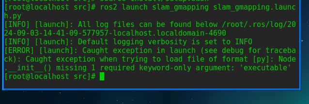
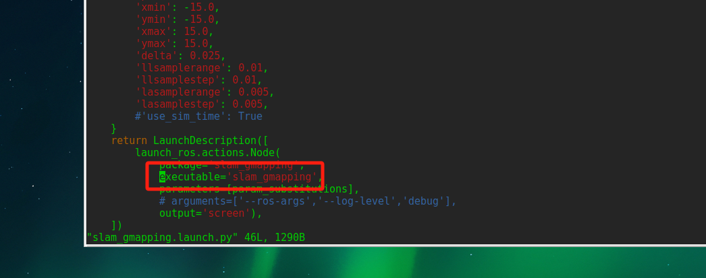
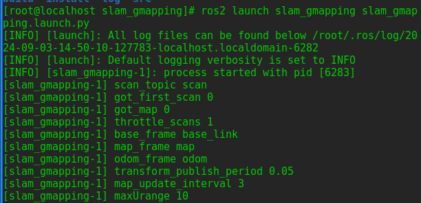

# 从源码编译 slam_gmapping

相关仓库:[gitee仓库](https://gitee.com/src-openeuler/slam_gmapping.git)

## 克隆仓库并编译
```bash
mkdir slam_gmapping
cd slam_gmapping
git clone git clone https://gitee.com/src-openeuler/slam_gmapping.git
git clone git clone https://gitee.com/src-openeuler/openslam_gmapping.git
cd slam_gmapping
tar -xzf ros-humble-slam-gmapping_1.4.2.orig.tar.gz
cd ../openslam_gmapping
tar -xzf ros-humble-openslam-gmapping_0.2.1.orig.tar.gz
cd ../
colcon build
source install/setup.bash
ros2 pkg list | grep slam
```

## 修改
运行

`ros2 launch slam_gmapping slam_gmapping.launch.py`

出现报错



```bash
[ERROR] [launch]: Caught exception in launch (see debug for traceback): __init__() missing 1 required keyword-only argument: 'node_executable'

```

修改launch文件中
讲`node_executable=....`改成`executable`




运行成功

