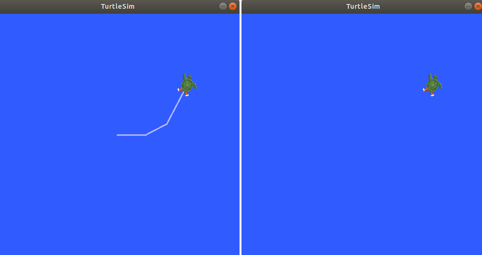
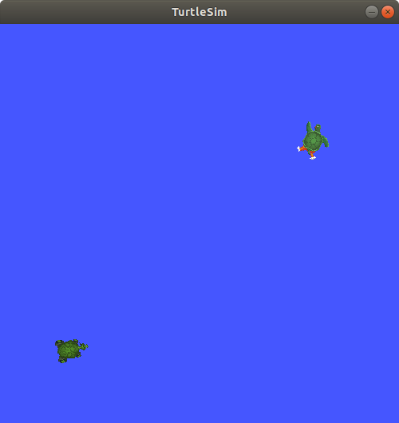

# 了解服务 

**目标:** 使用命令行工具学习ROS 2中的服务。

## 背景

服务是ROS图中节点之间的另一种通信方法。服务基于调用-响应模型，而不是主题的发布-订阅模型。虽然主题允许节点订阅数据流并获得持续更新，但服务仅在客户端特定调用时提供数据。


## 任务

### 1 设置

启动两个 turtlesim 节点， `/turtlesim` and `/teleop_turtle`.

打开一个新的终端并运行：

``` console
ros2 run turtlesim turtlesim_node
```

打开另一个终端并运行：

``` console
ros2 run turtlesim turtle_teleop_key
```

### 2 ros2 service list

在新终端中运行 `ros2 service list` 命令将返回当前系统中所有活动服务的列表：

``` console
/clear
/kill
/reset
/spawn
/teleop_turtle/describe_parameters
/teleop_turtle/get_parameter_types
/teleop_turtle/get_parameters
/teleop_turtle/list_parameters
/teleop_turtle/set_parameters
/teleop_turtle/set_parameters_atomically
/turtle1/set_pen
/turtle1/teleport_absolute
/turtle1/teleport_relative
/turtlesim/describe_parameters
/turtlesim/get_parameter_types
/turtlesim/get_parameters
/turtlesim/list_parameters
/turtlesim/set_parameters
/turtlesim/set_parameters_atomically
```

你会发现两个节点都有相同的六个以``parameters``结尾的服务。ROS 2中几乎每个节点都有这些基础设施服务，参数就是构建在这些服务之上的。下一个教程将更多地介绍参数。在本教程中，将省略对参数服务的讨论。

现在，让我们专注于turtlesim特定的服务 `/clear`,
`/kill`, `/reset`, `/spawn`, `/turtle1/set_pen`,
`/turtle1/teleport_absolute`,和 `/turtle1/teleport_relative`. 

### 3 ros2服务类型

服务具有描述服务的请求和响应数据结构的类型。服务类型的定义类似于主题类型，但服务类型由请求部分和响应部分组成。

要找出服务的类型，请使用以下命令：
``` console
ros2 service type <service_name>
```

让我们来看一下 turtlesim 的 `/clear` 服务。在新的终端中，输入以下命令：
``` console
ros2 service type /clear
```

预期的输出应为：

``` console
std_srvs/srv/Empty
```

`Empty` 类型表示服务调用在发送请求时不发送任何数据，在接收响应时也不接收任何数据。

#### 3.1 ros2 service list -t

要同时查看所有活动服务的类型，可以将 `--show-types` 选项（缩写为``-t``）, 附加到``list``命令后面：

``` console
ros2 service list -t
```

将返回：

``` console
/clear [std_srvs/srv/Empty]
/kill [turtlesim/srv/Kill]
/reset [std_srvs/srv/Empty]
/spawn [turtlesim/srv/Spawn]
...
/turtle1/set_pen [turtlesim/srv/SetPen]
/turtle1/teleport_absolute [turtlesim/srv/TeleportAbsolute]
/turtle1/teleport_relative [turtlesim/srv/TeleportRelative]
...
```

### 4 ros2 service find

如果您想找到特定类型的所有服务，请使用以下命令：

``` console
ros2 service find <type_name>
```

例如，您可以通过以下方式找到所有“Empty”类型的服务：

``` console
ros2 service find std_srvs/srv/Empty
```

将返回：

``` console
/clear
/reset
```

### 5 ros2 interface show

您可以从命令行调用服务，但首先需要了解输入参数的结构。

``` console
ros2 interface show <type_name>
```

在“/clear”服务的类型“Empty”上尝试一下：

``` console
ros2 interface show std_srvs/srv/Empty
```

将返回：

``` console
---
```

 `---` 分隔了请求结构（上方）和响应结构（下方）。但是，正如您之前学到的那样，`Empty` 类型不发送或接收任何数据。因此，它的结构自然为空白。
让我们来查看一个发送和接收数据的服务类型，比如 `/spawn`。 通过 `ros2 service list -t` 的结果，我们知道
`/spawn`的类型是 `turtlesim/srv/Spawn`.

要查看`/spawn` 服务的请求和响应参数，请运行以下命令：

``` console
ros2 interface show turtlesim/srv/Spawn
```

将返回：

``` console
float32 x
float32 y
float32 theta
string name # Optional.  A unique name will be created and returned if this is empty
---
string name
```

 `---` 行上方的信息告诉我们调用 `/spawn` 需要的参数。 `x`, `y` 和`theta` 决定了生成的乌龟的二维姿态，而 `name` 显然是可选的。

下划线以下的信息在这种情况下不是您需要了解的内容，但它可以帮助您理解调用返回的响应的数据类型。
### 6 ros2 服务调用

既然您知道了什么是服务类型，如何找到服务的类型，以及如何找到该类型参数的结构，您可以使用以下命令调用服务

``` console
ros2 service call <service_name> <service_type> <arguments>
```

 `<arguments>`  部分是可选的。例如，您知道 `Empty`
类型的服务没有任何参数：

``` console
ros2 service call /clear std_srvs/srv/Empty
```

该命令将清除乌龟绘制的所有线条，使得乌龟仿真窗口变空白。



现在让我们通过调用``/spawn``并设置参数来生成一个新的乌龟。在从命令行进行服务调用时，输入的``<arguments>``需要使用YAML语法。

输入以下命令：

``` console
ros2 service call /spawn turtlesim/srv/Spawn "{x: 2, y: 2, theta: 0.2, name: ''}"
```

您将会看到方法式的视图，了解正在发生的情况，然后获得服务的响应：

``` console
requester: making request: turtlesim.srv.Spawn_Request(x=2.0, y=2.0, theta=0.2, name='')

response:
turtlesim.srv.Spawn_Response(name='turtle2')
```

您的乌龟仿真窗口将立即更新，显示新生成的乌龟：



## 总结

节点可以使用ROS 2中的服务进行通信。与话题不同，话题是一种单向通信模式，其中一个节点发布信息，可以由一个或多个订阅者消费。服务是一种请求/响应模式，其中客户端向提供服务的节点发出请求，服务处理请求并生成响应。

通常情况下，你不应该使用服务进行连续调用；更适合使用话题或者甚至是动作。

在本教程中，你使用命令行工具来识别、内省和调用服务。


## 相关内容

请查看 [this
tutorial](https://discourse.ubuntu.com/t/call-services-in-ros-2/15261)
这是一个使用Robotis机械臂进行ROS服务的出色实际应用。

本文引用：   
-1:[https://fishros.org/doc/ros2/humble/Tutorials.html](https://fishros.org/doc/ros2/humble/Tutorials.html)   
-2:[https://github.com/ros2/ros2_documentation/blob/humble/source/Tutorials.rst](https://github.com/ros2/ros2_documentation/blob/humble/source/Tutorials.rst)   

