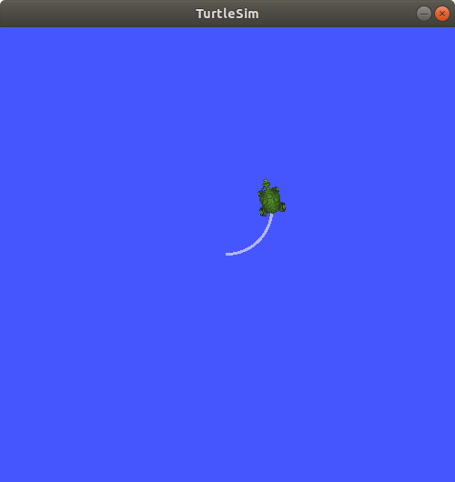
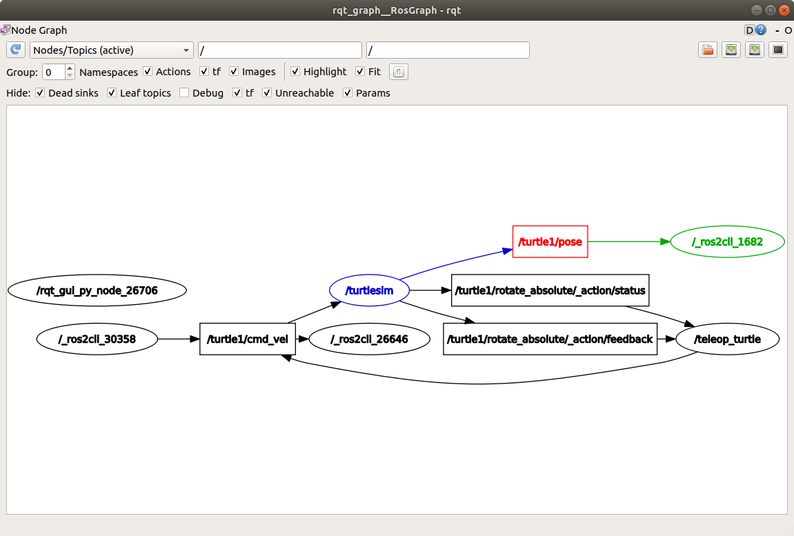

# 理解话题

**目标:** 使用rqt_graph和命令行工具来审查ROS 2话题。

## 背景

ROS 2将复杂系统分解为许多模块化节点。话题是ROS图中的重要组成部分，作为节点交换消息的总线。


一个节点可以向任意数量的主题发布数据，并同时订阅任意数量的主题。


主题是数据在节点之间以及系统不同部分之间传递的主要方式之一。

## 任务

### 1 设置

到目前为止，你应该已经熟悉如何启动turtlesim。

打开一个新的终端并运行：

``` console
ros2 run turtlesim turtlesim_node
```

打开另一个终端并运行：

``` console
ros2 run turtlesim turtle_teleop_key
```


### 2 rqt_graph

在本教程中，我们将使用``rqt_graph``来可视化节点和话题的变化，以及它们之间的连接。

在 turtlesim 教程 <../Introducing-Turtlesim/Introducing-Turtlesim>`中，介绍了如何安装 rqt 以及其包括的所有插件，包括``rqt_graph`。

要运行 rqt_graph，请打开一个新的终端并输入以下命令：

``` console
rqt_graph
```

您也可以通过打开 rqt 并选择 Plugins > Introspection > Node Graph 来打开 rqt_graph。


您应该能够看到上述的节点和主题，以及图形周围的两个操作（暂时忽略它们）。如果将鼠标悬停在中心的主题上，您会看到像上面图片中那样的颜色高亮显示。

该图形描述了 /turtlesim 节点和 /teleop_turtle 节点之间如何通过一个主题进行通信。/teleop_turtle 节点将数据（您输入的按键操作来移动乌龟）发布到 /turtle1/cmd_vel 主题上，而 /turtlesim 节点订阅该主题以接收数据。

rqt_graph的突出显示功能在检查具有许多以多种不同方式连接的节点和主题的更复杂系统时非常有帮助。

rqt_graph是一个图形化内省工具。现在我们将看一些用于内省主题的命令行工具。

### 3 ros2 topic list

在新终端中运行``ros2 topic list``命令将返回系统中当前活动的所有主题的列表：

``` console
/parameter_events
/rosout
/turtle1/cmd_vel
/turtle1/color_sensor
/turtle1/pose
```
ros2 topic list -t 将返回相同的主题列表，这次在括号中附加了主题类型：

``` console
/parameter_events [rcl_interfaces/msg/ParameterEvent]
/rosout [rcl_interfaces/msg/Log]
/turtle1/cmd_vel [geometry_msgs/msg/Twist]
/turtle1/color_sensor [turtlesim/msg/Color]
/turtle1/pose [turtlesim/msg/Pose]
```
特别是类型属性是节点了解它们正在通过主题传输相同信息的方式。

如果你想知道在 rqt_graph 中所有这些主题的位置，在 隐藏： 下取消选中所有复选框：


不过现在，保留这些选项的选择以避免混淆。

### 4 ros2 topic echo

要查看在话题上发布的数据，请使用：

``` console
ros2 topic echo <topic_name>
```

由于我们知道 /teleop_turtle 在 /turtle1/cmd_vel 话题上向 /turtlesim 发布数据，让我们使用 echo 来检查该话题：

``` console
ros2 topic echo /turtle1/cmd_vel
```

刚开始，这个命令不会返回任何数据。这是因为它正在等待 /teleop_turtle 发布一些东西。

返回到运行``turtle_teleop_key``的终端，并使用箭头键来移动乌龟。同时观察运行``echo``的终端，你将会看到每次移动时发布的位置数据：

``` console
linear:
  x: 2.0
  y: 0.0
  z: 0.0
angular:
  x: 0.0
  y: 0.0
  z: 0.0
  ---
```

现在返回到rqt_graph并取消选择**Debug**框。


``/_ros2cli_26646``是刚刚我们运行的``echo``命令创建的节点（数字可能不同）。现在你可以看到发布者正在通过``cmd_vel``主题发布数据，而两个订阅者正在订阅它。

### 5 ros2 topic info

主题不仅可以是一对一的通信，还可以是一对多的、多对一的或多对多的通信。

另一种理解方式是运行：

``` console
ros2 topic info /turtle1/cmd_vel
```

将返回：

``` console
Type: geometry_msgs/msg/Twist
Publisher count: 1
Subscription count: 2
```

### 6 ros2 interface show

节点使用消息在主题上发送数据。发布者和订阅者必须发送和接收相同类型的消息来进行通信。

在运行 ros2 topic list -t 后，我们可以看到之前提到的主题类型，它们告诉我们每个主题使用的消息类型。回想一下，cmd_vel 主题的类型是：

``` console
geometry_msgs/msg/Twist
```

这意味着在``geometry_msgs``包中有一个名为``Twist``的``msg``。

现在我们可以在此类型上运行``ros2 interface show <msg type>``以了解其详细信息。具体来说，消息期望的数据结构是什么样的。

``` console
ros2 interface show geometry_msgs/msg/Twist
```

对于上述消息类型，它产生以下结果：

``` console
# This expresses velocity in free space broken into its linear and angular parts.

    Vector3  linear
            float64 x
            float64 y
            float64 z
    Vector3  angular
            float64 x
            float64 y
            float64 z
```

这告诉你``/turtlesim``节点期望接收一个带有两个向量``linear``和``angular``的消息，每个向量都有三个元素。如果你回想一下我们使用``echo``命令看到``/teleop_turtle``传递给``/turtlesim``的数据，它具有相同的结构：

``` console
linear:
  x: 2.0
  y: 0.0
  z: 0.0
angular:
  x: 0.0
  y: 0.0
  z: 0.0
  ---
```

### 7 ros2 topic pub

现在您已经有了消息结构，您可以直接从命令行发布数据到一个话题上，使用以下命令：

``` console
ros2 topic pub <topic_name> <msg_type> '<args>'
```

'<args>' 参数是您将传递给话题的实际数据，其结构正如您在前一节中了解到的。

请注意，这个参数需要以 YAML 语法输入。请输入完整的命令，如下所示：

``` console
ros2 topic pub /turtle1/cmd_vel geometry_msgs/msg/Twist "{linear: {x: 2.0, y: 0.0, z: 0.0}, angular: {x: 0.0, y: 0.0, z: 1.8}}"
```

在没有命令行选项时, `ros2 topic pub` 消息频率将稳定运行在 1 Hz.


有时，你想发布数据到话题仅一次(即非持续发送)，你可以使用'--once'参数。

``` console
ros2 topic pub --once -w 2 /turtle1/cmd_vel geometry_msgs/msg/Twist "{linear: {x: 2.0, y: 0.0, z: 0.0}, angular: {x: 0.0, y: 0.0, z: 1.8}}"
```

`--once` 是个可选择的参数，它的含义是"发布一条消息后退出".

`-w 2` 同样是个可选择的参数，它的含义是"等待两个匹配的订阅". 因为我们有turtlesim和话题的这个两个订阅。
在终端能看到:

``` console
Waiting for at least 2 matching subscription(s)...
publisher: beginning loop
publishing #1: geometry_msgs.msg.Twist(linear=geometry_msgs.msg.Vector3(x=2.0, y=0.0, z=0.0), angular=geometry_msgs.msg.Vector3(x=0.0, y=0.0, z=1.8))
```

并且你会看到你的小乌龟如下图在移动”


你可以刷新rqt_graph来查看图形化的情况。你会看到``ros2 topic pub ...``节点（/_ros2cli_30358）正在``/turtle1/cmd_vel``话题上发布消息，这些消息被``ros2 topic echo ...``节点（/_ros2cli_26646）和``/turtlesim``节点接收。


最后，你可以在``pose``话题上运行``echo``命令，并重新检查rqt_graph：

``` console
ros2 topic echo /turtle1/pose
```



你会看到``/turtlesim``节点也在向``pose``话题发布消息，而新的``echo``节点已经订阅了该话题

当发布带有时间戳的消息时,`pub` 有两种方法
用当前时间自动填写。对于有
`std_msgs/msg/Header`的消息, header可以设置为 `auto` 以填写 `stamp` 字段.

``` console
ros2 topic pub /pose geometry_msgs/msg/PoseStamped '{header: "auto", pose: {position: {x: 1.0, y: 2.0, z: 3.0}}}'
```

如果消息没有使用完整的header, 而只有一个字段 `builtin_interfaces/msg/Time`, 就可以设置成 `now`.

``` console
ros2 topic pub /reference sensor_msgs/msg/TimeReference '{header: "auto", time_ref: "now", source: "dumy"}'
```

### 8 ros2 topic hz

您可以使用以下命令查看数据发布的速率：

``` console
ros2 topic hz /turtle1/pose
```

它将返回``/turtlesim``节点向``pose``主题发布数据的速率。

``` console
average rate: 59.354
  min: 0.005s max: 0.027s std dev: 0.00284s window: 58
```

回想一下，您使用``ros2 topic pub --rate 1``将``turtle1/cmd_vel``的速率设置为稳定的1 Hz。如果您使用``turtle1/cmd_vel``而不是``turtle1/pose``运行上述命令，则会看到反映该速率的平均值。

### 9 ros2 topic bw

您可以使用以下命令查看一个话题的带宽：
``` console
ros2 topic bw /turtle1/pose
```
会返回带宽利用率和向`/turtle1/pose`主题发布的消息数量。
``` console
Subscribed to [/turtle1/pose]
1.51 KB/s from 62 messages
    Message size mean: 0.02 KB min: 0.02 KB max: 0.02 KB
```

### 10 ros2 topic find

使用以下命令列出给定类型的可用topic列表：
``` console
ros2 topic find <topic_type>
```

回想一下，`cmd_vel`主题的类型是:
``` console
geometry_msgs/msg/Twist
```

当有消息时，用 `find` 命令输出可用的topics:

``` console
ros2 topic find geometry_msgs/msg/Twist
```

会输出:

``` console
/turtle1/cmd_vel
```

### 11 Clean up

此时你会有很多正在运行的节点。不要忘记在每个终端中输入``Ctrl+C``来停止它们。

本文引用：   
-1:[https://fishros.org/doc/ros2/humble/Tutorials.html](https://fishros.org/doc/ros2/humble/Tutorials.html)   
-2:[https://github.com/ros2/ros2_documentation/blob/humble/source/Tutorials.rst](https://github.com/ros2/ros2_documentation/blob/humble/source/Tutorials.rst)   
