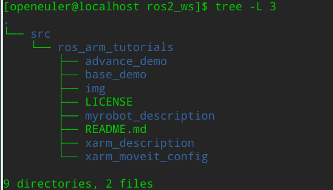
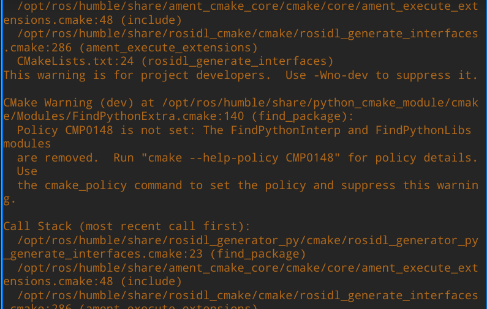
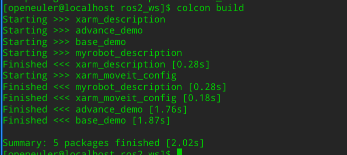
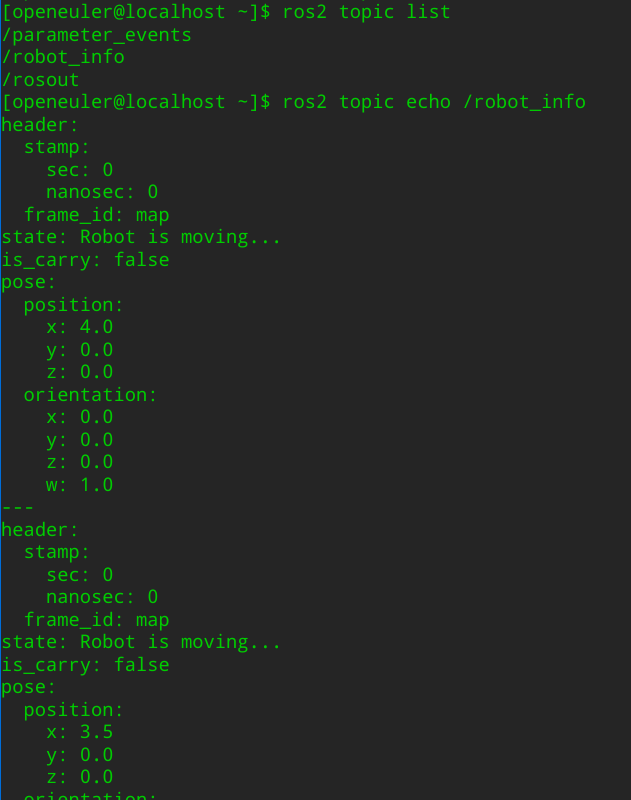
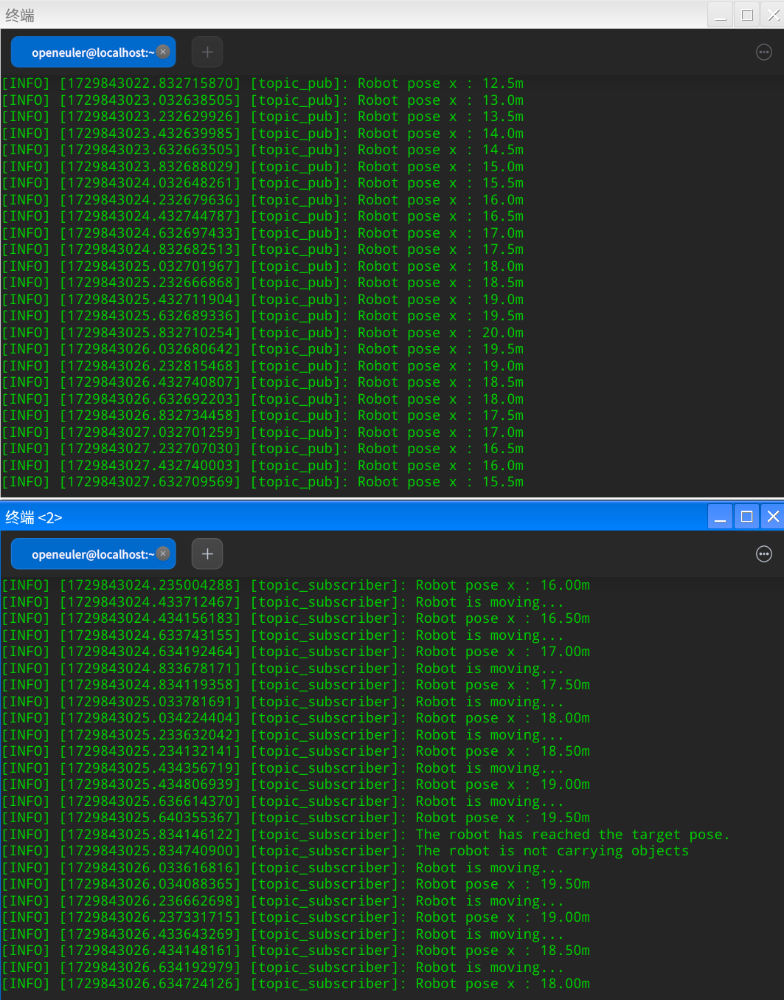
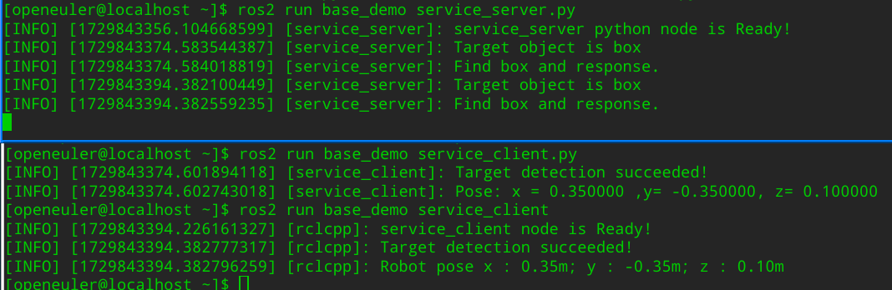

# colcon构建功能包并测试通信

在前面的章节中，我们已经安装好了openEuler系统和ROS2 Humble完整版：

[安装 ROS 2 Humble](https://openeuler-ros-docs.readthedocs.io/en/latest/installation/install-ros-humble.html)

本小节将介绍如何创建自己的工作空间构建代码，并简单测试节点间的Topic和Service通信

## 创建工作空间

ROS 工作空间（workspace）是一个具有特定结构的目录，用来存放管理机器人代码开发过程中的所有资料。工作空间下通常会有一个 src 子目录，存放着 ROS 软件包的源代码，可以是我们下载的开源代码，也可以是我们自研的代码。

打开终端，输入以下命令创建一个名为“ros2_ws”的工作空间以及其下的src子目录：

```
mkdir -p ~/ros2_ws/src
```

此时src目录下为空，下面我们下载[ros_arm_tutorials](https://gitee.com/xiao_yun_wang/ros_arm_tutorials/tree/ros2-humble/)仓库的代码到src目录下，作为后续测试节点通信的示例源代码：

```
cd ~/ros2_ws/src
git clone -b ros2-humble https://gitee.com/xiao_yun_wang/ros_arm_tutorials.git
```

下载完成后，我们可以安装tree工具用来查看工作空间下的目录结构：

```
 dnf install tree
 tree -L 3
```



ros_arm_tutorials 的ros2-humble分支代码共包含以下五个功能包:

| 功能包（软件包）    | 内容                                                         |
| ------------------- | ------------------------------------------------------------ |
| base_demo           | 自定义消息和服务、topic发布/订阅节点、service服务端/客户端节点、参数操作示例节点 |
| advance_demo        | action 的定义和服务端/客户端节点、ROS 常用工具、动态参数配置节点、TF2示例节点、RVIZ Marker发布和显示等 |
| myrobot_description | 三自由度机械臂和移动小车的URDF模型                           |
| xarm_description    | XBot-Arm 机械臂 URDF 模型文件包                              |
| xarm_moveit_config  | 使用配置助手生成的 XBot-Arm 机械臂 MoveIt!配置和启动功能包   |

更多说明可参考原仓库

## 构建功能包

ROS2使用colcon 构建工具进行源代码的构建，更多信息可参考：[设计文档](https://design.ros2.org/articles/build_tool.html)

默认情况下，colcon会创建以下目录作为 src 目录的同级目录：

- build：存放中间文件。

- install：每个软件包的安装目录。默认情况下，每个软件包都将安装到一个单独的子目录中。

- log：日志目录包含有关每次调用 colcon 的各种日志信息。

由于 ament_cmake 等联编类型不支持开发空间的概念，需要安装软件包，因此 colcon 支持选项 --symlink-install。这允许通过更改源代码空间中的文件（如 Python 文件或其他非编译资源）来更改已安装的文件，从而加快迭代速度。

安装colcon：

```
pip3 install -U pytest colcon-common-extensions
```

在工作空间的根目录下，使用colcon构建功能包。

```
cd ~/ros2_ws/
colcon build --symlink-install
```

构建过程中因使用的cmake版本不一致等原因可能会出现一些warnning，可先忽略。



构建完成后会提示已经完成5个软件包的构建：



## 设置环境

执行 `source ~/ros2_ws/install/setup.bash` 设置环境，或者运行以下命令添加到`.bashrc`中

```bash
echo "source ~/ros2_ws/install/setup.bash" >> ~/.bashrc
source ~/.bashrc
```

## 测试Topic通信节点

ROS2基于分布式的设计，将复杂系统分为许多用于实现不用功能的模块化节点（进程）。不同节点之间通过消息传递数据。Topic话题通信是一种基于发布/订阅的异步通信机制，base_demo功能包中提供了Topic通信的示例代码节点。每个节点都提供了Python与Cpp两种编程方式的实现。

打开终端，输入以下命令启动话题发布端的Python节点或者CPP节点：

```
ros2 run base_demo topic_pub.py
```

or

```
ros2 run base_demo topic_pub
```

新开终端，输入`ros2 topic list`可以查看当前的话题列表，其中/robot_info是节点发布的话题

输入`ros2 topic echo /robot_info`可以看到话题接收到的消息：



新开终端，输入以下命令启动话题订阅端的Python节点

```
ros2 run base_demo topic_sub.py
```

或者启动CPP节点：

```
ros2 run base_demo topic_sub
```

节点启动后会接收话题消息并将消息数据处理后发布到终端显示：



## 测试Service通信节点

Service通信是一种基于请求/响应模式的同步通信方式。base_demo功能包中提供了Service通信的示例代码节点。每个节点都提供了Python与Cpp两种编程方式的实现。

打开终端，输入以下命令启动Service服务端的Python节点：

```
ros2 run base_demo service_server.py
```

或者CPP节点：

```
ros2 run base_demo service_server
```

新开终端，输入以下命令启动Service客户端的Python节点：

```
ros2 run base_demo service_client.py
```

或者CPP节点：

```
ros2 run base_demo service_client
```

客户端节点启动后会向代码中自定义的服务发送请求，服务端接收到请求的信息后会进行处理并在终端提示“Target object is box”“find box and response”，同时反馈响应信息

客户端节点接收到响应后会在终端相应的信息：




！注意：本小节主要介绍工作空间的创建和代码包的构建，源码编写过程可参考

[ros_arm_tutorials](https://gitee.com/xiao_yun_wang/ros_arm_tutorials/tree/ros2-humble/)

大家可以参考此教程在openEuler系统上编译构建自己的ROS程序~

## 参考资料：

- https://docs.ros.org/en/humble/Tutorials/Beginner-Client-Libraries.html
- https://gitee.com/xiao_yun_wang/ros_arm_tutorials


| 文档     | 日期       | 姓名        |
| -------- | ---------- | ----------- |
| Created  | 2024-10-28 | WangXiaoyun |
| Modified |            |             |

