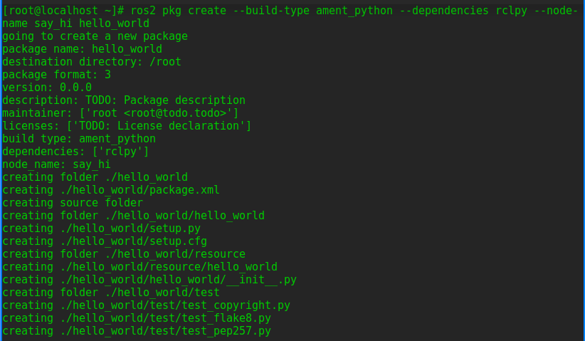
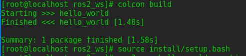
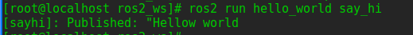

# 创建ROS功能包package
功能包（package）是 ROS 2 代码的组织单位。
如果你想安装你的代码或与他人分享，那么你就需要将其整理成一个package。有了软package，你就可以发布你的 ROS 2 作品，并允许他人轻松地构建和使用它。

ROS 2 中的package创建使用 ament 作为构建系统，使用 colcon 作为构建工具。你可以使用官方支持的 CMake 或 Python 创建package，当然也存在其他构建类型。


## 使用cmake创建
### 进入工作目录并且创建package
`cd ~/ros2_ws/src`  
创建包的简单语法：  
```
ros2 pkg create --build-type ament_cmake --license Apache-2.0 <package_name>
```
在本教程中，你将使用可选参数--node-name在软件包中创建一个简单的 Hello World 类型的可执行文件。  
```
ros2 pkg create --build-type ament_cmake --license Apache-2.0 --node-name my_node my_package
```  
终端返回消息：  
```
going to create a new package
package name: my_package
destination directory: /home/user/ros2_ws/src
package format: 3
version: 0.0.0
description: TODO: Package description
maintainer: ['<name> <email>']
licenses: ['TODO: License declaration']
build type: ament_cmake
dependencies: []
node_name: my_node
creating folder ./my_package
creating ./my_package/package.xml
creating source and include folder
creating folder ./my_package/src
creating folder ./my_package/include/my_package
creating ./my_package/CMakeLists.txt
creating ./my_package/src/my_node.cpp
```
  
文件结构：  
  

### 构建一个功能包
`cd ~/ros2_ws`  
由于构建会全部构建，时间很长，故添加--packages-select参数  
`colcon build`
需要建立一次后才可以使用指定名称构建  
`colcon build --packages-select my_package`  
  

### 获取配置文件  
`source install/local_setup.bash`  

### 运行构建的包  
`ros2 run my_package my_node`  
终端返回消息：
```
hello world my_package package  
``` 
  

### 检查包内容 
**此处官方教程有问题，前已经把src改成mypackage** 
`cd ros2_ws/src/my_package`  
  
这是自动生成的文件和文件夹    

### 自定义package.xml
`vi ros2_ws/src/my_package/package.xml`    
修改以下部分：  
```
<description>TODO: Package description</description>
<maintainer email="user@todo.todo">user</maintainer>
<license>TODO: License declaration</license>
```  
`<description>Beginner client libraries tutorials practice package</description>`  
`<license>Apache License 2.0</license>`  
邮箱姓名为自己邮箱姓名
    
**complete!!**


## 使用python 创建

### 创建功能包
使用以下命令创建功能包
```bash
ros2 pkg create  --build-type ament_python --dependencies rclpy --node-name  say_hi hello_world
```

查看此时的代码结构
```bash
$ tree
.
└── src
    └── hello_world
        ├── hello_world
        │   ├── __init__.py
        │   └── say_hi.py
        ├── package.xml
        ├── resource
        │   └── hello_world
        ├── setup.cfg
        ├── setup.py
        └── test
            ├── test_copyright.py
            ├── test_flake8.py
            └── test_pep257.py

5 directories, 9 files
```


### 编辑节点
在`src/hello_world/hello_world/say_hi`中编辑节点
 写入以下代码
```python
#!/usr/bin/env python3
import rclpy
from rclpy.node import Node
from std_msgs.msg import String

class SayHiNode(Node):
    def __init__(self):
        super().__init__('sayhi')
        self.publisher = self.create_publisher(String, 'hello_world_topic', 10)
        self.timer = self.create_timer(1.0, self.timer_callback)

    def timer_callback(self):
        msg = String()
        msg.data = 'Hello World'
        self.publisher.publish(msg)
        self.get_logger().info('Published: "%s"' % msg.data)

def main(args=None):
    rclpy.init(args=args)
    node = SayHiNode()
    rclpy.spin(node)
    node.destroy_node()
    rclpy.shutdown()

if __name__ == '__main__':
    main()

```

### 编辑配置文件
编辑`setup.py`文件，确保`entry_points`部分包含以下内容：
```python
entry_points={
    'console_scripts': [
        'sayhi = helloworld.sayhi:main',
    ],
},
```
### 编译运行
使用 `colcon`指令编译,并source功能包
```bash
colcon build
source install/setup.bash
```


使用`ros2 run`运行节点

```bash
ros2 run hello_world say_hi 
[sayhi]: Published: "Hello World"
```


这将允许通过ros2 run命令启动say_hi节点。
