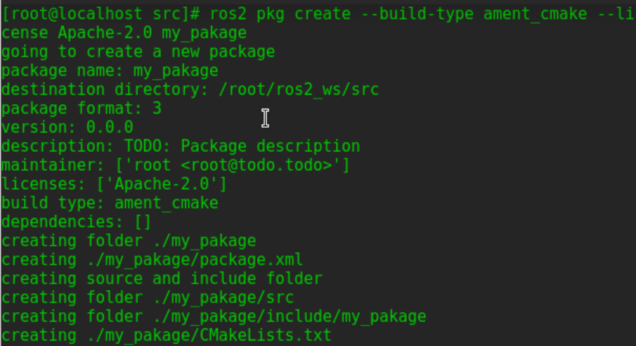
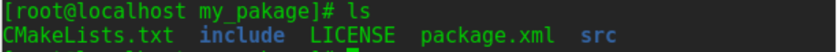
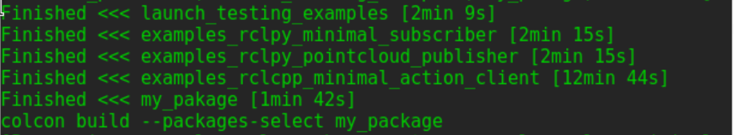
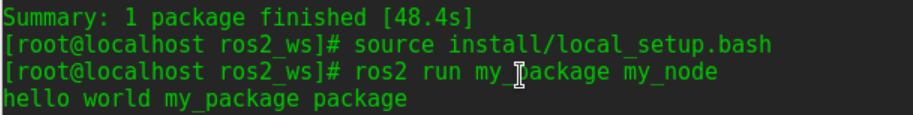
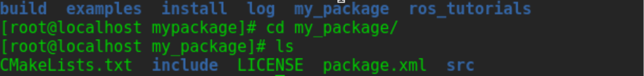
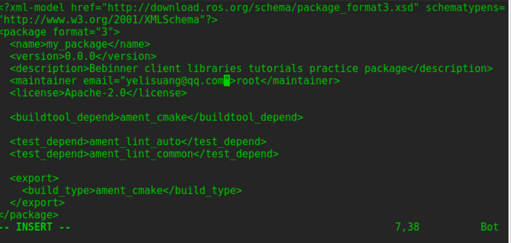

# 创建ROS功能包package
功能包（package）是 ROS 2 代码的组织单位。
如果你想安装你的代码或与他人分享，那么你就需要将其整理成一个package。有了软package，你就可以发布你的 ROS 2 作品，并允许他人轻松地构建和使用它。

ROS 2 中的package创建使用 ament 作为构建系统，使用 colcon 作为构建工具。你可以使用官方支持的 CMake 或 Python 创建package，当然也存在其他构建类型。

## 进入工作目录并且创建package
`cd ~/ros2_ws/src`  

创建包的简单语法：  
```
ros2 pkg create --build-type ament_cmake --license Apache-2.0 <package_name>
```
在本教程中，你将使用可选参数--node-name在软件包中创建一个简单的 Hello World 类型的可执行文件。  
```
ros2 pkg create --build-type ament_cmake --license Apache-2.0 --node-name my_node my_package
```  
终端返回消息：  
```
going to create a new package
package name: my_package
destination directory: /home/user/ros2_ws/src
package format: 3
version: 0.0.0
description: TODO: Package description
maintainer: ['<name> <email>']
licenses: ['TODO: License declaration']
build type: ament_cmake
dependencies: []
node_name: my_node
creating folder ./my_package
creating ./my_package/package.xml
creating source and include folder
creating folder ./my_package/src
creating folder ./my_package/include/my_package
creating ./my_package/CMakeLists.txt
creating ./my_package/src/my_node.cpp
```
  
文件结构：  
  

## 构建一个功能包
`cd ~/ros2_ws`  
由于构建会全部构建，时间很长，故添加--packages-select参数  
`colcon build`
需要建立一次后才可以使用指定名称构建  
`colcon build --packages-select my_package`  
  

## 获取配置文件  
`source install/local_setup.bash`  

## 运行构建的包  
`ros2 run my_package my_node`  
终端返回消息：
```
hello world my_package package  
``` 
  

## 检查包内容 
**此处官方教程有问题，前已经把src改成mypackage** 
`cd ros2_ws/src/my_package`  
  
这是自动生成的文件和文件夹    

## 自定义package.xml
`vi ros2_ws/src/my_package/package.xml`    
修改以下部分：  
```
<description>TODO: Package description</description>
<maintainer email="user@todo.todo">user</maintainer>
<license>TODO: License declaration</license>
```  
`<description>Beginner client libraries tutorials practice package</description>`  
`<license>Apache License 2.0</license>`  
邮箱姓名为自己邮箱姓名
    
**complete!!**
