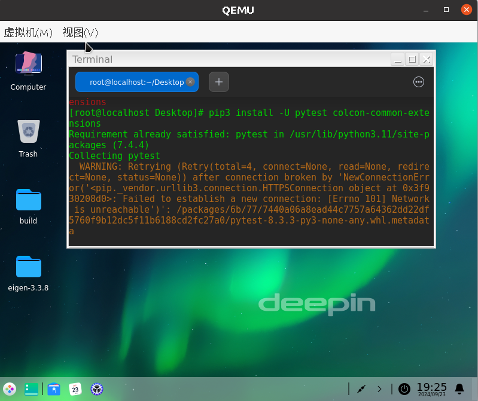
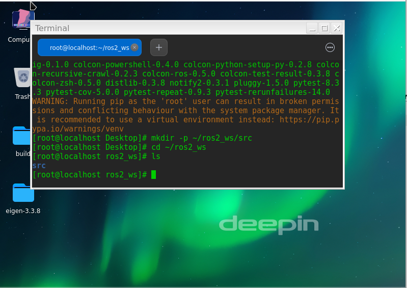
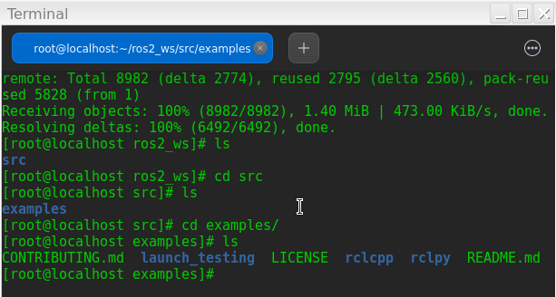
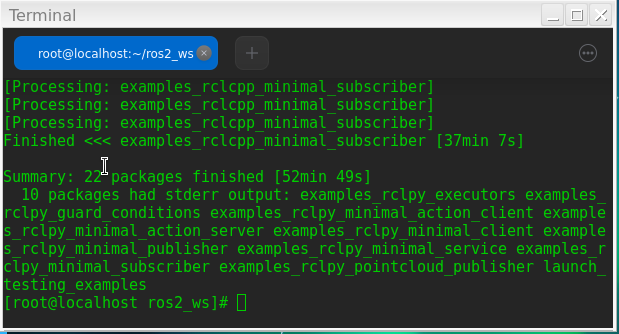
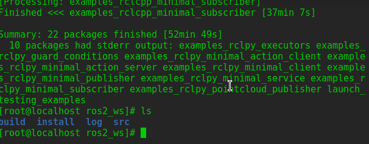
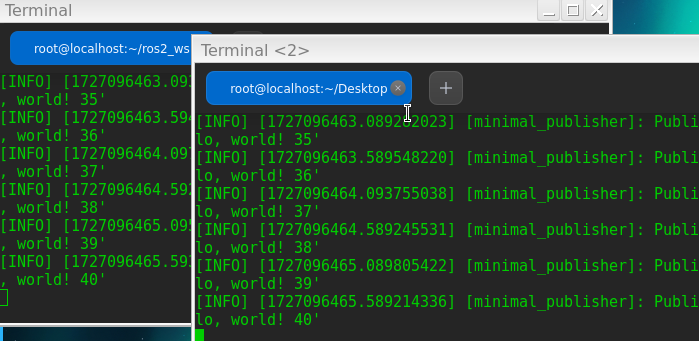

# 使用colcon构建功能包
确保已经安装好ROS
 - [安装 ROS 2 Humble](https://openeuler-ros-docs.readthedocs.io/en/latest/installation/install-ros-humble.html)
## 安装colcon 
终端输入以下命令安装colcon：

```
pip3 install -U pytest colcon-common-extensions
```


## 创建工作空间
```
mkdir -p ~/ros2_ws/src
cd ~/ros2_ws
```

工作区状态



## 添加源代码进入工作目录

`git clone https://github.com/ros2/examples src/examples -b humble`

结果：


工作空间目录：




## 构建工作区
在~/ros2_ws/目录下输入以下命令构建工作空间

`colcon build --symlink-install`



会在顶层目录创建三个文件夹

```text
.
├── build
├── install
├── log
└── src
```

构建结果和文件状态，构建时间很长。


	

## 运行示例程序
执行 `source ~/ros2_ws/install/setup.bash` 设置环境，或者运行以下命令添加到`.bashrc`中

```bash
echo "source ~/ros2_ws/install/setup.bash" >> ~/.bashrc
```


终端1启动：
```
ros2 run examples_rclcpp_minimal_subscriber subscriber_member_function
```

终端2启动：

```
ros2 run examples_rclcpp_minimal_publisher publisher_member_function
```

运行后可以看见不断打印hello world 并且后编号不断增长，两个节点之间实现了通信




