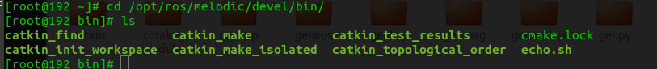
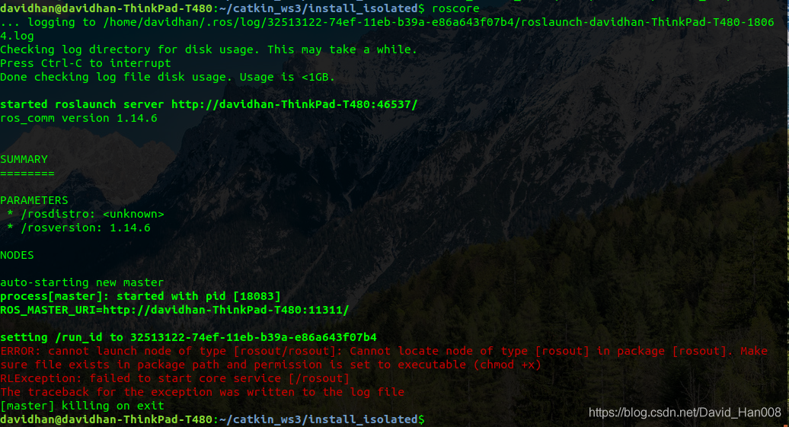

 关于obs上如何构建工程,并且生成rpm包,可以参考视频:已经很详细了:

[[玩转openEuler系列直播4\] openEuler构建之OBS使用指导](https://www.bilibili.com/video/BV1YK411H7E2?from=search&seid=18120875301555648408)


## 1.下载相关rpm包

首先需要下载相关的rpm包:

```
wget http://121.36.3.168:82/home:/davidhan:/branches:/openEuler:/Mainline/standard_aarch64/aarch64/catkin-0.7.26-1.oe1.aarch64.rpm
```

## 2.安装rpm包

```
rpm -ivh catkin-0.7.26-1.oe1.aarch64.rpm
```

## 3.验证相关rpm包

安装之后,会在/opt/ros/melodic/devel/bin



验证功能:

```
source /opt/ros/melodic/devel/setup.bash
mkdir -p catkin_ws/src
cd catkin_ws/src/
cd ..
catkin_make
```


可以正常编译通过,证明catkin_make功能正常,恭喜解锁catkin新技能

\-----------------------------------------------------------------------------------------------------------------------------------------------------

##  遇到的问题：

### 问题1：出现如下报错



可能的原因有两个：原因1：是因为CMAKE_PREFIX_PATH=的路径不对，需要export CMAKE_PREFIX_PATH=xxx放入你可执行程序的目录，例如CMAKE_PREFIX_PATH=/home/davidhan/catkin_ws3/install_isolated

还有一个可能是在/home/davidhan/catkin_ws3/install_isolated目录下面没有.catkin文件，是这样，在catkin_make_isolated --install 的时候默认会产生.catkin文件，但是在obs打包的时候执行cp -r 命令的时候却没有拷贝这个文件，导致在rpm安装的之后，安装目录下面也没有.catkin 文件，因此导致删除现象，无法找到所有的rosnode 。 大家加油，有什么问题欢迎在评论区留言。

另外值得记录的是 ：利用env可以有效的查看当前环境变量

```
davidhan@davidhan-ThinkPad-T480:~$ source /opt/ros/melodic/setup.bash 
davidhan@davidhan-ThinkPad-T480:~$ env | grep ros
LD_LIBRARY_PATH=/opt/ros/melodic/lib
ROS_ETC_DIR=/opt/ros/melodic/etc/ros
CMAKE_PREFIX_PATH=/opt/ros/melodic
ROS_ROOT=/opt/ros/melodic/share/ros
PYTHONPATH=/opt/ros/melodic/lib/python2.7/dist-packages:/home/davidhan/davidhan_project/python-pcl/:
ROS_PACKAGE_PATH=/opt/ros/melodic/share
PATH=/opt/ros/melodic/bin:/home/davidhan/.local/bin:/home/davidhan/bin:/usr/local/sbin:/usr/local/bin:/usr/sbin:/usr/bin:/sbin:/bin:/usr/games:/usr/local/games:/snap/bin
PKG_CONFIG_PATH=/opt/ros/melodic/lib/pkgconfig
davidhan@davidhan-ThinkPad-T480:~$ env | grep ROS
ROS_ETC_DIR=/opt/ros/melodic/etc/ros
ROS_ROOT=/opt/ros/melodic/share/ros
ROS_MASTER_URI=http://localhost:11311
ROS_VERSION=1
ROS_PYTHON_VERSION=2
ROS_PACKAGE_PATH=/opt/ros/melodic/share
ROSLISP_PACKAGE_DIRECTORIES=
ROS_DISTRO=melodic
```

