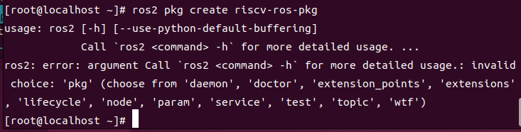
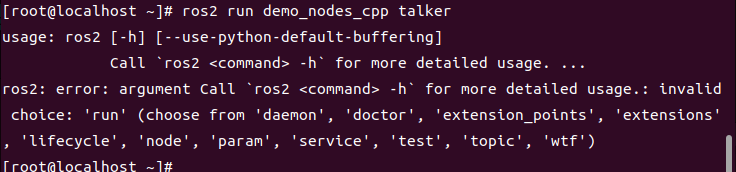
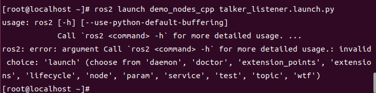
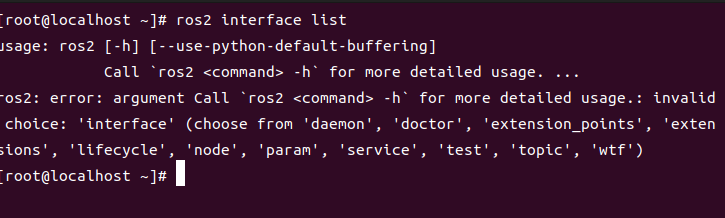
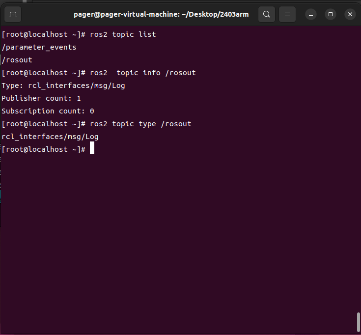
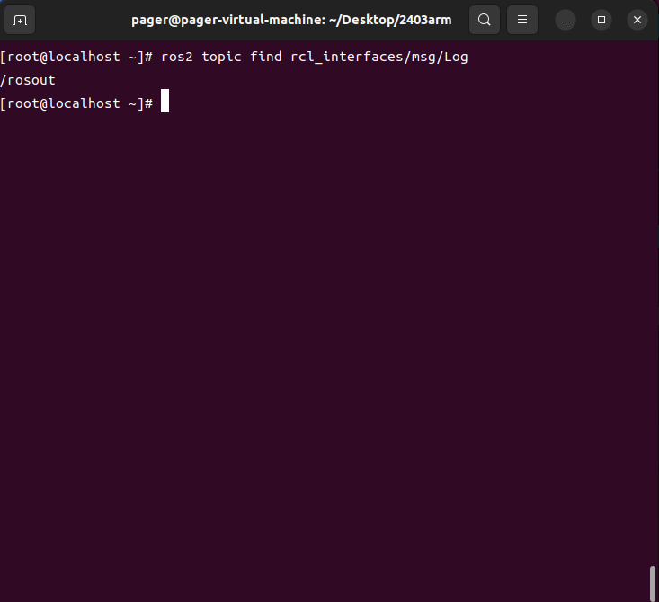
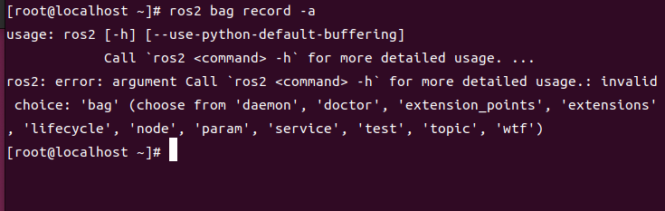

# ROS2 Humble 在 openEuler-24.03-Arm 上的测试

## 环境信息

#### 硬件信息
1. 处理器 intel 13700k
3. 内存 64GB

#### 软件信息
1. 宿主机操作系统：Ubuntu 22.04
2. OS 版本：openEuler-24.03-arm
3. 镜像地址：https://mirror.sjtu.edu.cn/openeuler/openEuler-24.03-LTS/virtual_machine_img/aarch64/openEuler-24.03-LTS-aarch64.qcow2.xz
4. 软件源：http://121.36.84.172/dailybuild/EBS-openEuler-24.03-LTS/EBS-openEuler-24.03-LTS/EPOL/multi_version/ROS/humble/aarch64/

## 刷写镜像并启动

前往官网，下载 镜像文件

使用以下命令进行启动

```
qemu-system-aarch64
    -M virt -m 8G -cpu cortex-a72 -smp 8
    -bios AAVMF_CODE.fd 
    -drive id=hd0,media=disk,if=none,file=img_base.qcow2 
    -device virtio-scsi-pci 
    -device scsi-hd,drive=hd0 
    -nic user,model=virtio-net-pci,hostfwd=tcp::2222-:22,hostfwd=tcp::8000-:80,hostfwd=tcp::8080-:8080,hostfwd=tcp::8888-:8888,hostfwd=tcp::9090-:9090,hostfwd=tcp::9000-:9000 
    -nographic 
```

登录用户名和密码如下

- 用户名：`root`

- 密码：`openEuler12#$`


## 测试安装

### 修改软件源

执行以下命令

```bash
bash -c 'cat << EOF > /etc/yum.repos.d/ROS.repo
[openEulerROS-humble]
name=openEulerROS-humble
baseurl=http://121.36.84.172/dailybuild/EBS-openEuler-24.03-LTS/EBS-openEuler-24.03-LTS/EPOL/multi_version/ROS/humble/aarch64/
enabled=1
gpgcheck=0
EOF'
```

### 安装

```bash
dnf install "ros-humble-*" --skip-broken --exclude=ros-humble-generate-parameter-library-example
```

安装成功,完整日志见 [dnf_install.log](./logs/dnf_install.log)

安装上述软件列表后，编辑 `~/.bashrc` 追加以下内容

```bash
source /opt/ros/humble/setup.sh
```

随后输入`source  ~/.bashrc`来激活

## 测试用例列表及测试结果

测试用例列表如下

| 测试用例名                  | 状态 |
| --------------------------- | ---- |
| 测试 turtlesim功能          | 失败 |
| 测试ros2 pkg create         | 失败 |
| 测试ros2 pkg executables    | 失败 |
| 测试ros2 pkg list           | 失败 |
| 测试ros2 pkg prefix         | 失败 |
| 测试ros2 pkg xml            | 失败 |
| 测试ros2 run                | 失败 |
| 测试ros2 topic list         | 成功 |
| 测试ros2 topic info         | 成功 |
| 测试ros2 topic type         | 成功 |
| 测试ros2 topic find         | 成功 |
| 测试ros2 topic hz           | 失败 |
| 测试ros2 topic bw           | 失败 |
| 测试ros2 topic echo         | 失败 |
| 测试ros2 param 工具         | 失败 |
| 测试ros2 service 工具       | 失败 |
| 测试ros2 node list          | 失败 |
| 测试ros2 node info          | 失败 |
| 测试ros2 bag 工具           | 失败 |
| 测试ros2 launch 工具        | 失败 |
| 测试ros2 interface list     | 失败 |
| 测试ros2 interface package  | 失败 |
| 测试ros2 interface packages | 失败 |
| 测试ros2 interface show     | 失败 |
| 测试ros2 interface proto    | 失败 |
| 测试 ros 通信组件相关功能   | 失败 |

失败的测试用例如下:

| 测试用例名                  | 状态 |
| --------------------------- | ---- |
| 测试 turtlesim功能          | 失败 |
| 测试ros2 topic hz           | 失败 |
| 测试ros2 topic bw           | 失败 |
| 测试ros2 topic echo         | 失败 |
| 测试ros2 param 工具         | 失败 |
| 测试ros2 service 工具       | 失败 |
| 测试ros2 node list          | 失败 |
| 测试ros2 node info          | 失败 |
| 测试ros2 bag 工具           | 失败 |
| 测试ros2 launch 工具        | 失败 |
| 测试ros2 interface list     | 失败 |
| 测试ros2 interface package  | 失败 |
| 测试ros2 interface packages | 失败 |
| 测试ros2 interface show     | 失败 |
| 测试ros2 interface proto    | 失败 |
| 测试 ros 通信组件相关功能   | 失败 |
| 测试ros2 pkg create         | 失败 |
| 测试ros2 pkg executables    | 失败 |
| 测试ros2 pkg list           | 失败 |
| 测试ros2 pkg prefix         | 失败 |
| 测试ros2 pkg xml            | 失败 |
| 测试ros2 run                | 失败 |

结论：当前镜像源中的ros组件仅支持`daemon`, `doctor`, `extension_points`, `extensions`, `lifecycle` `node`, `param`, `service`,`'test`, `topic`, `wtf`等指令，因此大部分测试用例无法通过s

## 测试 ros 基础工具相关功能

#### 1 ros2 pkg 工具

执行ros pkg相关指令时出错，目前不支持




#### 2 ros2 run 工具

执行ros run相关指令时出错，目前不支持



#### 3 ros2 topic 工具

##### 3.1 ros2 topic list

执行  `ros2 topic list`，输出如下，测试通过



##### 3.2 ros2 topic info

执行 `ros2  topic info /rosout`，输出如下，测试通过



##### 3.3 ros2 topic type

执行 `ros2 topic type /rosout`，输出如下，测试通过



##### 3.4 ros2 topic find

执行 `ros2 topic find rcl_interfaces/msg/Log`，输出如下， 测试通过



##### 3.5 ros2 topic hz

执行ros run相关指令时出错，目前不支持


##### 3.6 ros2 topic bw

执行ros run相关指令时出错，目前不支持


##### 3.7 ros2 topic echo

执行ros run相关指令时出错，目前不支持


#### 4 ros2 param 工具

执行ros run相关指令时出错，目前不支持


#### 5 ros2 service 工具

执行ros run相关指令时出错，目前不支持


#### 6 ros2 node 工具

##### 6.1 ros2 node list

执行ros run相关指令时出错，目前不支持


##### 6.2 ros2 node info

执行ros run相关指令时出错，目前不支持


#### 7 ros2 bag 工具

执行ros bag 相关指令时出错，目前不支持




#### 8 ros2 launch 工具

执行ros launch相关指令时出错，目前不支持


#### 9 ros2 interface 工具


执行ros interface 相关指令时出错，目前不支持


##### 

#### 10.测试 ros 通信组件相关功能

执行ros run相关指令时出错，目前不支持


#### 11 测试 turtlesim

执行ros run相关指令时出错，目前不支持


