# ROS1 Noetic 在 openEuler-24.03-LTS-x86 上的测试

## 环境信息

#### 硬件信息
1. 处理器 intel 13700k
3. 内存 8GB

#### 软件信息
1. 宿主机操作系统：Ubuntu 18.04
2. OS 版本：openEuler-24.03-LTS-x86
3. 镜像地址：https://www.openeuler.org/zh/download/?version=openEuler%2024.03%20LTS
4. 软件源：https://eulermaker.compass-ci.openeuler.openatom.cn/api/ems1/repositories/ROS-SIG-Multi-Version_ros-noetic_openEuler-24.03-LTS-TEST1/openEuler%3A24.03-LTS/


## 测试安装

### 修改软件源

执行以下命令

```bash
bash -c 'cat << EOF > /etc/yum.repos.d/ROS.repo
[openEulerROS-noetic]
name=openEulerROS-noeic
baseurl=https://eulermaker.compass-ci.openeuler.openatom.cn/api/ems1/repositories/ROS-SIG-Multi-Version_ros-noetic_openEuler-24.03-LTS-TEST1/openEuler%3A24.03-LTS/
enabled=1
gpgcheck=0
EOF'
```

### 安装

```bash
yum install "ros-noetic-*"
```

安装成功,完整日志见 [yum_install.log](./logs/dnf_install.log)

安装上述软件列表后，编辑 `~/.bashrc` 追加以下内容

```bash
source /opt/ros/noetic/setup.sh
```

随后输入`source  ~/.bashrc`来激活

## 安装UKUI桌面

安装字体

```
sudo dnf -y groupinstall fonts 
```

安装UKUI

```
sudo dnf -y install ukui
```

设置图形启动

```
sudo systemctl set-default graphical.target
```

重启电脑


## 测试 ros 基础工具相关功能

#### 1 catkin_make编译工具

##### 1.1 catkin_make_isolated 编译命令

执行 
```
mkdir -p ~/catkin_ws/src
cd ~/catkin_ws/src
catkin_init_workspace
cd ..
catkin_make_isolated
source /opt/ros/noetic/setup.bash
```
，输出如下，且当前目录存在相应文件夹，测试通过

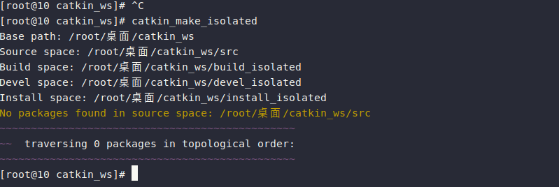

##### 1.2  catkin_find 查找命令

执行 `catkin_find catkin`，输出如下，测试通过

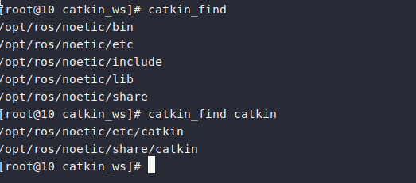


#### 2 ros基础工具

##### 2.1 roscore 工具

执行  `roscore`，输出如下，测试通过

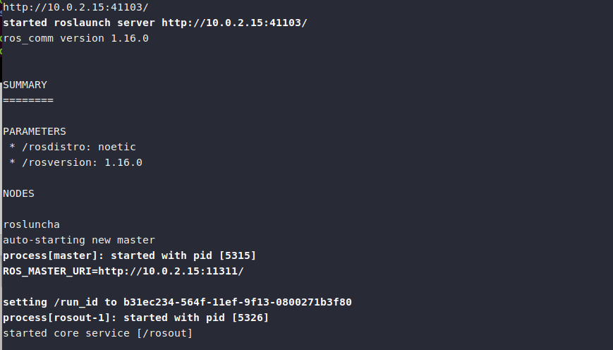

注: 由于ros通讯方式需求，roscore节点需要一直开启

##### 2.2 rostopic 工具

执行 `rostopic list`，输出如下，测试通过

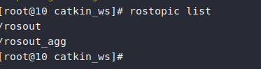

##### 2.3 rosmsg 工具

执行 `rosmsg list`，输出如下，测试通过

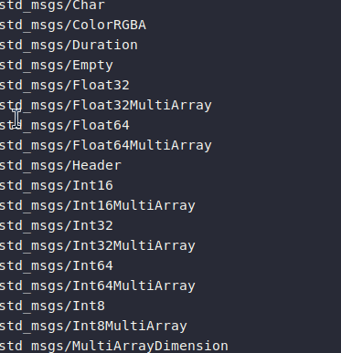

##### 2.4 rosclean 工具

执行 `rosclean check`，输出如下， 测试通过

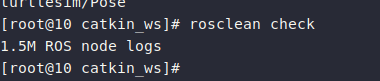

##### 2.5 rosservice 工具

执行命令 `rosservice list`，输出如下，测试通过

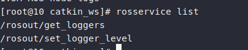

##### 2.6 rospack 工具

执行命令 `rospack list`，输出如下，测试通过

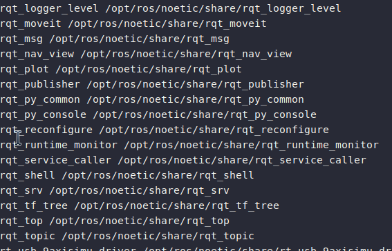

##### 2.7 rosnode 工具

执行命令 `rosnode list`，输出如下，测试通过


##### 2.7 rosbag 工具

执行命令 `rosbag record -a`，输出如下，测试通过


执行命令 `rosbag info [bag文件]`，输出如下，测试通过

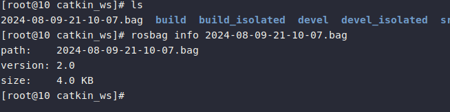


执行命令 `rosbag play [bag文件]`，输出如下，测试通过

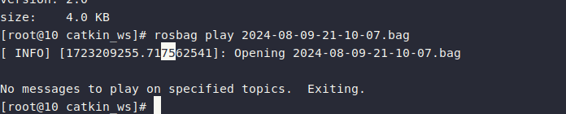

##### 2.8 rosgraph 工具

执行命令 `rosgraph`，输出如下，测试通过

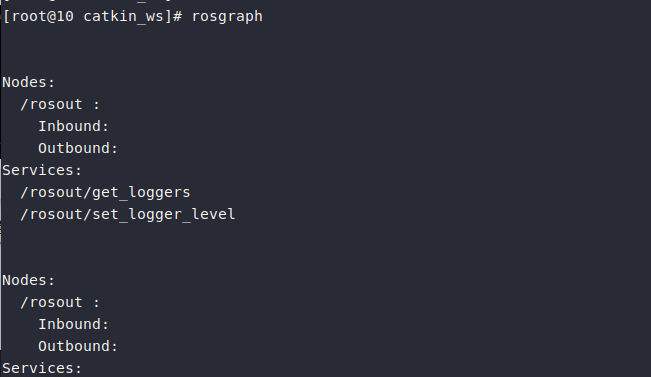


##### 2.9 roslaunch 工具

执行命令 `roslaunch roscpp_tutorials talker_listener.launch`，输出如下，测试通过

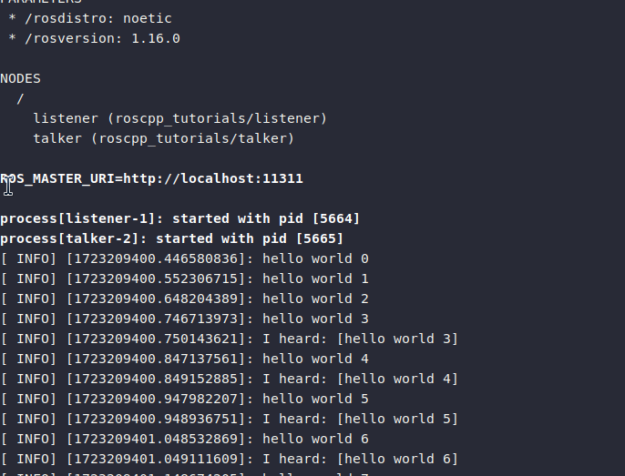


##### 2.10 ros topic 通讯功能

执行命令 `rosrun roscpp_tutorials talker`，输出如下，测试通过

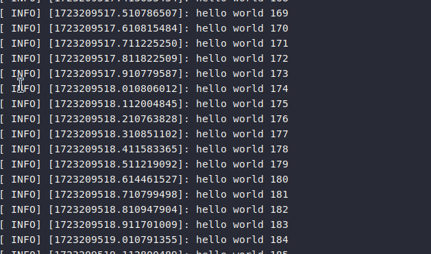

执行命令 `rosrun roscpp_tutorials  listener`，输出如下，测试通过

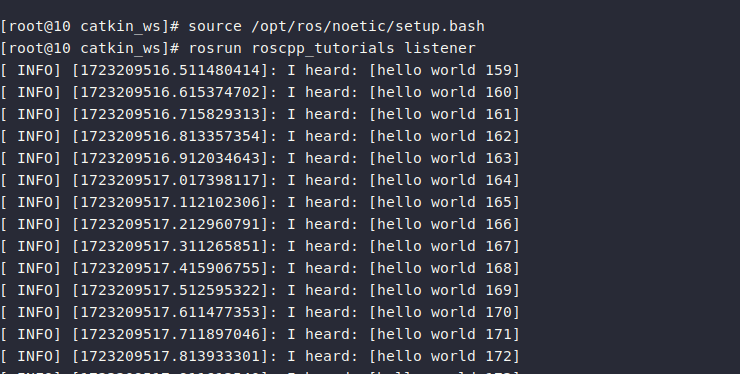