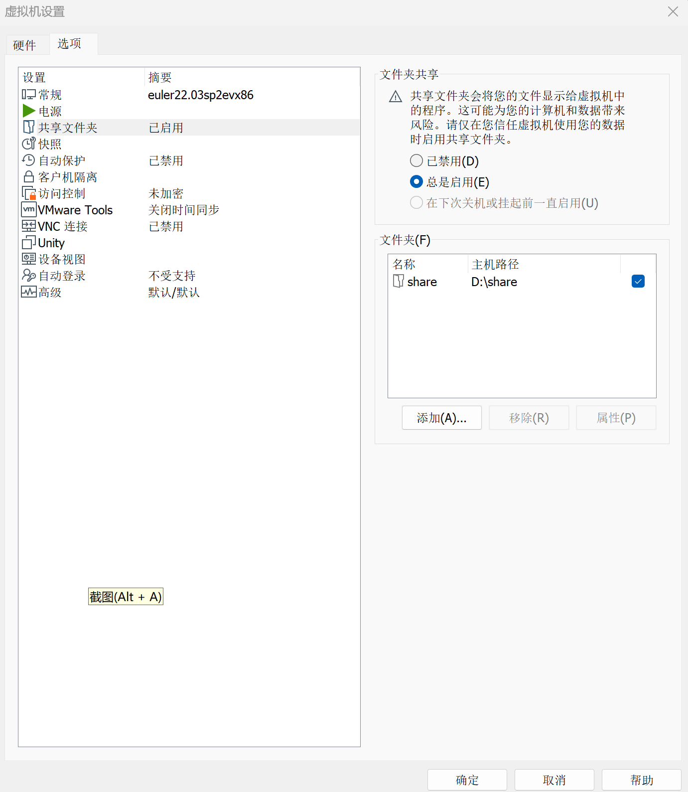
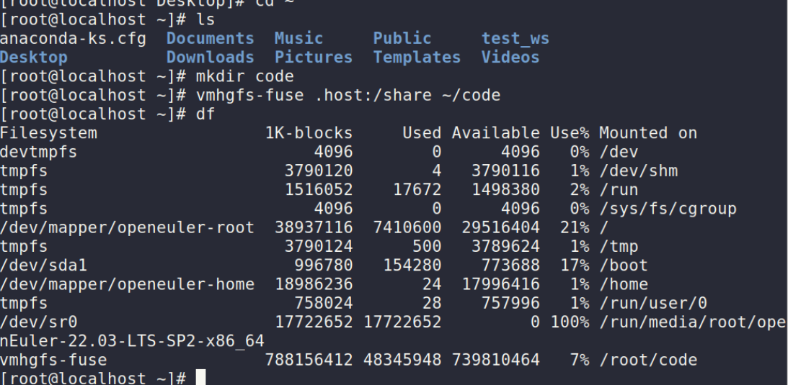

## openEuler22.03 安装测试ROS2 Humble

### 1.安装系统

#### 1.1安装系统

参考openEuler官方教程物理机安装openEuler系统或虚拟机安装系统

#### 1.2安装桌面环境

```
yum install ukui
systemctl set-default graphical.target
```

### 2.安装ROS2 humble

安装：

```
yum install openeuler-ros
yum install ros-humble-ros-base ros-humble-turtlesim
```

安装一些常用包：

```
yum install ros-humble-rviz*   
yum install ros-humble-tf*   
yum install ros-humble-control*   
```

ROS SIG已经打包发版的功能包均可通过`yum install ros-humble-功能包名`的形式安装，其他尚未移植的功能包需要自行源码编译安装

设置环境变量：

```
echo " source /opt/ros/humble/setup.bash" >> ~/.bashrc 
```

### 3. 测试小乌龟程序

```
ros2 run turtlesim turtlesim_node
ros2 run turtlesim turtle_teleop_key
```


### 4.安装编译器colcon

```
dnf install -y python3-pip
pip3 install -U colcon-common-extensions
yum -y install gcc automake autoconf libtool make
```

### 5.测试自己的代码

新建工作空间、编译、运行其他功能包的流程与ROS官方教程基本一致：https://docs.ros.org/en/humble/Tutorials.html

### 6.其他配置

#### 6.1 VM虚拟机设置文件共享(可选)

openEuler系统提供了VMtools工具的安装：

```
yum -y install open-vm-tools
```

编译安装完成后，关闭虚拟机，设置宿主机的共享目录：




开启虚拟机命令行输入`vmhgfs-fuse .host:/share  ~/code`将主机目录挂到~/code下

出现下图最后一行说明文件共享成功：



